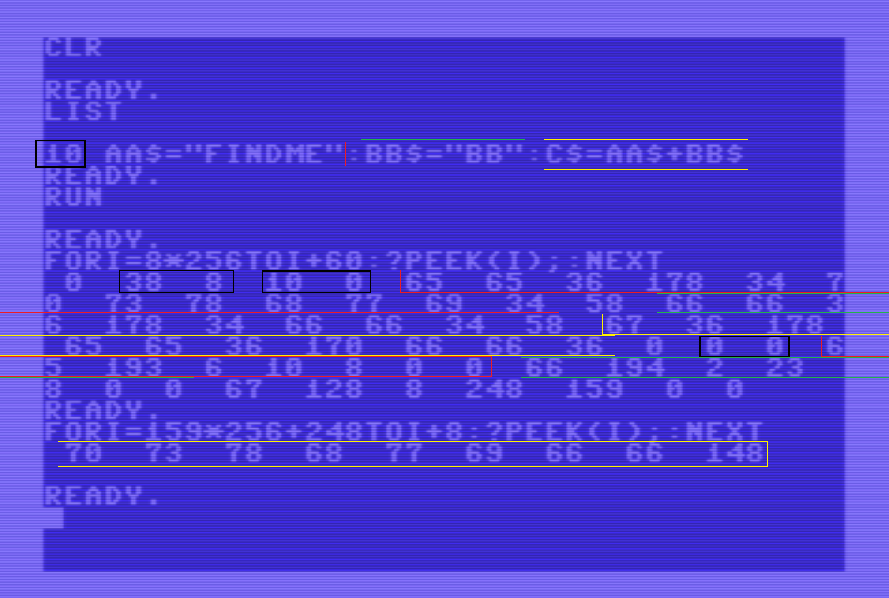

# C64 Strings

How are strings stored in a C64 (Commodore 64) BASIC program?


## Test program

We wrote a small test program which uses three string variables `AA$`, `BB$` and `C$`.
We ran the program, so that the variables are actually created/allocated.
And the we made two memory dumps (`FOR..?PEEK..NEXT`).




## BASIC program

The first memory dump starts at 0x800, because that is where C64 BASIC stores its source lines.
The size of the dump (60) was a lucky guess :-).

In the screenshot, we outlined the line (10) in black, and the
three strings in red (`AA$`), green (`BB$`), and yellow (`C$`).
The corresponding bytes in the memory dump are outlined with the same colors.

Note that the variable name of `AA$` is encoded as 65 65 36, so plain ASCII.
Note also that the variable content of `AA$` is encoded as 70 73 78 68 77 69, so also plain ASCII.
There is no terminating zero byte. You simply can not type a string literal in C64 basic with a quote `"`.

We have annotated the hex dump below. The program ends at 0x0826 with 00 00; no more next line.
What is interesting is that _after that the basic variables start - if the program has run.

```
0800 0                       <start>
0801 38 8                    0x0826 next line
0803 10 0                    0x000A line number
0805 65 65 36 178 34         AA$="
080A 70 73 78 68 77 69       FINDME
0810 34 58 66 66 36 178 34   ":BB$="
0817 66 66                   BB
0819 34 58 67 36 178         ":C$=
081E 65 65 36 170 66 66 36   AA$+BB$
0825 0                       <eoln>
0826 0 0                     0x0000 no next line
0828 65 193 6 10 8 0 0       AA$ len=8 addr 0x080A
082F 66 194 2 23 8 0 0       BB$ len=2 addr 0x0817
0836 67 128 8 248 159 0 0    C$  len=8 addr 0x9FF8
083D 
....
9FF8 70 73 78 68 77 69 66 66 FINDMEBB
```


## Variable descriptors

Each variable has a descriptor of 7 bytes. The first two bytes contain the ASCII value of the (first two)
characters of the variable name. The second byte is 0 if the name has a length of 1. 
The MSBs of these two bits denote the type, and that determines the meaning of the other 5 bytes.

| MSB byte 1 | MSB byte 2 |    type    | remaining 5 bytes   |
|:----------:|:----------:|:----------:|:-------------------:|
|      0     |      0     |  float ( ) |mantissa and exponent|
|      0     |      1     | string ($) |len addrlo addrhi 0 0|
|      1     |      0     |    FN F(X) |Flo Fhi Xlo Xhi 0    |
|      1     |      1     |  int (%)   | hi lo 0 0 0         |

Observe that at 0x0828 variable `AA$` is stored, with its length 6 and its address 0x080A, which is in the basic source.
Similarly, at 0x082F variable `BB$` is stored, length 2 and a pointer into the basic source.

Finally, at 0x0836 we have `C$` (single letter string variable) with a _computed_ content.
Its length is 8 and it is stored in the "string heap" at 8 248 or 0x9FF8. 

The second memory dump is just there and we find as contents the ASCII values of its
characters 70 73 78 68 77 69 66 66 or FINDMEBB. There is no terminating 0, the length is in the decsriptor.


## Final notes

The command `CLR` deletes all descriptors (and presumable the string heap).
A `FRE(0)` first runs the garbage collector (on the string heap) before reporting how much memory is free.


(end)
