# Debugging ESP32S3 in Arduino


## 1. Introduction

I'm trying to use the debugger in the Arduino IDE to debug the 
[ESP32-S3-DevKitC-1](https://docs.espressif.com/projects/esp-idf/en/latest/esp32s3/hw-reference/esp32s3/user-guide-devkitc-1.html).

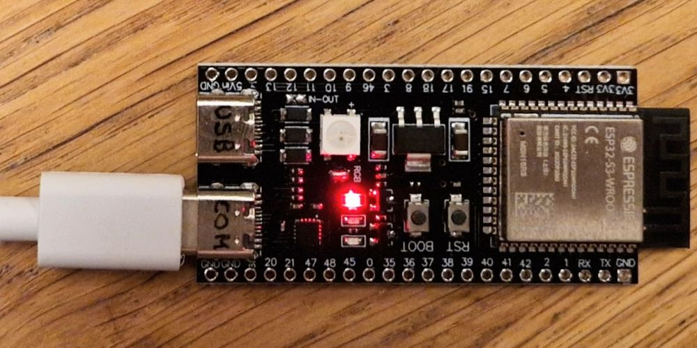

The ESP32S3-DevKitC-1 board is made by Espressif - but mine is a clone. 
It contains the ESP32-S3, which has a built-in USB controller.
This USB controller allows the ESP to act as a HID device (keyboard), CDC device (serial port) or even have JTAG (debug).
The ESP32S3-DevKitC-1 board has _two_ USB connectors, one for the built-in USB controller, and one traditional:
connecting the ESP32 serial lines via a serial-to-USB chip. On my board the first is labeled "USB",
the other "COM" - at the back side of the PCB; I have written those labels on the connectors.

The board does _not_ have a simple built-in LED, instead it has a Neopixel. 
But the standard ESP32 libraries these days come with two features: (1) they include a
driver for Neopixels, so `neopixelWrite(LED_BUILTIN,100,0,100)` switches the builtin LED to
purple (red+blue); (2) `digitalWrite` accepts pin numbers that are "virtual", so 
`digitalWrite(LED_BUILTIN,HIGH)` actually calls `neopixelWrite()`.

I have one of the "bigger" ESP32S3-DevKitC-1 boards, known as N16R8, which presumably means 16M external flash and 8M external psram. 
I got it from [AliExpress](https://nl.aliexpress.com/item/1005005481618843.html).

Due to the two USB connectors, this board might be a bit more generic/flexible than the 
[Arduino Nano ESP32](https://store.arduino.cc/products/nano-esp32),
but it is very similar. Both have the ESP32-S3. 
And the Arduino 2.x IDE has a debugger for this CPU.


## 2. Installs

- Install the [Arduino 2 IDE](https://www.arduino.cc/en/software).
  This also installs all kinds of USB drivers.
  I have IDE version [2.2.1](https://downloads.arduino.cc/arduino-ide/arduino-ide_2.2.1_Windows_64bit.exe) (installed for All Users").
  
  **Do not use version 2.3.0** as there is [Temporary loss of debugger support for ESP32 boards](https://forum.arduino.cc/t/arduino-ide-2-3-0-is-now-available/1221189).
  But a newer version might work (again).
  
- In Arduino, using the BOARDS MANAGER, install "esp32 _by Espressif Systems_".
  I have version 2.0.11.
  This does contain the "ESP32S3 Dev Module".
  Note that this is the Espressif package, not the recent libraries from Arduino for their Arduino Nano ESP32.

- Some sites/[videos](https://www.youtube.com/watch?v=HGB9PI3IDL0) claim that 
  you have to download [Zadig](https://zadig.akeo.ie/) so that you can alter
  the default USB drivers (after you connect the board).
   - "USB JTAG/serial debug uint (Interface **0**)" to USB Serial (CDC) - usbser
   - "USB JTAG/serial debug uint (Interface **2**)" to WinUSB
   
  But for me those drivers were installed by default, so I didn't use Zadig.
  
- I'm not sure, but maybe the debugger itself comes with the Arduino ESP32 boards package.
  In Arduino, using the BOARDS MANAGER, install "Arduino ESP32 Boards _by Arduino_".
  I have version 2.0.13.


## 3. Experiments

### 3.1. Single USB cable

We begin with a simple test: blinking the built-in LED, writing over Serial, and 
using the hardware serial USB connector.

- Connect the development PC with a USB-C cable to the ESP board 
  **using the port labeled "COM"** (not "USB").
  My board has these labels at the backside of the PCB.
  
  After plugging in, the Windows _Device Manager_ shows a new COM port: COM5
  (this is probably different for you).
  
  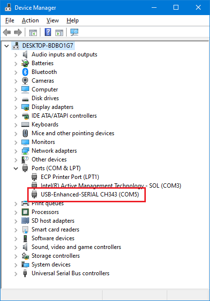

  Device manager > COM5 > Properties > Details > Property "Hardware Ids" shows
  a vendor ID (VID) of 1A86 and a product ID (PID) 55D3, 
  i.e. "QinHeng Electronics USB Single Serial". 
  This confirms we are using the USB to serial bridge IC.
  
- Use a small test sketch with a blinking led and printf's.
  As explained in the intro, `digitalWrite` also supports the Neopixel on the board.
  
  ```C++
  int n;

  void setup() {
    Serial.begin(115200);
    delay(2000);
    Serial.printf("\nSerial : ESP32-S3 test\n");
    n=1000;
  }

  void loop() {
    n= n+1;
    digitalWrite(LED_BUILTIN, n%2 );
    Serial.printf("Serial : %d\n",n);
    delay(2000);
  }
  ```
  
- In the Tools menu (or the "Select Other Board and Port" drop down in the ribbon)
  select board **ESP32S3 Dev Module** and the "COM5" we found in the first step.

- I believe I used all the default compiler settings, except for flash. 
  Maybe I should have configured PSRAM too.
  
  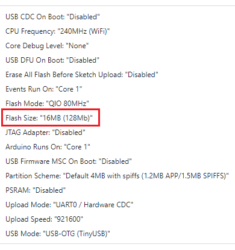

- Compile and Upload.
  Note that the "COM" USB port works as on any Arduino (ESP) board:
  it can be used to flash new firmware.

- The "Serial Monitor" shows what we expect, and the Neopixel is blinking.
  Since this connection is via the USB-serial, make sure the baud rate on the 
  PC side Serial Monitor is set to 115200 just as we have in the sketch.
  
  ```text
  Serial : ESP32-S3 test
  Serial : 1001
  Serial : 1002
  Serial : 1003
  ```


### 3.2. Second USB cable

We will now try to use the same sketch, but use the other USB port.

- With a second USB cable connect the port labeled "USB" also to the development PC.
  On my PC this means COM4 appears.
  Also a JTAG device pops up (if not, maybe you need Zadig, see section Installs above).
  In other words, we deal with a composite USB device with two services JTAG and CDC.
  
  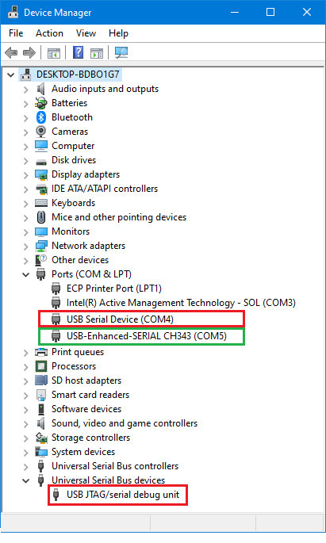

  COM4 is a physically different USB (VID 303A, PID 1001, i.e. "Espressif Incorporated ...") 
  therefore Windows assigns a new COM port "COM4" in my case.
  
  However, we keep the Serial Monitor Port to COM5.
  
  I believe that COM4 can be used for Serial output, but we have to tell
  the compiler to remap `Serial` from tx/rx pins to USB.
  This is done by selecting "Enabled" in Tools > USB CDC On Boot.
  From then on the `Serial` is no longer mapped to tx/rx but to USB; however `Serial0` is now mapped to tx/rx.
  We have two CDC connections.
  
- Change the sketch a bit so that we are sure the firmware is updated
  (e.g. change the initial value of n to 8000, or change the delay).
  
- Compile and Upload.  
  We hear some USB disconnect and connect beeps from the PC.
  This is due to the fact that during an upload the ESP32 is
  reset, and this resets the new COM4 port which is implemented by the ESP.

- The "Serial Monitor" shows what we expect.

  ```text
  Serial : ESP32-S3 test
  Serial : 8001
  Serial : 8002
  Serial : 8003
  Serial : 8004
  Serial : 8005
  ```
  
- Compared to the previous experiment (single USB cable) nothing much has changed.
  There is a second cable, but we are not using it.
  

### 3.3. Debugging

We will now try to _debug_ this sketch.

- The crucial step is to enable the JTAG. This will run over the second USB cable.

  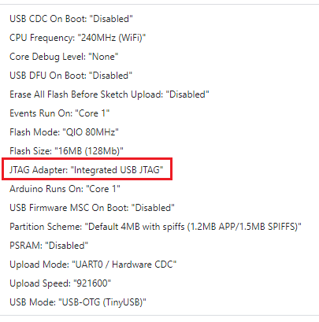
  
- This JTAG support needs to be flashed. So we compile and upload.
  After this completes, the IDE has generated debug files.
  This is a bit of a surprise; the debug files are ESP32S3 specific, but why does a _compile_ generated them?
  
  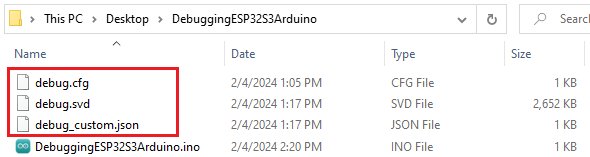

  I believe the presence of these debug files is crucial, for the IDE willing to start the debugger.
  
  The file `C:\Users\maarten\AppData\Local\Arduino15\packages\esp32\hardware\esp32\2.0.11\platform.txt`
  has these sections, which are probably responsible for generating the three debug files.
  
  ```text
  # Generate debug.cfg (must be postbuild)
  recipe.hooks.postbuild.1.pattern=bash -c "[ {build.copy_jtag_files} -eq 0 ] || cp -f "{debug.server.openocd.scripts_dir}"board/{build.openocdscript} "{build.source.path}"/debug.cfg"
  recipe.hooks.postbuild.1.pattern.windows=cmd /c IF {build.copy_jtag_files}==1 COPY /y "{debug.server.openocd.scripts_dir}board\{build.openocdscript}" "{build.source.path}\debug.cfg"

  # Generate debug_custom.json
  recipe.hooks.postbuild.2.pattern=bash -c "[ {build.copy_jtag_files} -eq 0 ] || cp -f "{runtime.platform.path}"/tools/ide-debug/{build.mcu}.json "{build.source.path}"/debug_custom.json"
  recipe.hooks.postbuild.2.pattern.windows=cmd /c IF {build.copy_jtag_files}==1 COPY /y "{runtime.platform.path}\tools\ide-debug\{build.mcu}.json" "{build.source.path}\debug_custom.json"

  # Generate chip.svd
  recipe.hooks.postbuild.3.pattern=bash -c "[ {build.copy_jtag_files} -eq 0 ] || cp -f "{runtime.platform.path}"/tools/ide-debug/svd/{build.mcu}.svd "{build.source.path}"/debug.svd"
  recipe.hooks.postbuild.3.pattern.windows=cmd /c IF {build.copy_jtag_files}==1 COPY /y "{runtime.platform.path}\tools\ide-debug\svd\{build.mcu}.svd" "{build.source.path}\debug.svd"
  ```

- Optionally, we could disable compiler optimizations. 
  This makes the firmware image larger and slower, but also makes debugging easier.
  You need to compile and upload after changing this option.
  
  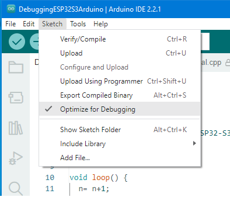
  
- Sometimes the debug button in the IDE ribbon stays disabled.

  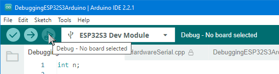

  But we can convince the IDE to start the debugger nonetheless.
  
  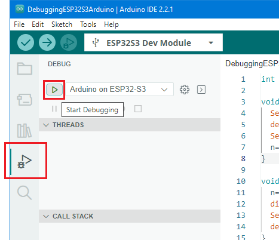
  
  **Warning** Note that debugger has a _debug configuration_, namely
  "Arduino on ESP32-S3". That is good. However, sometimes the _debug configuration_ 
  drop down is empty ("No Configurations"). That is not good. See the Appendix.
  
- Have a bit if patience for all tools to start.
  The gdb-server tab in the bottom pane of the Arduino IDE should pop up.

  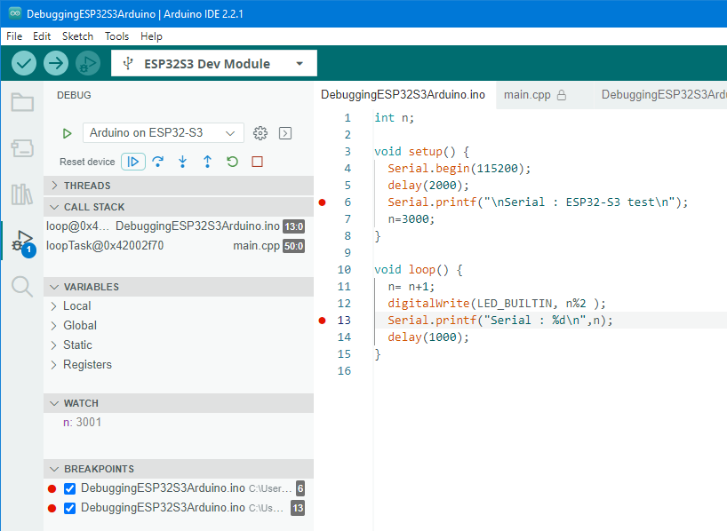


## 4. Tips

### 4.1. Debugging tips

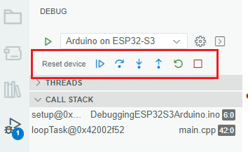

- When starting the debugger, it not always starts at the first line of `setup`.
  I typically have a break point early in `setup` and press `Continue` to reach it.
  
- Continue button (blue triangle) toggles between running and pausing the firmware.
  
- The next three buttons are Step Over, Step Into and Step Out.
  
- The green circular button restarts the program.
  I'm not completely sure what the difference with the first button `Reset device` is.
  
- The last button (red square) is important: it stops debugging.
  While the debugger is running, it locks the elf file generated by the
  compiler, so a new compile will fail.
  
- To set a break point, click in the gutter. A red dot appears, and the line
  is listed in the debugger pane in the BREAKPOINTS section.
  
- Somehow the VARIABLES section doesn't show globals for me.
  But globals (actually expressions) can be viewed in the WATCH section.
  Once in a function locals can be viewed.
  
- To change the value of a variable go to the last line of the Debug console
  and type e.g. `set var n = 10` (assuming variable `n` is in scope). 
  Also this doe snot work completely for me. I can only set globals.

  
### 4.2. Output Windows

The bottom pane of the Arduino IDE may contain an assortment of tabs.

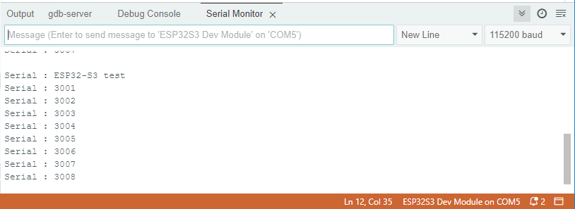

- `Output` shows output from compiler and flasher.

- `gdb-server` shows feedback from the gdb server.

- `Debug Console` shows feedback from GDB and allows entering gdb commands.

  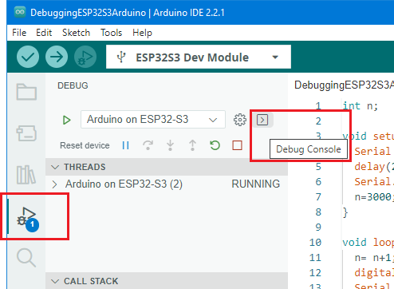

- `Serial Monitor` shows Serial output from the firmware - get via Tools > Serial Monitor).


## A. Appendix 

### A.1 No debug configuration

When I tried the steps in this document on another PC it did not work.
Where it failed was that the _debug configuration_ is empty.

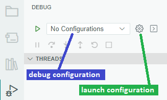

Pressing the _launch configuration_ button results in an empty-ish file
instead of the following, which I get on the PC were the debugging works.

```json
{
  "version": "0.2.0",
  "configurations": [
    {
      "cwd": "${workspaceRoot}",
      "name": "Arduino on ESP32-S3",
      "request": "attach",
      "type": "cortex-debug",
      "executable": "C:\\Users\\maarten\\AppData\\Local\\Temp\\arduino\\sketches\\9FF916268DD3C6EAC0FEA0B48F086DFA/DebuggingESP32S3Arduino.ino.elf",
      "servertype": "openocd",
      "serverpath": "C:\\Users\\maarten\\AppData\\Local\\Arduino15\\packages\\esp32\\tools\\openocd-esp32\\v0.11.0-esp32-20221026/bin/openocd",
      "armToolchainPath": "C:\\Users\\maarten\\AppData\\Local\\Arduino15\\packages\\esp32\\tools\\xtensa-esp-elf-gdb\\11.2_20220823/bin/",
      "configFiles": [
        "debug.cfg"
      ],
      "toolchainPrefix": "xtensa-esp32s3-elf",
      "svdFile": "debug.svd",
      "overrideAttachCommands": [
        "set remote hardware-watchpoint-limit 2",
        "monitor reset halt",
        "monitor gdb_sync",
        "thb setup",
        "c"
      ],
      "overrideRestartCommands": [
        "monitor reset halt",
        "monitor gdb_sync"
      ]
    }
  ]
}
```

On the working PC, a new sketch for ESP32-S3 also doesn't debug.
Hmm, what did I do the first time to make that project work?

Things I tried but which do not seem to help

 - Place a checkmark at Tools > Programmes > Esptool.
 - Switch to COM4.
 - Sketch > Upload Using Programmer.
 - In DEBUG pane Add Configuration (this creates `.theia\launch.json"` in the project dir) but that seems useless (my working project doesn't have it).


### A.2 USB connections

The USB setup is not very clear to me.
This is how I understand it.

- The USB port labeled COM uses [Qinheng Microelectronics CH343 USB to serial adapter](https://www.wch-ic.com/products/CH343.html)
  to bridge the tx/rx lines of the ESP32 to USB.
  
- The USB port labeled USB connects directly into the ESP32, to either of two blocks: 
  USB OTG or USB Serial/JTAG

  - The USB port labeled USB can be wired to the Serial/JTAG hardware block
    and thus perform those functions.
    
  - The USB port labeled USB can be wired to the OTG block.
    In this case firmware determines what this USB port does (again it could be serial).
    A typical software stack controlling the OTG hardware is TinyUSB.

  We learn this from [Espressif docs](https://docs.espressif.com/projects/esp-idf/en/latest/esp32s3/api-guides/usb-serial-jtag-console.html)
  
  > The USB Serial/JTAG Controller is a fixed-function USB device that is implemented entirely in hardware, meaning that it cannot be reconfigured to perform any function other than a serial port and JTAG debugging functionality. This is in contrast to the USB OTG controllers in some ESP chips that can be configured to perform the function of multiple types of USB devices.

  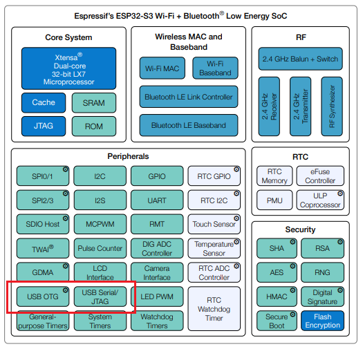


(end)
