# Debugging ESP32S3 in Arduino


## Introduction

I'm trying to use the debugger in the Arduino IDE to debug the 
[ESP32-S3-DevKitC-1](https://docs.espressif.com/projects/esp-idf/en/latest/esp32s3/hw-reference/esp32s3/user-guide-devkitc-1.html).

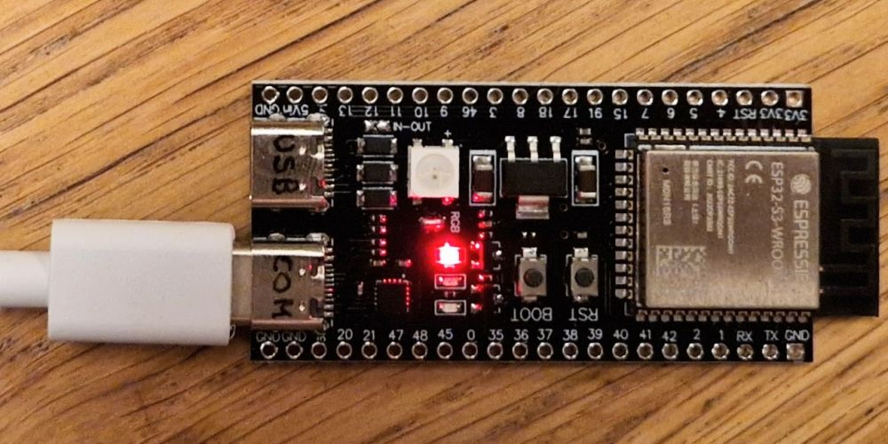

The ESP32S3-DevKitC-1 board is made by Espressif - but mine is a clone. 
It contains the ESP32-S3, which has a built-in USB controller.
This USB controller allows the ESP to act as a HID device (keyboard), CDC device (serial port) or even have JTAG (debug).
The ESP32S3-DevKitC-1 board has _two_ USB connectors, one for the built-in USB controller, and one traditional:
connecting the ESP32 serial lines via a serial-to-USB chip. On my board the first is labeled "USB",
the other "COM" - at the back side of the PCB; I have written those labels on the connectors.

The board does _not_ have a simple built-in LED, instead it has a Neopixel. 
But the standard ESP32 libraries these days come with two features: (1) they include a
driver for Neopixels, so `neopixelWrite(LED_BUILTIN,100,0,100)` switches the builtin LED to
purple (red+blue); (2) `digitalWrite` accepts pin numbers that are "virtual", so 
`digitalWrite(LED_BUILTIN,HIGH)` actually calls `neopixelWrite()`.

I have one of the "bigger" ESP32S3-DevKitC-1 boards, known as N16R8, which presumably means 16M external flash and 8M external psram. 
I got it from [AliExpress](https://nl.aliexpress.com/item/1005005481618843.html).

Due to the two USB connectors, this board might be a bit more generic/flexible than the 
[Arduino Nano ESP32](https://store.arduino.cc/products/nano-esp32),
but it is very similar. Both have the ESP32-S3. 
And the Arduino 2.x IDE has a debugger for the controller.


## Installs

- Install the [Arduino 2 IDE](https://www.arduino.cc/en/software).
  This also installs all kinds of USB drivers.
  I have IDE version 2.2.1.
  
- In Arduino, using the "boards manager", install "esp32 _by Espressif Systems_".
  I have version 2.0.11.
  This does contain the "ESP32S3 Dev Module".
  Note that this is the Espressif package, not the recent libraries from Arduino
  for their Arduino Nano ESP32.

- Some sites/[videos](https://www.youtube.com/watch?v=HGB9PI3IDL0) claim that 
  you have to download [Zadig](https://zadig.akeo.ie/) so that you can alter
  the default USB drivers (after you connect the board).
   - "USB JTAG/serial debug uint (Interface **0**)" to USB Serial (CDC) - usbser
   - "USB JTAG/serial debug uint (Interface **2**)" to WinUSB
   
  But for me those drivers were installed by default, so I didn't use Zadig.


## Experiments

### Single USB cable

We begin we a simple test: blinking the built-in LED, writing over Serial, and 
using the hardware serial.

- Connect the development PC with a USB-C cable to the ESP board 
  **using the port labeled "COM"** (not "USB").
  My board has these labels at the backside of the PCB.
  
  After plugging in, my device manager shows a new COM port: COM5.
  
  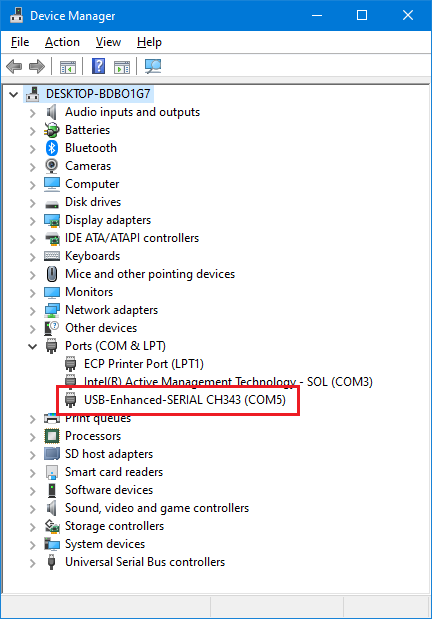

  Device manager > COM5 > Properties > Details > Property "Hardware Ids" shows
  a vendor ID (VID) of 1A86 and a product ID (PID) 55D3, 
  i.e. "QinHeng Electronics USB Single Serial". 
  This confirms we are using the USB to serial bridge IC.
  
- Use a small test sketch with a blinking led and printf's.
  ```C++
  int n;

  void setup() {
    Serial.begin(115200);
    delay(2000);
    Serial.printf("\nSerial : ESP32-S3 test\n");
    n=1000;
  }

  void loop() {
    n= n+1;
    digitalWrite(LED_BUILTIN, n%2 );
    Serial.printf("Serial : %d\n",n);
    delay(2000);
  }
  ```
  
- Select board "ESP32S3 Dev Module" and the "COM5" we found in the first step 
  (this is probably different for you).

- I believe I used all the default settings, except for flash. 
  Maybe I should have configured PSRAM too.
  
  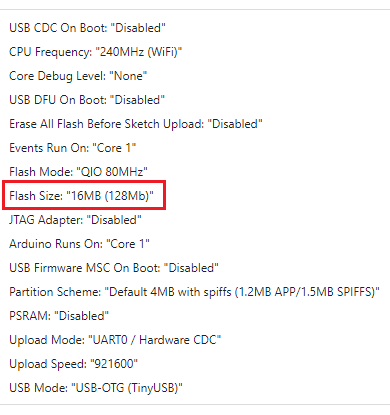


- Compile and Upload.

- The "Serial Monitor" shows what we expect.
  Since this connection is via the USB-serial, make sure the baud rate on the 
  PC side Serial Monitor is set to 115200 just as we have in the sketch.
  
  ```text
  Serial : ESP32-S3 test
  Serial : 1001
  Serial : 1002
  Serial : 1003
  ```
  
- Test completes successfully.


### Second USB cable

We will now try to use the same sketch, but use the other USB port.

- With a second USB cable connect the port labeled "USB" also to the development PC.
  On my PC this means COM4 appears.
  Also a JTAG device pops up (if not, maybe you need Zadig, see section Installs above).
  
  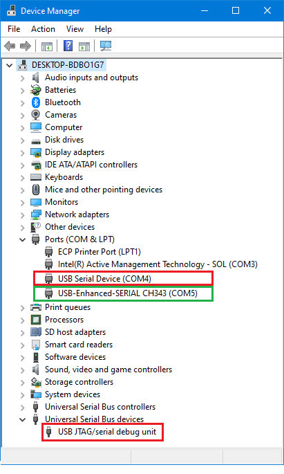

  COM4 has a physically different USB (VID 303A, PID 1001, i.e. "Espressif Incorporated ...") 
  therefore Windows assigns a new COM port: "COM4" (this is probably different for you).
  
  However, we keep the Serial Monitor Port to COM5.
  
  I have to admit that I have no idea what COM4 is used for.
  I expected it to carry a second Serial channel (e.g. `Serial1`) but I can't get it to work.
  
- Changed the sketch the sketch a bit so that we are sure the firmware is
  updates (e.g. change the initial value of n to 8000, or the delay).
  
- Compile and Upload.  
  We hear some USB disconnect and connect beeps from the PC.
  This is due to the fact that during an upload the ESP32 is
  reset, and this resets the new COM4 port.

- The "Serial Monitor" shows what we expect.

  ```text
  Serial : ESP32-S3 test
  Serial : 8001
  Serial : 8002
  Serial : 8003
  Serial : 8004
  Serial : 8005
  ```

### Debugging

We will now try to debug the program.

- The crucial step is to enable the JTAG.

  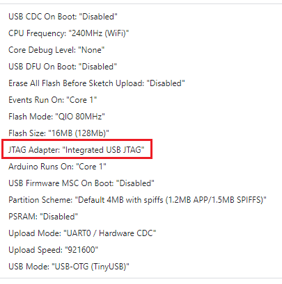
  
- This JTAG support needs to be flashed. So we compile and upload.
  After this completes, the IDE has generated debug files.
  
  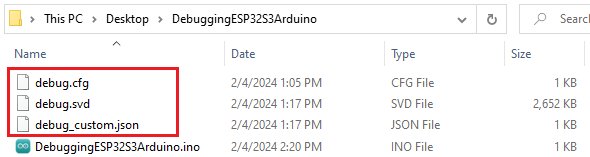

- Optionally, we could disable compiler optimizations. 
  This makes the firmware image larger and slower, but also makes debugging easier.
  You need to compile and upload after changing this option.
  
  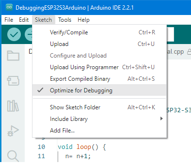
  
- For some reason the debug button in the ribbon stays disabled.

  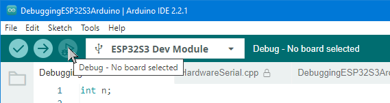

  But we can convince the IDE to start the debugger nonetheless.
  
  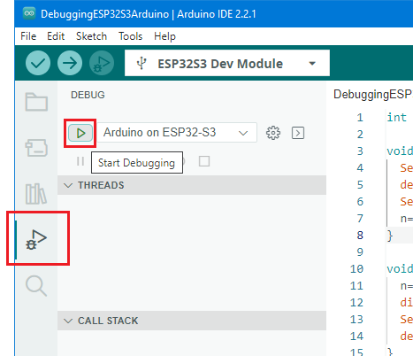
  
- Have a bit if patience for all tools to start.
  The gdb-server tab in the bottom pane of the Arduino IDE should pop up.

  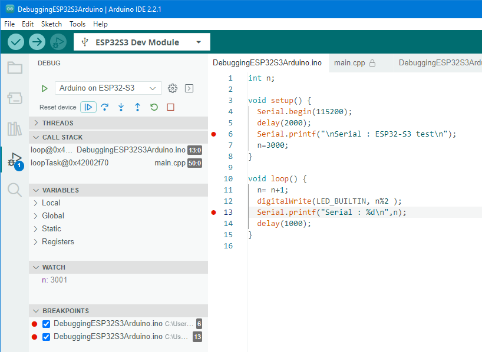


## Debug tips

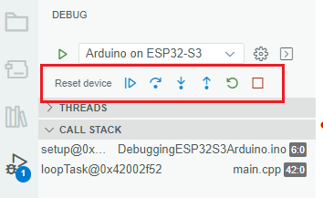

- When starting the debugger, it is not always at the first line of `setup`.
  I typically have a break point early in `setup` and press `Continue` to reach it.
- Continue button (blue triangle) toggles between running and pausing the firmware.
- The next three buttons are Step Over, Step Into and Step Out.
- The green circular button restarts the program.
  I'm not completely sure what the difference with the first button `Reset device` is.
- The last button (red square) is important: it stops debugging.
  While the debugger is running, it lock the elf file generated by the
  compiler, so a new compile will fail.
- To set a break point, click in the gutter. A red dot appears, and the line
  is listed in the debugger pane in the BREAKPOINTS section.
- Somehow the VARIABLES section doesn't work for me.
  But variables (actually expressions) can be viewed in the WATCH section.
- To change the value of a variable go to the last line of the Debug console
  and type e.g. `set var n = 10` (assuming variable `n` is in scope). 
  
## Output Windows

The bottom pane of the Arduino IDE may contain an assortment of tabs.

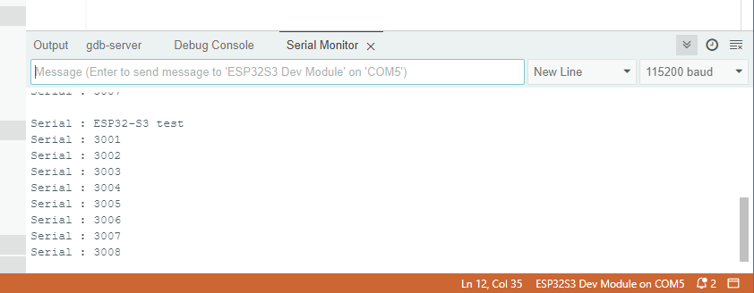

- `Output` shows output from compiler and flasher.

- `gdb-server` shows feedback from the gdb server.

- `Debug Console` shows feedback from GDB and allows entering gdb commands.

  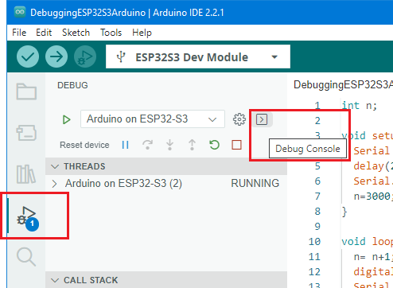

- `Serial Monitor` shows Serial output from the firmware - get via Tools > Serial Monitor).
  
(end)
