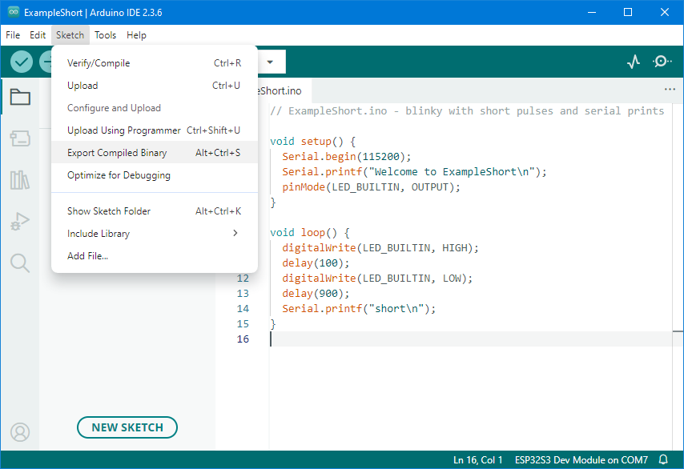
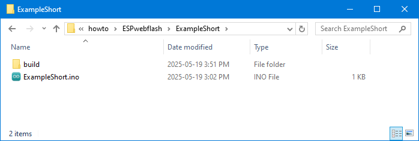
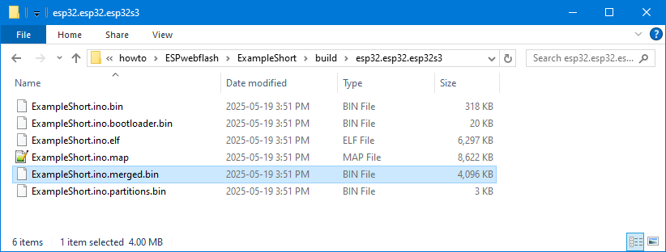
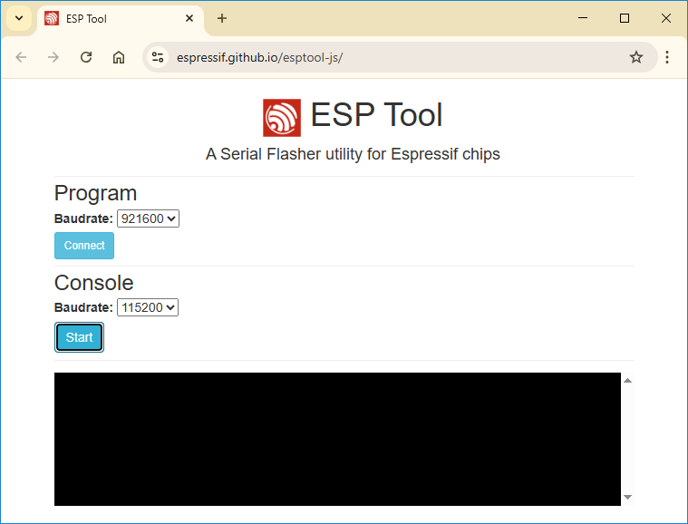
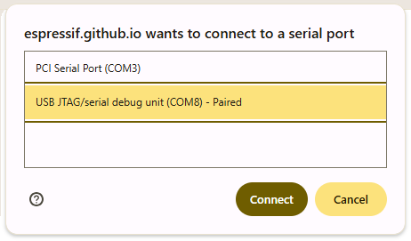
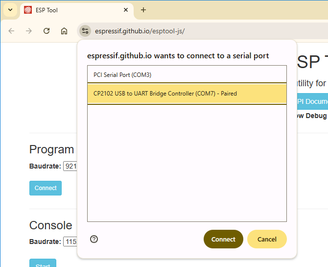
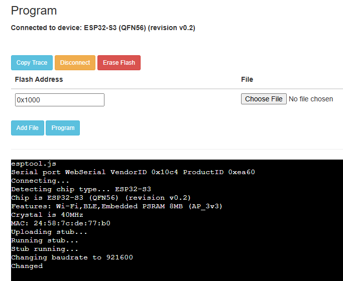
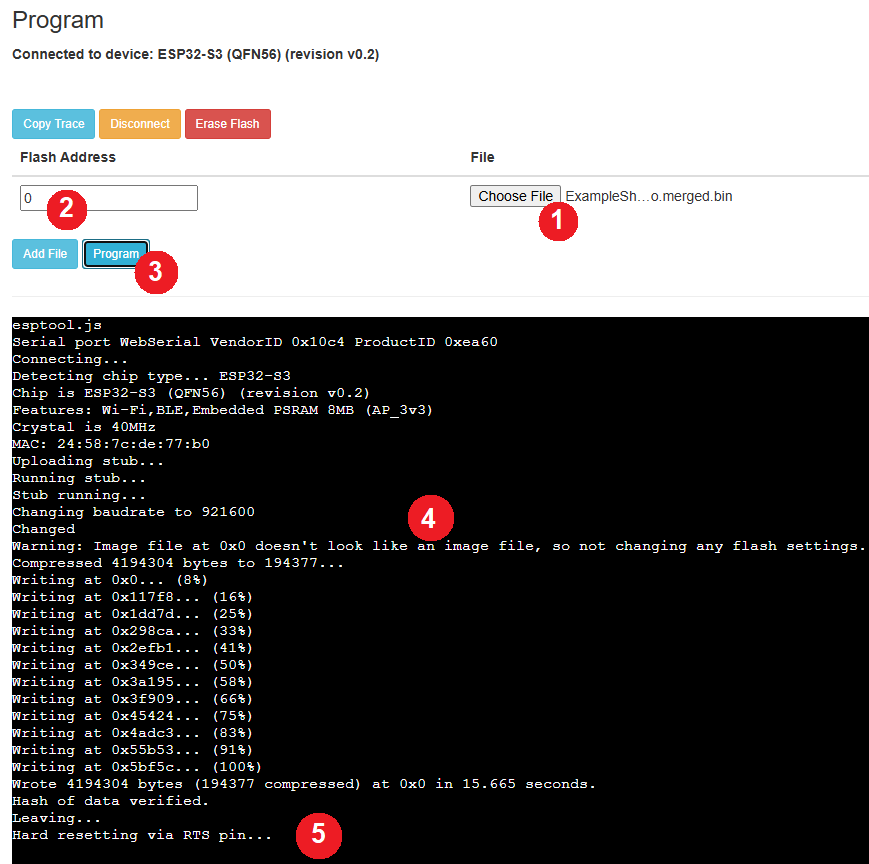

# ESP web flash

Flashing an ESP controller - via the web.


## Introduction

To flash an ESP, one standard route is using the Arduino IDE.
Installing Arduino is relatively simple, installing ESP support is relatively 
simple, selecting a board and COM port is a bit harder, compiling and 
uploading is again relatively simple. Nevertheless, the entire process is 
still quite challenging for novices, and it requires the _sources_, which
you might not want to want to make public.

Over a longer period, I found several _web_ installers competing with
the Arduino route. These installers are on public websites. They connect 
to your ESP, then flash a hard-wired or custom firmware image. Examples

 - [ESPhome](https://web.esphome.io/) 
   first one I found; with a hardwired image
   
 - Adafruit [ESPTool](https://adafruit.github.io/Adafruit_WebSerial_ESPTool/) 
   comes with [repo](https://github.com/makermelissa/Adafruit_WebSerial_ESPTool);
   for any image
   
 - [ESP Tool](https://espressif.github.io/esptool-js/) from Espressif the manufacturer 
   of ESPs, also comes with a [repo](https://github.com/espressif/esptool-js/); 
   basically a JavaScript version of their "esptool", the serial flasher
   that is also used by the Arduino IDE.

I do not want to make my own web site for now, the ESPhome drops off.
The other two have one major drawback: an ESP firmware image consists off 
four binaries that each need to be flashed to a different address:

```
  0x01000 myproject.ino.bootloader.bin
  0x08000 myproject.ino.partitions.bin
  0x0e000 boot_app0.bin
  0x10000 myproject.ino.bin
```

Then I stumbled on the post of [PJ_Glasso](https://forum.seeedstudio.com/t/how-to-export-compiled-binary-create-a-single-bin-file-for-production-and-test/274990) explaining that Arduino can make
a _combined_ binary. This also hides the load addresses.


## Generating the image

I wrote two similar example sketches for this how-to.
Both print to Serial, both blink the built-in LED.
The difference is that one has [long](ExampleLong) on-times, 
the other one [short](ExampleShort).

Here is the "short" example.

```c++
// ExampleShort.ino - blinky with short pulses and serial prints

void setup() {
  Serial.begin(115200);
  Serial.printf("Welcome to ExampleShort\n");
  pinMode(LED_BUILTIN, OUTPUT);
}

void loop() {
  digitalWrite(LED_BUILTIN, HIGH);
  delay(100);
  digitalWrite(LED_BUILTIN, LOW);
  delay(900);
  Serial.printf("short\n");
}
```

I compiled these examples for an [ESP32-S3-DevKitC-1](https://docs.espressif.com/projects/esp-dev-kits/en/latest/esp32s3/esp32-s3-devkitc-1/user_guide.html),
so using "ESP32S3 Dev Module" in Arduino.

What I learned from Glasso is to "Export Compiled Binary" (from the Sketch menu).



If you have File > Preferences > compile, you would see at the 
end of compilation (beautified by me)

```
Wrote 0x400000 bytes to file C:\Users\maarten\AppData\Local\arduino\sketches\
  A96FF57EB02B523B0D7504F16AEEAA3C\ExampleShort.ino.merged.bin
  ready to flash to offset 0x0
```

What is important to me is the "easy" `flash to offset 0x0`.

What did puzzle me is where I could find the `ExampleShort.ino.merged.bin`.
I looked in `A96FF57EB02B523B0D7504F16AEEAA3C` and there I found it.
But it is much simpler. When selecting "Export Compiled Binary", a `build` 
directory is created in the project.



In that build we find (a subdir per target with) the binaries



We need the `ExampleShort/build/esp32.esp32.esp32s3/ExampleShort.ino.merged.bin`.


## Web flashing 

First we need to establish a connection between the ESP board and 
the browser. Then the page in the browser can flash a firmware image.


### Connect

The hardest part is to connect the ESP board to the browser page.
There are two options: USB-serial or USB-debug.

- **USB-debug**  
  The idea here is to use the USB-debug block built into the ESP32S3.
  The S3 has such a block, not all ESP32s do.
  
  - Connect the ESP32S3 with the USB connector marked "USB" (not "UART")

  - Hopefully there is no need to install a driver on the PC.
  
  - Visit the web flasher at [Espressif esptool-js](https://espressif.github.io/esptool-js/).

    
    
    With the "Console" pane you can view the prints over Serial.
    We ignore that here, we focus on the "Program" pane.
    
  - The default baudrate (921600) is ok; click on the "Connect" button 
    in the "Program" pane.
    A security feature of the browser pops-up: the user has to grant the browser
    access to the USB port. 

    

- **USB-serial**  
  The idea here is to use the USB-to-serial chip on the dev kit board.
  Most all ESP32s have such a chip.
  
  - Connect the ESP32S3 with the USB connector marked "UART" (not "USB")

  - If you don't have Arduino installed, you probably need to install the driver 
    for the USB to UART bridge. The ESP32-S3-DevKitC-1 has an USB to UART Bridge 
    of type CP2102N. Download and install the driver from 
    [Silabs](https://www.silabs.com/interface/usb-bridges/usbxpress/device.cp2102n-gqfn28).

  - Visit the web flasher at [Espressif esptool-js](https://espressif.github.io/esptool-js/).
    See "USB_debug" for details.
  
  - This time select the COM port

    

### Flashing

- Once the connection means is selected (see previous section)  press Connect
  in the browser connection control window. The browser page starts 
  communicating with the ESP. For example we see it detects the ESP32-S3 (line 4).

  

- With the "Choose File" (1) select the firmware image, e.g. 
  [`ExampleShort.ino.merged.bin`](ExampleShort/build/esp32.esp32.esp32s3/ExampleShort.ino.merged.bin).
  
  Do not forget to put the "Flash Address" to 0 (2), then press "Program" (3).
  
  
  
  If you forgot the 0 in step (2), the firmware is flashed to the wrong 
  location and won't work. No harm done, just repeat the process with a 0.

- After pressing "Program", wait. Flashing takes time.

  You will see the remark about the address 0x0 (hexadecimal for the 0 we enterd at "Flash Address").
  Wait till you see the "Leaving..." message (5).
  
- For me the "Hard resetting" doesn't work; I need to press the RESET button 
  on the ESP32 board (or unplug and replug the USB cable).


## My own server

I did try to get my own server, a clone of Espressif's tool.
See the [log](ownserver.md) of my experiment.
  
(end)
