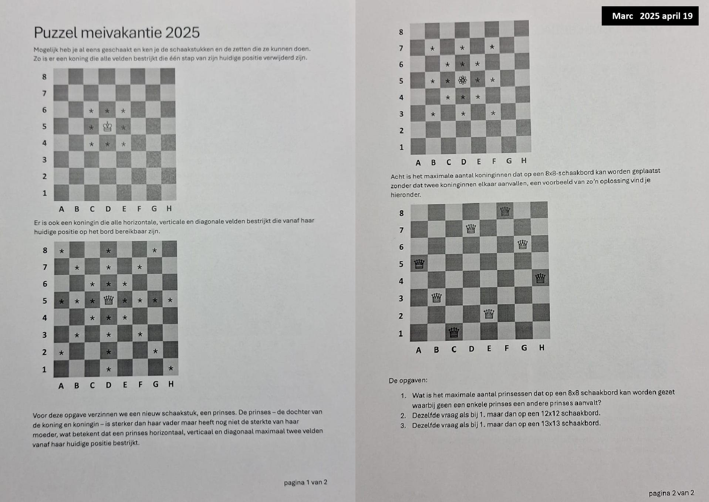
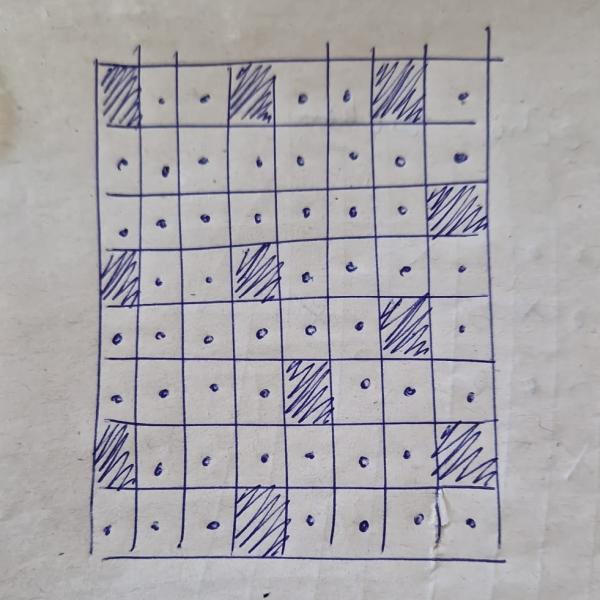
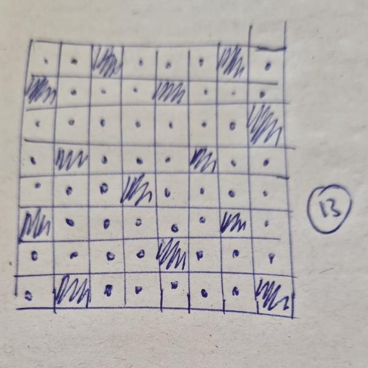

# 8 Princesses (on Gemini 2.5 Flash)

A problem by Marc Ridders, solved using Gemini.


## The problem

Marc sent me this problem he authored.



This is a derivative of the [8 queens problem](https://en.wikipedia.org/wiki/Eight_queens_puzzle).
I knew that that problem places 8 queens in non-attacking positions on a regular chess board.
Since princesses have a reach of 2 squares, instead of 8 of a queen, I knew 
I had to find a solution with at least 8 princesses. I was happy I found a solution that placed 11 princesses.

.

Marc said I could do better. And yes I could.

.

Marc said he could _not_ do better.
But I felt that there were quite some empty places in the third row.

But writing a whole algorithm ... pff... what a work.


## Gemini

Let's go lazy and ask Gemini (I used 2.5 Flash).

### First prompt - the problem

> I hope you know the 8 queens problem: place 8 queens on a chess board so that they do not attack each other. I have a similar problem with a new chess piece: the princess. A princess moves/attacks just like a queen or king. But where the range of a queen is indefinite and of a king it is one, the range of a princess is two squares. How many princesses can I place on a regular chessboard without any attacking another.

Okay, let's define the movement and attack of the "princess" piece on a standard 8x8 chessboard based on your description. A princess moves and attacks like a queen or king, but with a range limited to exactly two squares.

This means from a square (r, c), a princess attacks all squares (r+i, c+j) where:

 - -2 ≤ i ≤ 2
 - -2 ≤ j ≤ 2
 - However, we must exclude the square the princess is on itself (i=0, j=0).
 - We must also exclude squares where the maximum of the absolute values of i and j is greater than 2. This means if a queen can reach a square in one move, and that square is 3 or more steps away in any direction (horizontal, vertical, or diagonal), the princess with a range of 2 cannot reach it.
 
Essentially, a princess at (r, c) attacks all squares within a 5x5 square centered at (r, c), excluding the center square itself, and respecting the board boundaries.

The problem is to find the maximum number of princesses that can be placed on an 8x8 board such that no two princesses attack each other. This is a classic packing problem similar to the N-Queens problem but with a different piece movement.

To solve this, we can use a backtracking algorithm. We'll try to place princesses on the board one by one, ensuring that each new princess does not attack any previously placed princesses.

Here's the general approach:

 1. **Represent the board:** An 8x8 grid (a 2D array) can represent the chessboard. Each cell can store whether it's empty or occupied by a princess.
 2. **Keep track of attacked squares:** Alongside the board, we need a way to mark squares that are under attack by the princesses already placed. Another 8x8 grid of booleans could work, where true means the square is attacked.
 3. **Backtracking function:** A recursive function will attempt to place a princess on the board.
    - It iterates through the squares of the board.
    - For each empty square, it checks if placing a princess there would attack any existing princess (by checking the attacked squares grid).
    - If it's safe to place a princess:
      - Place the princess on the board.
      - Update the attacked squares grid by marking all squares within the new princess's range of 2 as attacked.
      - Recursively call the function to place the next princess.
      - After the recursive call returns, "unplace" the princess and revert the attacked squares (backtracking) to explore other possibilities.
   - The function keeps track of the maximum number of princesses successfully placed in any branch of the search.

Due to the limited range of the princess compared to a queen, we might expect to place more princesses than the 8 queens in the classic problem. The attacked area for a princess is smaller and more localized.

Determining the absolute maximum requires a computational search. However, based on the reduced attack range, we can infer that a higher number of princesses than queens (which is 8) should be possible. Without running a full search algorithm, providing an exact guaranteed maximum is challenging.

This problem falls into the category of constraint satisfaction problems, and computationally, finding the optimal solution involves exploring a significant number of possibilities. While I cannot execute a program to provide the definitive answer through simulation here, the described backtracking approach is the standard method to solve such problems.

Based on the nature of the piece and similar chess variant packing problems, the maximum number of non-attacking princesses is likely to be significantly higher than 8. Searching online resources for this specific variant "princess chess piece range 2 maximum placement" might yield results from previous computational studies if they exist.

However, as I am to provide an answer based on the problem as stated and my capabilities, I can only describe the method to find the solution. A precise numerical answer requires running the described algorithm.

Given the constraints and the localized attack, a reasonable estimate would be in the range of 10 to 12 or even higher, but this is an educated guess, not a computed result.

To get the definitive maximum number, the backtracking algorithm described above would need to be implemented and executed.


_From the sentence "a princess at (r, c) attacks all squares within a 5x5 square centered at (r, c)" it was clear Gemini miss-understood me.
We need to better explain the moves_


### Second prompt - correcting the miss-understanding

> You misunderstood how the princess moves. It is not a 5x5 square because a princess moves like a queen but only 1 or two squares. So from 0,0 it can reach 1,1 and 2,2, but not 2,1.

Apologies for the misunderbursement of the princess's movement. Thank you for clarifying.

Based on your correction, the princess moves and attacks like a queen but only to squares that are exactly 1 or 2 steps away along a horizontal, vertical, or diagonal line.

Let's precisely define the squares a princess at position (r, c) attacks on an 8x8 board. It attacks squares (r', c') if and only if:

 1. The move is along a valid queen's path: either r' = r, c' = c, or |r' - r| = |c' - c|.
 2. The distance from (r, c) to (r', c') is exactly 1 or 2 squares. The distance is defined as the maximum of the absolute differences in the row and column coordinates: max(|r' - r|, |c' - c|).

So, a princess at (r, c) attacks the following squares (provided they are within the 8x8 board boundaries):

 - **Horizontal and Vertical (distance 1 and 2):**
   - (r±1, c), (r±2, c)
   - (r, c±1), (r, c±2)
 - **Diagonal (distance 1 and 2):**
   - (r±1, c±1) (all four combinations of ±)
   - (r±2, c±2) (all four combinations of ±)

This set of attacked squares is indeed different from a simple 5x5 area. For example, a princess at (3,3) would attack (3,1), (3,2), (3,4), (3,5), (1,3), (2,3), (4,3), (5,3), (1,1), (2,2), (4,4), (5,5), (1,5), (2,4), (4,2), (5,1).

The problem is still to find the maximum number of these "range-2 princess" pieces that can be placed on a standard 8x8 chessboard without any two princesses attacking each other.

This is a complex combinatorial optimization problem. The most effective way to find the guaranteed maximum number is through a complete search algorithm, such as backtracking.

The backtracking approach would involve:

 1. Representing the 8x8 chessboard.
 2. For each square, trying to place a princess.
 3. If a princess is placed at (r, c), mark all the squares listed above (within board bounds) as attacked.
 4. Recursively call the function to place the next princess on a subsequent square, only considering squares that are not attacked.
 5. If a square is reached where a princess cannot be placed, backtrack to the last placed princess and try a different position.
 6. Keep track of the maximum number of princesses successfully placed in any valid configuration.

Implementing and running such a search is required to get the precise maximum number. This specific variant of a chess piece and its packing problem might have been studied before.

Unfortunately, I do not have access to pre-computed results for this exact "princess with range 2" piece on an 8x8 board to provide a definitive number immediately.

Therefore, while the method to solve it is clear (a backtracking search considering the specific attack pattern), stating the exact maximum number of non-attacking princesses requires performing this computation. Based on the localized attack pattern, the number will likely be higher than the 8 queens in the standard problem, but the precise value is not readily available without computation.

_Doesn't sound too bad. But "while the method to solve it is clear ... stating the exact maximum number of non-attacking princesses requires performing this computation".
Let's go for the computation then._Doesn


### Third prompt - getting the code

> Could you write a c-program to solve this?

Okay, I can provide you with a C program that uses a backtracking approach to find the maximum number of non-attacking princesses on an 8x8 board with the specific range-2 movement you described.

Keep in mind that for an 8x8 board, a full backtracking search can still take a significant amount of time to explore all possibilities.

```c
#include <stdio.h>
#include <stdbool.h>
#include <stdlib.h> // For max function if needed, or use a ternary operator

#define BOARD_SIZE 8

// Board to keep track of how many princesses attack each square
// A square is safe if attacked_count[r][c] == 0
int attacked_count[BOARD_SIZE][BOARD_SIZE];

// Store the maximum number of princesses found so far
int max_princesses = 0;

// Possible movements for the princess (dr, dc)
// Range 1: Horizontal, Vertical, Diagonal
// Range 2: Horizontal, Vertical, Diagonal
int moves_dr[] = {-1, -1, -1,  0, 0,  1, 1, 1, // Range 1
                  -2, -2, -2,  0, 0,  2, 2, 2}; // Range 2
int moves_dc[] = {-1,  0,  1, -1, 1, -1, 0, 1, // Range 1
                  -2,  0,  2, -2, 2, -2, 0, 2}; // Range 2

// Function to check if a position is within the board boundaries
bool is_valid(int r, int c) {
    return (r >= 0 && r < BOARD_SIZE && c >= 0 && c < BOARD_SIZE);
}

// Function to update the attacked_count grid when placing or removing a princess
// delta will be +1 for placing, -1 for removing
void update_attacked_count(int r, int c, int delta) {
    // Mark/unmark the current square as attacked by *other* pieces (though not strictly needed for safety check of *this* piece)
    // More importantly, mark all squares attacked by a piece at (r, c)
    for (int i = 0; i < 16; ++i) { // 16 possible move types (8 range 1, 8 range 2)
        int next_r = r + moves_dr[i];
        int next_c = c + moves_dc[i];

        if (is_valid(next_r, next_c)) {
            attacked_count[next_r][next_c] += delta;
        }
    }
}

// Backtracking function to find the maximum number of princesses
// square_index: the linear index of the current square being considered (0 to 63)
// current_count: the number of princesses placed so far in this configuration
void solve(int square_index, int current_count) {
    // Base case: All squares considered
    if (square_index == BOARD_SIZE * BOARD_SIZE) {
        if (current_count > max_princesses) {
            max_princesses = current_count;
        }
        return;
    }

    int r = square_index / BOARD_SIZE; // Current row
    int c = square_index % BOARD_SIZE; // Current column

    // Option 1: Do not place a princess at the current square
    solve(square_index + 1, current_count);

    // Option 2: Place a princess at the current square, if it's safe
    if (attacked_count[r][c] == 0) {
        // Place the princess
        update_attacked_count(r, c, 1); // Mark squares attacked by this princess

        // Recurse to the next square
        solve(square_index + 1, current_count + 1);

        // Backtrack: Remove the princess and unmark attacked squares
        update_attacked_count(r, c, -1);
    }
}

int main() {
    // Initialize attacked_count board to all zeros
    for (int i = 0; i < BOARD_SIZE; ++i) {
        for (int j = 0; j < BOARD_SIZE; ++j) {
            attacked_count[i][j] = 0;
        }
    }

    // Start the backtracking search from the first square (index 0)
    solve(0, 0);

    printf("Maximum number of non-attacking princesses: %d\n", max_princesses);

    return 0;
}
```

Explanation:

 1. **`attacked_count[8][8]`:** This 2D array is the core of the state. `attacked_count[r][c]` stores how many princesses currently placed on the board attack the square `(r, c)`. A square is safe to place a new princess if its count is 0.
 2. **`max_princesses`:** A global variable to keep track of the highest number of princesses found in any valid arrangement during the search.
 3. **`moves_dr`, `moves_dc`:** Arrays defining the row and column offsets for all 16 possible moves of a range-2 princess (8 for range 1, 8 for range 2).
 4. **`is_valid(r, c)`:** A helper function to check if a given row and column are within the 8x8 board boundaries.
 5. **`update_attacked_count(r, c, delta)`:** This crucial function takes the coordinates of a square `(r, c)` where a princess is being placed `(delta = 1)` or removed `(delta = -1)`. 
    It iterates through all squares attacked by a princess at `(r, c)` and increments or decrements their count in the attacked_count array.
 6. **`solve(square_index, current_count)`:** This is the recursive backtracking function.
    - `square_index`: Represents the current square being considered, using a linear index from 0 to 63. This ensures every square is evaluated.
    - `current_count`: The number of princesses placed up to the decision made for the previous square.
    - **Base Case:** When `square_index` reaches 64, it means we have considered placing or not placing a princess on every square of the board. 
      We update `max_princesses` if the `current_count` is better.
    - **Recursive Step:**
      - It first explores the option of _not_ placing a princess at the current square `(r, c)` by calling `solve(square_index + 1, current_count)`.
      - Then, it checks if it's safe to place a princess at `(r, c)` by checking if `attacked_count[r][c]` is 0.
      - If it's safe, it "places" the princess by calling `update_attacked_count(r, c, 1)` to mark the squares it attacks, and then recursively `calls solve(square_index + 1, current_count + 1)` to continue the search with one more princess placed.
      - After the recursive call returns (meaning that path of placing a princess at `(r, c)` has been fully explored), it "unplaces" the princess by calling `update_attacked_count(r, c, -1)` to revert the attacked_count state. This backtracking is essential to explore other possibilities.
 7. **`main()`:** Initializes the attacked_count board, starts the solve function from the first square (square_index = 0) with 0 princesses, and finally prints the maximum number found.
To compile and run this code, you would typically use a C compiler like GCC:

```
gcc your_program_name.c -o princess_solver
./princess_solver
```

The program will then perform the search and print the result. Please be patient as it might take some time to complete.

_I tried to compile, no errors. I tried to run and the output was "`Maximum number of non-attacking princesses: 13`". Same as Marc's claim.
Pity we do not get to see the solution._


### Fourth prompt - the board

> Could you modify the code so that it prints the solution; the chessboard with the placement of the princesses?

Okay, here is the modified C program that will print the chessboard configuration corresponding to the maximum number of non-attacking princesses found.

```c
#include <stdio.h>
#include <stdbool.h>
#include <stdlib.h> // For max function if needed

#define BOARD_SIZE 8

// 0: empty, 1: princess
int current_board[BOARD_SIZE][BOARD_SIZE];
int best_board[BOARD_SIZE][BOARD_SIZE]; // To store the board with max princesses

// Board to keep track of how many princesses attack each square
// A square is safe if attacked_count[r][c] == 0
int attacked_count[BOARD_SIZE][BOARD_SIZE];

// Store the maximum number of princesses found so far
int max_princesses = 0;

// Possible movements for the princess (dr, dc)
// Range 1: Horizontal, Vertical, Diagonal
// Range 2: Horizontal, Vertical, Diagonal
int moves_dr[] = {-1, -1, -1,  0, 0,  1, 1, 1, // Range 1
                  -2, -2, -2,  0, 0,  2, 2, 2}; // Range 2
int moves_dc[] = {-1,  0,  1, -1, 1, -1, 0, 1, // Range 1
                  -2,  0,  2, -2, 2, -2, 0, 2}; // Range 2

// Function to check if a position is within the board boundaries
bool is_valid(int r, int c) {
    return (r >= 0 && r < BOARD_SIZE && c >= 0 && c < BOARD_SIZE);
}

// Function to update the attacked_count grid when placing or removing a princess
// delta will be +1 for placing, -1 for removing
void update_attacked_count(int r, int c, int delta) {
    for (int i = 0; i < 16; ++i) { // 16 possible move types (8 range 1, 8 range 2)
        int next_r = r + moves_dr[i];
        int next_c = c + moves_dc[i];

        if (is_valid(next_r, next_c)) {
            attacked_count[next_r][next_c] += delta;
        }
    }
}

// Function to copy the current board to the best_board
void copy_board() {
    for (int i = 0; i < BOARD_SIZE; ++i) {
        for (int j = 0; j < BOARD_SIZE; ++j) {
            best_board[i][j] = current_board[i][j];
        }
    }
}

// Backtracking function to find the maximum number of princesses
// square_index: the linear index of the current square being considered (0 to 63)
// current_count: the number of princesses placed so far in this configuration
void solve(int square_index, int current_count) {
    // Base case: All squares considered
    if (square_index == BOARD_SIZE * BOARD_SIZE) {
        if (current_count > max_princesses) {
            max_princesses = current_count;
            copy_board(); // Store this best configuration
        }
        return;
    }

    int r = square_index / BOARD_SIZE; // Current row
    int c = square_index % BOARD_SIZE; // Current column

    // Option 1: Do not place a princess at the current square
    solve(square_index + 1, current_count);

    // Option 2: Place a princess at the current square, if it's safe
    if (attacked_count[r][c] == 0) {
        // Place the princess on the current board
        current_board[r][c] = 1;

        // Update squares attacked by this new princess
        update_attacked_count(r, c, 1);

        // Recurse to the next square
        solve(square_index + 1, current_count + 1);

        // Backtrack: Remove the princess and unmark attacked squares
        update_attacked_count(r, c, -1);
        current_board[r][c] = 0; // Remove the princess from the current board
    }
}

// Function to print the board
void print_board(int board[BOARD_SIZE][BOARD_SIZE]) {
    for (int i = 0; i < BOARD_SIZE; ++i) {
        for (int j = 0; j < BOARD_SIZE; ++j) {
            if (board[i][j] == 1) {
                printf(" P"); // P for Princess
            } else {
                printf(" ."); // . for empty
            }
        }
        printf("\n");
    }
}

int main() {
    // Initialize boards and attacked_count
    for (int i = 0; i < BOARD_SIZE; ++i) {
        for (int j = 0; j < BOARD_SIZE; ++j) {
            current_board[i][j] = 0;
            best_board[i][j] = 0;
            attacked_count[i][j] = 0;
        }
    }

    // Start the backtracking search from the first square (index 0)
    solve(0, 0);

    printf("Maximum number of non-attacking princesses: %d\n", max_princesses);
    printf("One possible solution:\n");
    print_board(best_board);

    return 0;
}
```

Changes Made:

 1. **`current_board[8][8]`:** An array to represent the board state in the current recursive path.
 2. **`best_board[8][8]`:** An array to store the configuration of the board that achieved the `max_princesses` found so far.
 3. **`copy_board()`:** A new function to copy the contents of `current_board` into `best_board`.
 4. **`print_board()`:** A function to display the contents of a given board array.
 5. **`solve()` modification:
    - The `current_board` is now passed implicitly (as it's a global).
    - When a princess is placed, `current_board[r][c]` is set to 1.
    - When backtracking, `current_board[r][c]` is reset to 0.
    - In the base case, if a new maximum `current_count` is found, `copy_board()` is called to save the `current_board` configuration into `best_board`.
 6. **`main()` modification:
    - Initialize `current_board` and `best_board`.
    - After `solve()` finishes, print `max_princesses` and then call `print_board(best_board)` to display the solution board.

Compile and run this code as before. It will now output the maximum count and a visual representation of one arrangement that achieves that count.

_And yes, also this compiles flawlessly and gives a credible solution - nicely regular._And


```
8princess$ gcc solver2.c
8princess $ time ./a.out
Maximum number of non-attacking princesses: 13
One possible solution:
 . . . . P . . .
 . . P . . . . P
 P . . . . P . .
 . . . P . . . .
 . P . . . . P .
 . . . . P . . .
 . . P . . . . P
 P . . . . P . .

real    0m2.200s
user    0m2.178s
sys     0m0.010s
```

(end)


