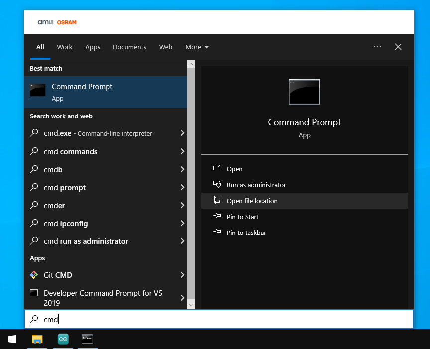

# LinkedLibrary

Using Windows' symbolic links to manage Arduino Libraries.

## Introduction

The Arduino IDE is a bit poor in managing (files of) bigger projects.
What I wanted is to make several applications (i.e. Arduino sketches).
But those applications share common code (i.e. Arduino libraries).
But I also want to store the applications and the libraries 
side by side in a git repository.

## My solution

I learned that Windows Vista (?) and up has symbolic links; shortcuts that are transparent for applications.
In this repo, there is
 - An application `myapp`, whose [sketch](mypapp\myapp.ino) uses `mylib`, namely `mylib_succ()`.
 - A library `mylib`, whose [source](mylib\src\mylib.cpp) implements `mylib_succ()`.
 - Those are side by side - but `myapp` can not find `mylib`.
 - A batch file [link.bat](link.bat) that uses `mklink` to create a link 
   `C:\Users\maarten\Documents\Arduino\libraries\mylib`
   to the repo.
 - Now, `myapp` does compile.
 
## Note

To execute `link.bat` you need a `cmd` shell with administrator privileges.

Hit the Windows button, start typing `cmd` and select Run As Administrator.

(end)