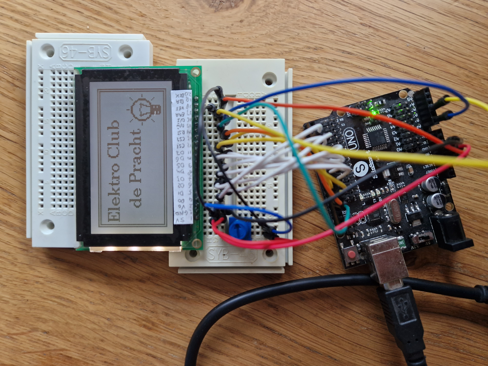

# NT7108-12864LCD

I was given a LCD module.
Took quite some time to get it running.


## Finding documentation

The display came from and original factory box.


The stamp shows the manufacturer name: POWERTIP.
There is also a type indication `PG12864WRF-JNN-H-P5`.

On the backside of the module there is similar information.
POWERTIP `PG12864J-P5(1.1)` and `PG12864WRF-JNN-H-P5`.


Some Googling revealed a [datasheet](PG12864WRF-JCNHP5Q.pdf).
The datasheet mentions controller ICs NT7107, NT7108.
I also found that [datasheet](nt7108.pdf).

I was confused about seeing two controllers (NT7107 and NT7108).
At this moment I believe it works as follows:
A single NT7108 can drive 64 columns of 64 rows.
So for a 128x64 display we need two NT7108.
However, the module also needs a row driver.
A single NT7107 drives 64 rows,
the row driver is controlled (and shared) by the column drivers.


## Wiring

I found some libraries for Arduino. 
One from [simple-circuit](https://simple-circuit.com/interfacing-arduino-with-ks0108-glcd-graphics-display-128x64-pixel/)
and also the famous [u8g2](https://github.com/olikraus/u8g2) from olikraus.
But at first both failed to work (and now, the "simple circuit" one still swaps columns).

The biggest issue turned out the wiring.
This is how I wired to get my sketch running.

- Section 2.2.1 of the [datasheet](PG12864WRF-JCNHP5Q.pdf) indicates a VDD of 5V (4.5V-5.5V).
  So I did my experiments with an Arduino Uno (that is 5V, unlike eg an ESP32).
  Please note that the [NT7108 datasheet](nt7108.pdf) lists as VDD from 2.7V to 5.5V,
  so maybe an ESP is possible after all.
   - Pin 1 VDD (supply voltage) needs to be wired to Uno 5V.
   - Pin 2 GND (ground needs) to be wired to Uno GND.

- Section 2.2.1 of the [datasheet](PG12864WRF-JCNHP5Q.pdf) explains how to power
  the backlight.
  - Pin 20 BLK (backlight kathode) needs to be wired to Uno GND.
  - Pin 19 BLA (backlight anode) needs to be wired to **3V3**. An Arduino UNO has a 3V3 out pin.
    No resister seems necessary.
  - A potmeter (10 to 20 kΩ) needs to bridge Vee (pin 18) and VDD (pin 1), the varying pin goes to Vo (pin 3).

    

- The module is a parallel module (8 lanes).
  - Pin 4 DB0 (data bus bit 0) needs to be wired to Uno GPIO 2. 
  - Pin 5 DB1 (data bus bit 1) needs to be wired to Uno GPIO 3. 
  - ...
  - Pin 11 DB7 (data bus bit 7) needs to be wired to Uno GPIO 9. 
  
- There are seveal control lines.
  - Pin 12 CS1 (chip select first column driver) needs to be wired to Uno GPIO 10. 
  - Pin 13 CS2 (chip select second column driver) needs to be wired to Uno GPIO 11.  
    Note that I had to **swap CS1 and CS2**.
  - Pin 14 RST (reset) needs to be wired to Uno GPIO 12. 
  - Pin 15 R/Wn (read/write select) needs to be wired to Uno GPIO 13.  
    Note that the **U8g2 library does not use R/Wn, it needs to be grounded**.
    I connect it to GPIO 13 and below Arduino sketch pulls that pin down in `setup()`.
  - Pin 16 D/In (data/instruction select, aka as data/command select), needs to be wired to Uno A0.  
  - Pin 17 ENA (enable), needs to be wired to Uno A2.  

|  1 |  2 |  3 |  4 |  5 |  6 |  7 |  8 |  9 | 10 | 11 | 12 | 13 | 14 | 15 | 16 | 17 | 18 | 19 | 20 |
|:--:|:--:|:--:|:--:|:--:|:--:|:--:|:--:|:--:|:--:|:--:|:--:|:--:|:--:|:--:|:--:|:--:|:--:|:--:|:--:|
| 5V |GND | Vo |DB0 |DB1 |DB2 |DB3 |DB4 |DB5 |DB6 |DB7 |CS1 |CS2 |RST |R/Wn|D/In|ENA |Vee |BLA |BLK |
| 5V |GND |pot2|  2 |  3 |  4 |  5 |  6 |  7 |  8 |  9 | 10 | 11 | 12 | 13 | A0 | A1 |pot1|3V3 |GND |  


## Firmware

The U8g2 library is a likely candidate.
Unfortunately, it does not list NT7108.
However, somewhere I found a snippet saying that BT7108 is a KS0108 clone.
With that, I got the U8g2 lib working.

With the above wiring, this is the constructor call
```cpp
U8G2_KS0108_128X64_1    u8g2(  /*rotation*/ U8G2_R0,        
  /*DB0..7=*/ 2,3,4,5,6,7,8,9, 
  /*enable=*/ A2, 
  /*D/In=  */ A0, 
  /*CS1=   */ 11, 
  /*CS2=   */ 10, 
  /*CS3=   */ U8X8_PIN_NONE, 
  /*RST=   */ 12);   
  /*R/Wn=  */ // This library does not use it; connect to GND on the PCB!
```

The `setup()` takes care of grounding R/Wn.

```cpp
void setup(void) {
  pinMode(13, OUTPUT); digitalWrite(13, 0); // R/Wn tied to GND
  u8g2.begin();  
}
```

The `loop()` draws the test screen.

```cpp
void loop(void) {
  u8g2.firstPage();
  do {
    u8g2.setFont(u8g2_font_ncenB10_tr);
    u8g2.drawStr(5,20,"Elektro Club");
    u8g2.drawStr(18,40,"de Pracht");
    u8g2.drawFrame(0,0,128,64);
    u8g2.drawFrame(2,2,124,60);
    u8g2.drawXBM( 93, 27, u8g_logo_width, u8g_logo_height, (uint8_t*)u8g_logo_bits);
  } while ( u8g2.nextPage() );
}
```

which results in



The full [sketch](demo) is available.

Of course,  it also runs on Nano.


(end of doc)


