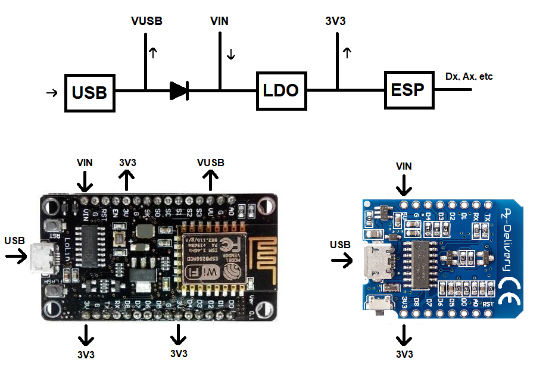
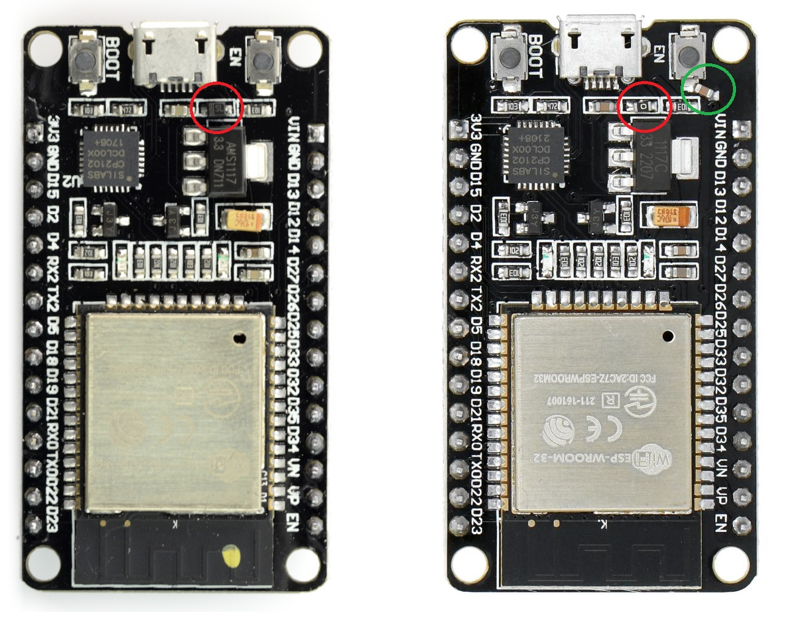

# NodeMCU power architecture

The NodeMCU board (ESP8266, ESP32) have several pins related to power.
What do these pins offer?

This is copied from [WordClock](https://github.com/maarten-pennings/WordClock).

## Power architecture

The ESP runs on 3V3, but typically comes on boards that are powerd via USB (and thus 5V).
These boards have a voltage regulator (LDO) that converts 5V to 3V3. The boards also have a VIN that 
connects to the regulator. This allows us to use an external power supply (4.3V-12V) instead of 
power over USB.

Note that there is a diode between the USB port and VIN. 
If you would externally power the NodeMCU board via VIN (say 9V), and you would also have connected the
USB port to a PC (e.g. for debugging using the Serial port) the external 9V would also be on the PCs USB port, 
possibly damaging it. The diode protects your PC against over-voltage.

There is an extra effect: the diode has a voltage drop. Typically, a Schottky diode is used, which has 
a voltage drop of only 0.3V. So if you plug in USB (5V), the voltage regulator has 4V7 as input, which is still
enough to have 3V3 out. The side effect is that VIN will be at 4V7.

You might want to power a 5V device from a NodeMCU board. 
It would be easiest to tab 5V from the USB port. Some boards do have a pin for that.
I call it VUSB in the diagram above. 
However not all (big) boards do have a VUSB pin, and the smaller boards typically never have one. 

We could use VIN as _output_ instead of _input_, and power the 5V device with VIN. 
This means the device run on 4V7, which is usually acceptable.
However, before we get enthusiastic about this setup, there is one drawback.
The diode is typically limited to 250mA.
So if a device draws more than that, the diode will burn out.

One option is to replace the diode with a solder dot.
In this way, the VIN is actually converted into a VUSB, and we can use that pin to power the 5V device.
Of course we lose the PC over voltage protection.

## ESP32 DEV KIT PRO V1

Many of these boards actually have the diode already replaced by a 0ohms resistor.
As en example see an "old" and a "new" DOIT ESP32 DEV KIT V1 board: the diode is replaced by a 0ohm (red circle).

By the way, notice the extra cap on the new board.
Presumable they make the Arduino reset and flash firmware via serial work (without the user pressing the boot button).

(end)
