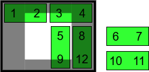

# How to solve the Quadro puzzle.

I, and Marc, stumbled upon the Quadro puzzle on [YouTube](https://www.youtube.com/shorts/B8nTNSduKsM).
I'm not sure what the origin is, this [seller](https://cruxpuzzles.co.uk/products/quadro) lists 
Yavuz Demirhan as the creator. You also find sites referring to it as the Quadra puzzle (with an A).

This how-to explains how you can reason towards the solution.

## Introduction

Quadro is a _packing puzzle_: you must fit all pieces into a given box. 

The pieces are straightforward; there are six, and they are all the same, they consist of 2×1 cubes.
The box is also straightforward, it has 4×3 cells.
So twelve cubes in a box of twelve cells, what is the catch?

The catch is an opening into the puzzle box that restricts entering pieces.

It is important to understand the geometry.
The box has 4 by 3 cells, the gap is 2 by 2 cells.
The gap has a horizontal offset of 1 cell and a vertical offset of ½ a cell.
Although there is a bit of play so that the pieces move smoothly, the play does
not allow for tricky moves like rotation.
The geometry is sketched below.

Terminology-wise we will say that there are 6 _piecese_ each consisting of two _cubes_.
They need to fit in a _box_ consisting of 12 _cells_.
Pieces will be shifted horizontally or vertically, that is in the _xy-plane_,
or they move in the _z-direction_, that is, they are taken out of the box via the _gap_.

## Analysis

You can solve this puzzle via _reasoning_.

We start by assuming the puzzle is solved.
With that we mean that all pieces are in the box.
And we will take the pieces out one by one.

### End situation

When the puzzle is solved we do not know is how the cubes connect to pieces.
So we begin with drawing just the  cubes, not yet the pieces.

 
### Situation 1

In the end situation, the box is full.
Therefore, no piece can move in the xy-plane.
The only legal move would be if cube 6 and 7 form one piece and move in z-direction (are taken out).

### Situation 2

We now ask what cube 2 is connected two.
There are only two possibilities: either cube 2 is connected to cube 1 or to cube 3.
From that choice follows the rest of the "chain".
Below diagram sketches both possible chains.

Observe that they are the same under 180° rotation.
We will continue with the left one only.

### Situation 3

Given the chain, none of the pieces can move, in the xy-plane or in the z-direction,
with one exception: piece 10-11  can move in the y-direction.

### Situation 4

With 10-11 in the center, none of the pieces can move, in the xy-plane or in the z-direction,
with one exception: again piece 10-11  can move in the y-direction but now also in the z-direction.
The y-direction brings us back to the previous situation, so we discard that.

We take out 10-11.

### Situation 5

Now it gets a bit more complicated. Pieces 1-2 and 3-4 are locked, 
but pieces 5-9 and 8-12 can both move in the x-direction.
But in the end, only 6 variations exists.

In the diagram below, the top row (variations A, B, C) shows the variations where 8-12 stays right,
the middle row (variations D and E) where 8-12 is moved one cell, and
the bottom row (variation F) shows where 8-12 has moved 2 cells.

For symmetry reasons, we ignore variations D and F.

However, we can also ignore variations A, B and E.
In those situation no move is possible except moving 5-9 or 8-12, leading to one of A-F.
So we only consider C. In other words, from situation 4 we get to the following situation.

Note that C (and with symmetry F) is the only variation where we unlock 1-2 (or 3-4).

### Situation 6

In this situation we can move 5-9 (and/or 8-12), but that only circles around in the
variations of situation 5.

So we start moving 1-2; leading to 7 variations.

First column (A) shows where 1-2 stays at the top.
Middle column (B, C, D) shows where 1-2 has moved 1 down,
and the last column (E, F, G, H) where 1-2 moved 2 down.

Again, we will ignore A, B, C, and E.
In those variations no move is possible except moving 1-2 or 3-4, leading to one of A-H.
So we are left with three variations in step 6: D, G and H.

> To be fair there are more variations, because as soon as 3-4 is moved, we can move 8-12 or even 5-9. But this is more or less what we do next.

### Situation 7

We can now stop analysing and rush to emptying the box.
We have three variations (D, G, H), but in all three we move 5-9 by half a cell.

### Situation 8

Now we can move 5-9 in the z-direction to take it out.

The rest of the emptying of the box is left to the reader.

## Solution

The solution to packing the pieces in the box is to make the above steps
in reverse order.

(end)

