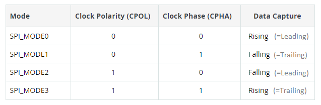
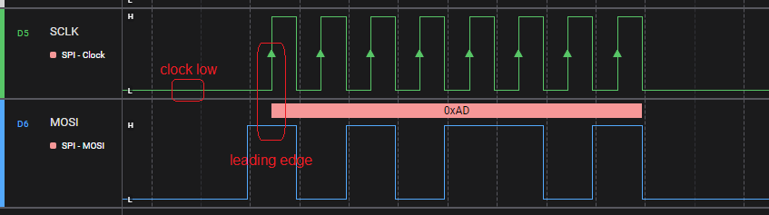
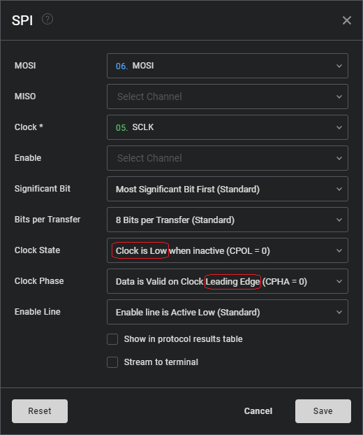
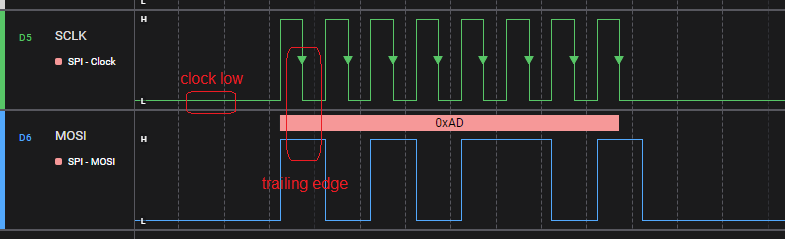
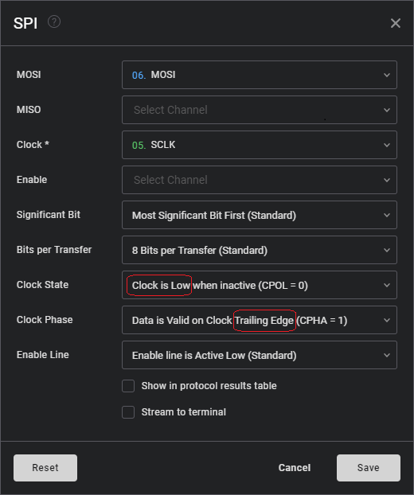
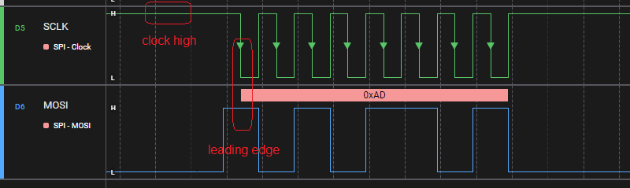
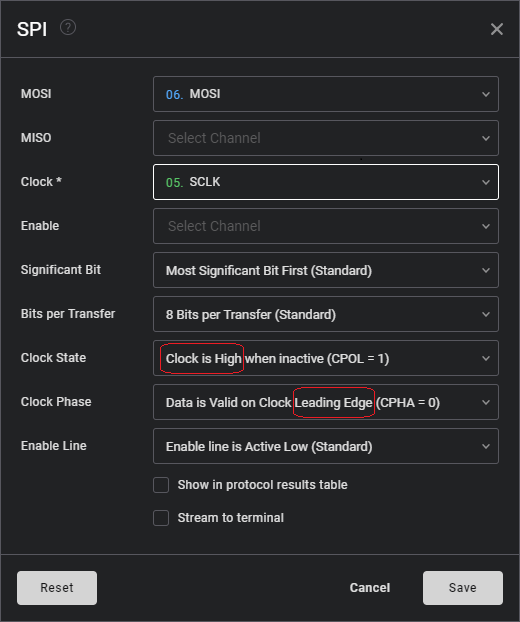
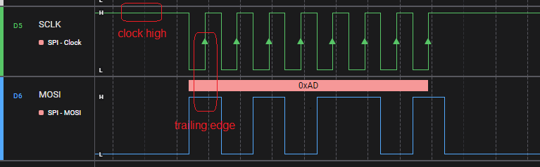

# SPI modes

SPI communication knows much more variation than e.g. I2C.
This "how to" looks at the four modes induced
by CPOL (default clock state) and CPHA (data valid phase).

Arduino has the [following table](https://docs.arduino.cc/learn/communication/spi) giving an overview of the modes.

The [sketch](SPImodes.ino) is available.
The traces are made with [Saleae](https://www.saleae.com/).

## Mode 0

## Mode 1

## Mode 2

## Mode 3

(end)
