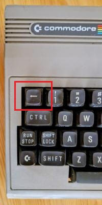
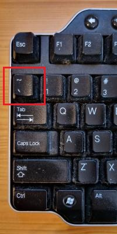
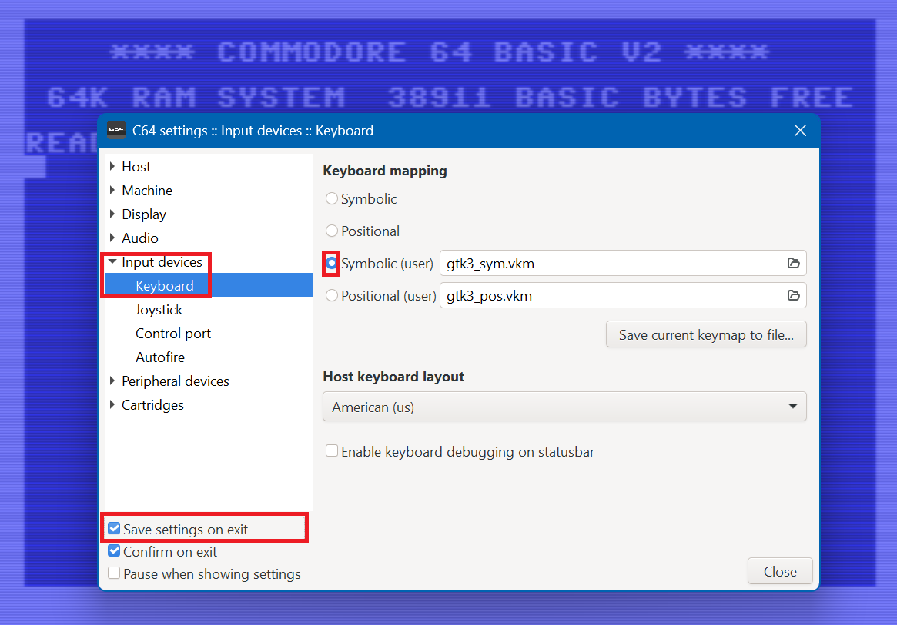
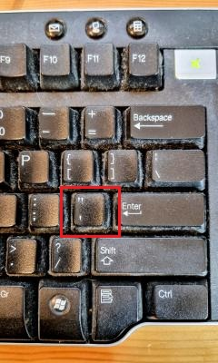
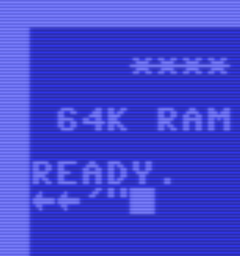

# Vice keyboard

[VICE](https://vice-emu.sourceforge.io/) is a PC program that emulates amonst other the Commodore 64 (C64).
I was running the [TMP (Turbo Macro Pro)](https://turbo.style64.org/) assembler on it.
TMP is a bit like VI: the left arrow key (the upper left key on the C64 keyboard with the symbol `←`) 
is the command key. See official [doc](https://turbo.style64.org/docs/turbo-macro-pro-editor) or 
[here](https://github.com/PotcFdk/JSIDPlay2/blob/master/jsidplay2/src/test/resources/cpu/Testsuite/Ass/tmp-general.txt#L178)
for the list of commands.

 

VICE needs to map PC keys to C64 keys and does a pretty good job.
Except that on my system, I had to press SHIFT-grave, to get the tilde, which maps to the command key (`←`).

This document explains how to change that key mapping.


## Enabling key mapping

The first step is to enable user key mapping, and make that persistent.

Start VICE, go to Preferences Settings and select Symbolic (user).
Also click "Save settings on exit".



Close Settings and exit VICE.
The configuration file of VICE is now updated.

On my system I find it at `C:\Users\maarten\AppData\Roaming\vice\vice.ini`.

```text
[Version]
ConfigVersion=3.9

[C64SC]
SaveResourcesOnExit=1
Window0Height=1152
Window0Width=1327
Window0Xpos=1295
Window0Ypos=261
KeymapIndex=2
```

We see four settings:

- The emulator window size (`Window0Height` and `Window0Width`) and position (`Window0Xpos` and `Window0Ypos`)
- The Symbolic user keymap (`KeymapIndex=2`)
- Save on exit (`SaveResourcesOnExit=1`)

I personally changed `SaveResourcesOnExit=1` to `SaveResourcesOnExit=0`.


## Changing the key mapping

We saw in the Settings dialogue that the key mapping file is named `gtk3_sym.vkm`.
We find it in the installation directory. On my system that is 
`C:\Programs\GTK3VICE-3.9-win64\C64\gtk3_sym.vkm`.

Before editing you might want to make a copy of that file.

In my file, on line 163 I find the mapping:

```
grave           3 0 1
```

This maps the PC key `grave` (`` ` ``) to keyboard row 3 and column 0 of the C64.
On line 80 of `gtk3_sym.vkm` we find the C64 keyboard row/col matrix and see 
that indeed 3,0 maps to an accent (the wrong one, the tick or egute `'` as 
opposed to backtick `` ` `` or grave, but C64 only has one flavor of ticks, 
so no worries about this).

```
# C64 keyboard matrix:
#
#       +-----+-----+-----+-----+-----+-----+-----+-----+
#       |Bit 0|Bit 1|Bit 2|Bit 3|Bit 4|Bit 5|Bit 6|Bit 7|
# +-----+-----+-----+-----+-----+-----+-----+-----+-----+
# |Bit 0| DEL |Retrn|C_L/R|  F7 |  F1 |  F3 |  F5 |C_U/D|
# +-----+-----+-----+-----+-----+-----+-----+-----+-----+
# |Bit 1| 3 # |  W  |  A  | 4 $ |  Z  |  S  |  E  | S_L |
# +-----+-----+-----+-----+-----+-----+-----+-----+-----+
# |Bit 2| 5 % |  R  |  D  | 6 & |  C  |  F  |  T  |  X  |
# +-----+-----+-----+-----+-----+-----+-----+-----+-----+
# |Bit 3| 7 ' |  Y  |  G  | 8 ( |  B  |  H  |  U  |  V  |
# +-----+-----+-----+-----+-----+-----+-----+-----+-----+
# |Bit 4| 9 ) |  I  |  J  |  0  |  M  |  K  |  O  |  N  |
# +-----+-----+-----+-----+-----+-----+-----+-----+-----+
# |Bit 5|  +  |  P  |  L  |  -  | . > | : [ |  @  | , < |
# +-----+-----+-----+-----+-----+-----+-----+-----+-----+
# |Bit 6|POUND|  *  | ; ] | HOME| S_R |  =  | A_UP| / ? |
# +-----+-----+-----+-----+-----+-----+-----+-----+-----+
# |Bit 7| 1 ! |A_LFT| CTRL| 2 " |SPACE|  C= |  Q  | R/S |
# +-----+-----+-----+-----+-----+-----+-----+-----+-----+
```

I changed that line to

```
grave           7 1 1
```

Note that row 7 col 1 is key A_LFT (`←`) on the C64.


## Testing

With the keymap file saved, restart VICE.
Hit the backtick/tilde key with and without shift.
In both cases it now gives `←`.

You could change the keymap file that backtick/tilde with shift now gives the tick.
However, on my keyboard there is a tick key next to ENTER.



Pressing that one without and with shift give `'` and `"`.



So, that is good (enough) for now.

(end)


