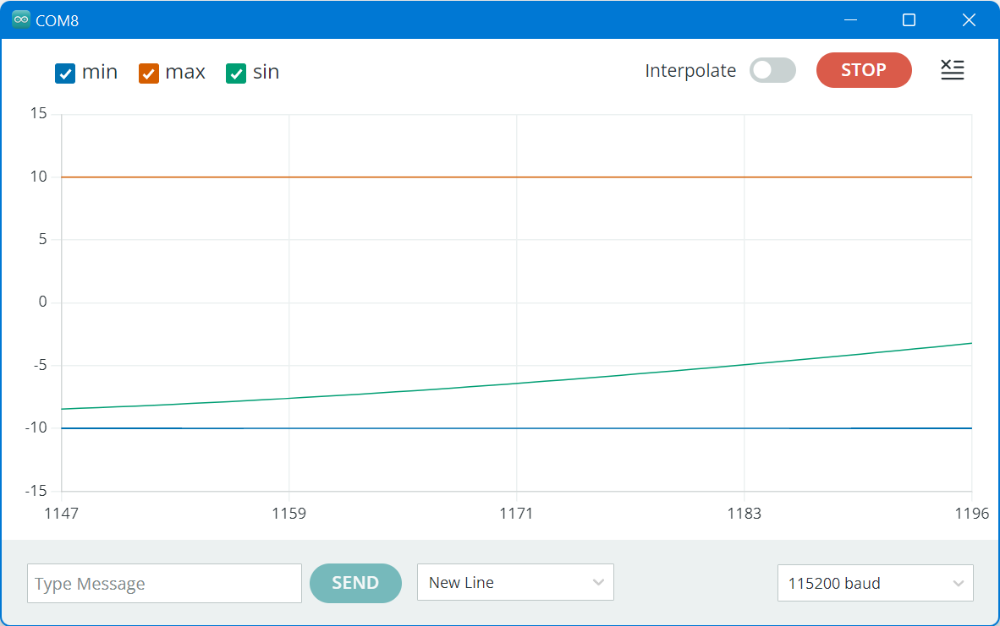
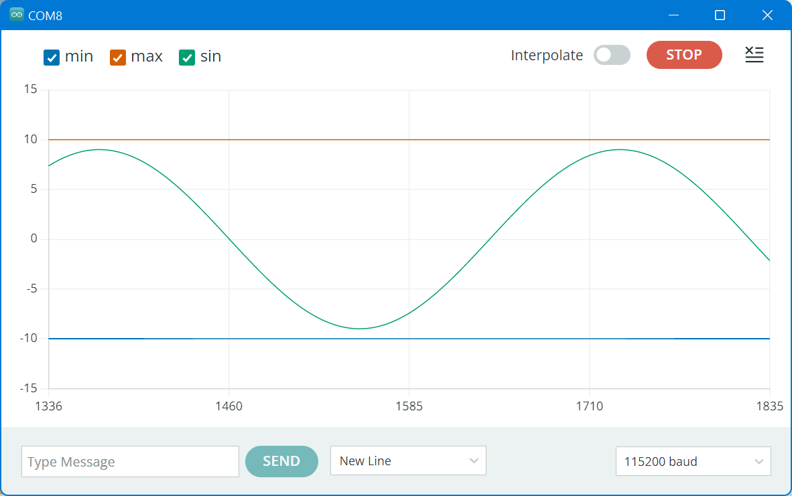

# Wide Arduino Serial plotter

The Serial Plotter in Arduino 2.0 has a too narrow x-axis. That can be patched wider.


## Introductions

An Arduino sketch can issue `Serial.print` to print numbers, which can then be graphed.

To be more precise, the sketch shall only print numbers, optionally prefixed with a labels, as in below example.

```C
  Serial.printf("min:-10 max:+10 sin:%f\n",9.0*sin(t/180*3.14159));
```

Then Tools > Serial Plotter will output something like



In Arduino 1.8, this serial plotter had an x-axis size of 500, but in Arduino 2.0/2.1/2.2 (and maybe up) 
the x-axis is only 50 (1147..1196), and can not be configured.


## Making the serial plotter wider

[Someone found out](https://github.com/arduino/arduino-ide/issues/803#issuecomment-1338149431) that the serial plotter is a web application.
The source of that web application (html, css, js) is part of the Arduino install, otherwise it could not be run.
But that also means we can change that source. We need to change the file `main.35ae02cb.chunk.js`,
but on different machines, I found it in different directories:

 - `…\AppData\Local\Programs\Arduino IDE 2\resources\app\node_modules\arduino-serial-plotter-webapp\build\static\js`
 - `…\AppData\Local\Programs\Arduino IDE\resources\app\lib\backend\resources\arduino-serial-plotter-webapp\static\js`
 - `C:\Program Files\ArduinoIDE2\Arduino IDE\resources\app\lib\backend\resources\arduino-serial-plotter-webapp\static\js`,

I'm note sure where the difference comes from (install for one user, install for all).

Anyhow, locate the file `main.35ae02cb.chunk.js`, search for `(50)` and 
change `Object(o.useState)(50)` to `Object(o.useState)(500)`. The previous graph now runs from 1336 to1835 (500 ticks).



## Demo

I used [arduino2.0-wideplot.ino](arduino2.0-wideplot.ino) as demo app.

(end)
