# Keyboard mapping for BMC64

Commodore 64 emulation, the keyboard mapping.


## Introduction

The BMC64 (see [GitHub](https://github.com/randyrossi/bmc64) or 
[accentual](https://accentual.com/bmc64/)) is an C64 emulator running on a 
Raspberry Pi. It uses [VICE](https://vice-emu.sourceforge.io/) as emulator,
which means emulation is great - up to multi kernal, PAL/NTSC, screen color 
config, drive sound emulation, etc. The best thing about BMC64 is that it 
runs VICE directly ("bare metal") on the Pi hardware, getting rid of the 
Linux layer. This means that your emulated commodore boots in a couple of 
seconds, and that you can just unplug power when you're done.

Getting started was really easy. Format an SD card, download 
`bmc64-4.2.files.zip` from [accentual](https://accentual.com/bmc64/), unpack 
and copy to the SD card. Get C64 roms (kernal, chargen, basic, d1541II) e.g. from 
[Zimmers](https://www.zimmers.net/anonftp/pub/cbm/firmware/computers/c64/index.html)
and place them in the `C64` dir of the SD card. SD card in RPi 3b+, 
power on and go! 

What is this howto about? 
I have a small old USB keyboard laying around and want to use that for my BMC64. 

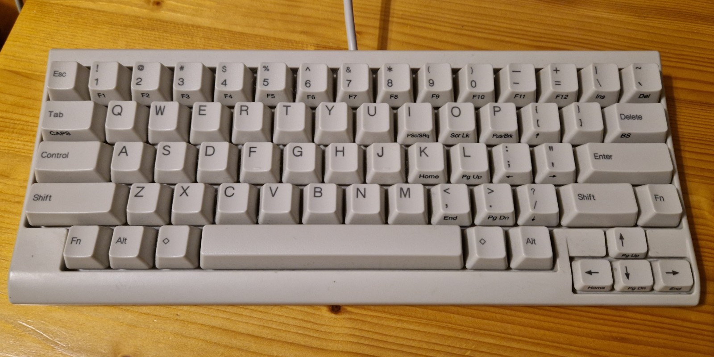

I want the layout to be close to the real C64 keyboard.

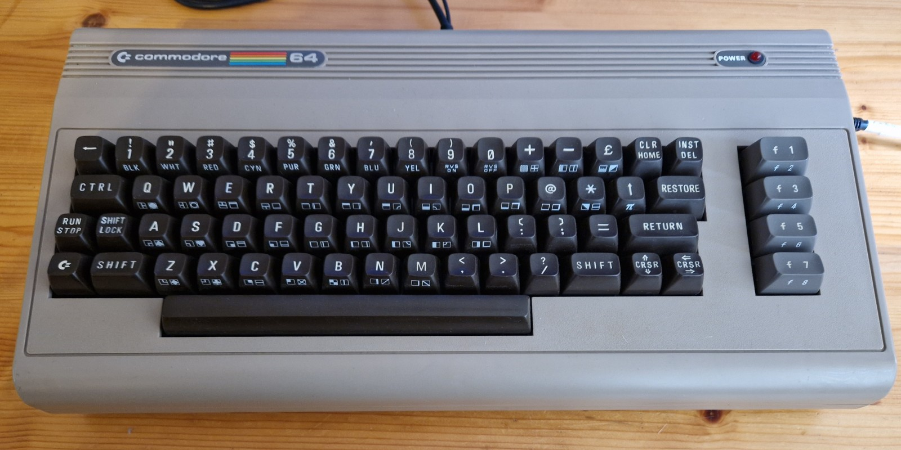


## Keyboard mapping theory

The keyboard emulation works like this: whenever the user presses a key, 
VICE receives an event. Part of the event is a value called a keysym, which is 
unique to that key. The emulator then looks up that keysym in an internal 
mapping table, which tells which key to press or release on the emulated keyboard.

We need to define such a mapping table.

The BMC64 has a "meta menu" that pops up by pressing F12.
This allows to configure your emulated computer and the attached
devices like disk drives, cartridges, tapes, joysticks, and keyboard. 

When we configure the kernal rom to be used, we get a file browser 
where we can select some file to be used as kernal rom. Likewise,
there is also a file that defines the keyboard mapping, but the menu 
does not allow us to select a keyboard mapping file. Instead we get an
enumeration that we can change with cursor left and cursor right.
An each enumerated value is associated with some specific mapping file.

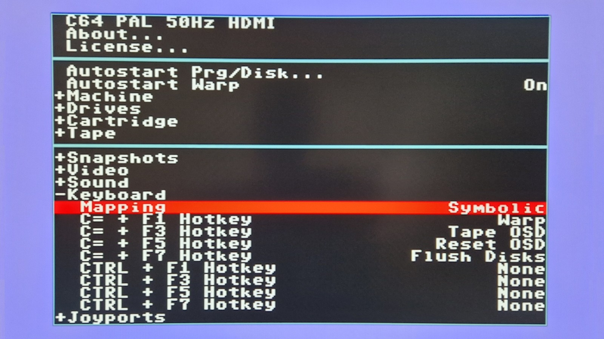

I decided to go for setting "Symbolic". The associated file appears to 
be `"D:\C64\rpi_sym.vkm"`. I decided to modify that file. Of course 
I first made a copy of the original [`rpi_sym.vkm`](rpi_sym0.vkm).

There are several meta commands in the file. They start with `!`.
The meta commands mainly define where the shift keys are. The rest of the file is 
_key mappings_, one per line. Every key mapping consists of four fields. 
The comments explain that these are `keysym/scancode row column shiftflag`. 
I find that a bit cryptic.

What it means is that the first field, keysym is a string that describes
a key issued by the physical keyboard. It is the "source" key. The next two 
fields are integers that describe the _location_ (row and column) of the C64 key
that we want to associate with the keysym. It is the "target" key.
The final field describes how this mapping relates to shift.


### Keysym

When running VICE on a PC there is a debug feature to easily find a keysym.

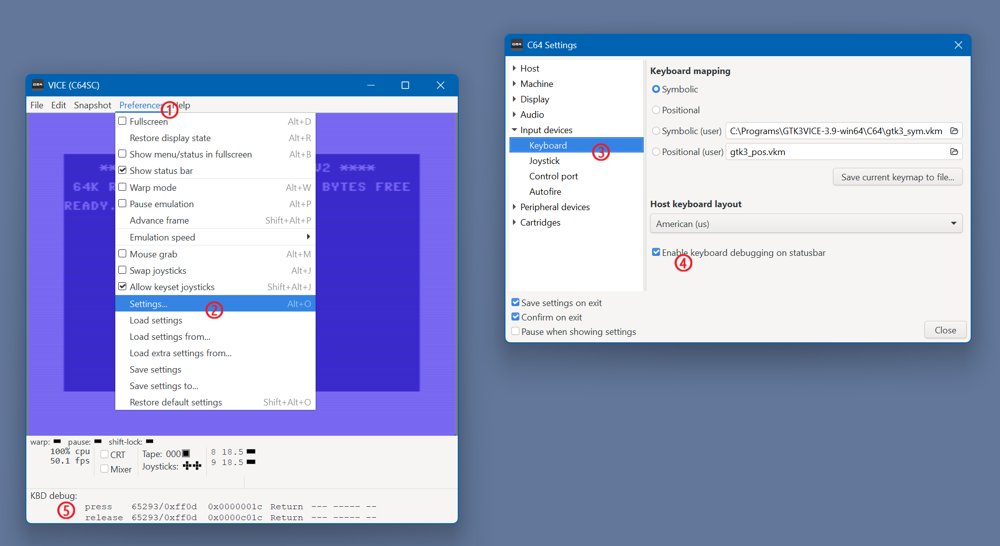

When you press a key, the extra debug lines in VICE, show the keysym string of 
that key. In the above screenshot, the `Return` key was pressed and released. The 
keysyms on BMC64 are largely equal, but some are different from the ones for VICE
on PC. I'm not sure why, maybe a VICE version difference (on PC I run 3.9, 
BMC64 uses [VICE 3.3](https://github.com/randyrossi/bmc64/tree/master/third_party/vice-3.3)).

To get the keysyms for BMC64, I first inspected the file `/kernel.img` 
(this the BMC64 kernel, not to be confused with `/C64/kernal` the C64 kernal file) 
and found on file offset 2884288 (0x2c02c0) What looks like an array of keysyms. 
Later I found the same list in the [source](https://github.com/randyrossi/bmc64/blob/master/third_party/common/kbd.c#L153):
`Return`, `BackSpace`, `PageUp`, `Delete`, `PageDown`, `CapsLock`, `Comma`, 
`comma`, `Period`, `period`, `RightBracket`, `asterisk`, `Del`, `arrowup`, 
`Shift_L`, `Shift_R`, `Dash`, `plus`, `BackQuote`, `arrowleft`, `Equals`, 
`minus`, `SemiColon`, `Home`, `End`, `slash`, `BackSlash`, `Pound`, `Insert`, 
`sterling`, `SingleQuote`, `semicolon`, `Tab`, `Control_L`, `Control_R`, 
`Alt_L`, `Alt_R`, `Super_L`, `Super_R`, `Escape`, `LeftBracket`, `at`, 
`F1`, `F2`, `F3`, `F4`, `F5`, `F6`, `F7`, `F8`, `F9`, `F10`, `F11`, 
`ScrollLock`, `KP_Divide`, `KP_Decimal`, `KP_Multiply`, `KP_Subtract`, `KP_Add`, `KP_Enter`, 
`KP_1`, `KP_2`, `KP_3`, `KP_4`, `KP_5`, `KP_6`, `KP_7`, `KP_8`, `KP_9`, `KP_0`.

There are double names (`comma` and `Comma`), something to do with [legacy](https://github.com/randyrossi/bmc64/blob/master/third_party/common/kbd.c#L68).


### Row and column

The C64 keyboard keys are wired in 8 rows of 8 columns. 
This is the matrix

   |         |**Col 0**|**Col 1**|**Col 2**|**Col 3**| **Col 4** |**Col 5**|**Col 6**| **Col 7** |
   |:--------|:-------:|:-------:|:-------:|:-------:|:---------:|:-------:|:-------:|:---------:|
   |**Row 0**|INST DEL | RETURN  |← CRSR → |    F7   |     F1    |    F3   |    F5   | ↑ CRSR ↓  |
   |**Row 1**|   3 #   |    W    |    A    |   4 $   |     Z     |    S    |    E    |SHIFT (lft)|
   |**Row 2**|   5 %   |    R    |    D    |   6 &   |     C     |    F    |    T    |     X     |
   |**Row 3**|   7 '   |    Y    |    G    |   8 (   |     B     |    H    |    U    |     V     |
   |**Row 4**|   9 )   |    I    |    J    |    0    |     M     |    K    |    O    |     N     |
   |**Row 5**|    +    |    P    |    L    |    -    |    . >    |   : [   |    @    |    , <    |
   |**Row 6**|    £    |    *    |   ; ]   |CLR HOME |SHIFT (rgt)|    =    | ↑ (sym) |    / ?    |
   |**Row 7**|   1 !   | ← (sym) |   CTRL  |   2 "   |   SPACE   |    C=   |    Q    | RUN STOP  |

There are two keys missing in the matrix. The SHIFT LOCK key is a self-locking key 
connected in parallel to the non-locking shift key. Secondly, the RESTORE key 
is wired directly to the NMI pin of the CPU. They might be absent in the 
C64 row/column matrix, we still need to emulate them, just like all other keys.

VICE has added extra rows with negative values for these special keys, and some others.

 - keysym -1 n -- joystick #1/A, direction n
 - keysym -2 n -- joystick #2/B, direction n
 - keysym -3 0 -- first RESTORE key
 - keysym -3 1 -- second RESTORE key
 - keysym -4 0 -- 40/80 column key
 - keysym -4 1 -- CAPS (ASCII/DIN) key
 - keysym -5 n -- joyport keypad, key n


### Shiftflags

The shiftflags determine how VICE deals with key shifts. Quite a complex issue.

First be warned the BMC64 has far fewer shiftflags than VICE on PC, again, maybe 
due to BMC64 using an older version of VICE. I believe the shiftflags in BMC64 
are restricted to 1, 2, 4, 8, 16, 32, and 64. It seems the PC version adds
128, 256, 512, 1024, 2048, 4096 and even 32768.

- The emulator has to **de-shift** (remove the shift modifier) from some keys.  
  For example, on the PC keyboard, if you want to get a `:`, you have to 
  press `;` and `Shift` simultaneously. The emulator sees the events 
  "`Shift` pressed" and "`;` pressed". We want the emulator to fire 
  row 5 col 5 (`: [`), however not with shift otherwise we would get `[`.
  
  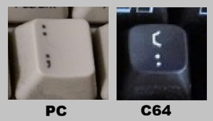
  
  Typically the `Shift` key on the PC keyboard is mapped to the `SHIFT` key 
  of the emulated C64. But for the above example, the emulated shift should be 
  undone (By the way, this is tricky, because we start by pressing `Shift`, 
  which will cause a `SHIFT` on the emulated C64. Only when the `;` is pressed,
  the emulator should remove the `SHIFT` and emulate the `:` press).

- The emulator has to **spoof-shift** (add a shift) for some keys.  
  For example on a PC keyboard, if you want to get a square bracket `[`, you press
  the `[` key without shift, or you would get `{`. 
  We want the emulator the fire  row 5 col 5 but with a spoofed shift, 
  otherwise we would get `:`

  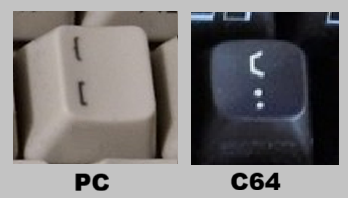

The associated shiftflags:
 - 0      key is not shifted for this keysym
 - 1      key is shifted for this keysym (press `7` with shift will fire `&`)
 - 8      key can be shifted or not with this keysym (press `A` without or with will fire `A` respectively `♠`)
 - 16     deshift key for this keysym (press `2` with shift will fire `@` without shift)

Some shiftflags _define_ a key
 - 2      left shift
 - 4      right shift
 - 64     shift lock

It is possible to use one keysym with multiple shiftflags, or in other words, map one
keysym to multiple C64 keys. The following shiftflag shall be used for that.
 - 32     another definition for this keysym/scancode follows


Shiftflags can be OR-ed together.

## My mapping

I found out that the `Alt` key does not work on BMC64.
By the way, in practice it doesn't work on VICE-on-PC either, because `Alt`
maps to hot-keys in VICE itself, e.g. ALT-Q is exit VICE.

Also the `Windows` key (typically next to `Alt`) does not work on VICE-on-PC 
either, because Windows itself "steals" that key, e.g. Windows-E starts 
the file explorer.

However, it turns out that on BMC64, the `Windows` key is free since there is no OS.
I decided to map that to the `C=` key. This was important for me, because 
the usual mapping of `Control` to `C=`, then `Tab` to `Control`, and finally `Esc` 
to `RUN/STOP` sacrifices the  `←` (left arrow) key which is important in 
Turbo Macro Pro. I want to have the `←` key, and in the correct position.

Below sections show the mappings graphically, one row of keys at a time. 
The blue lines denotes a key mapping. The dot is the source side of the line. 
If there is a second mapping, then there 
is a dot on the first target key with a line to the second target key. 
The lines are tagged with the shiftflags value.


### Row 1

The most important decisions, as mentioned above, was to map `Esc` to `←`.
Next I have two other positional mappings that I thought were relevant: 
`\` to `CLR/HOME` and `` ` `` to `INST/DEL`. 

I decided to do the mappings of the shifted digits symbolic rather than 
positional. Underscore does not exist on the C64 keyboard, I mapped that to π.

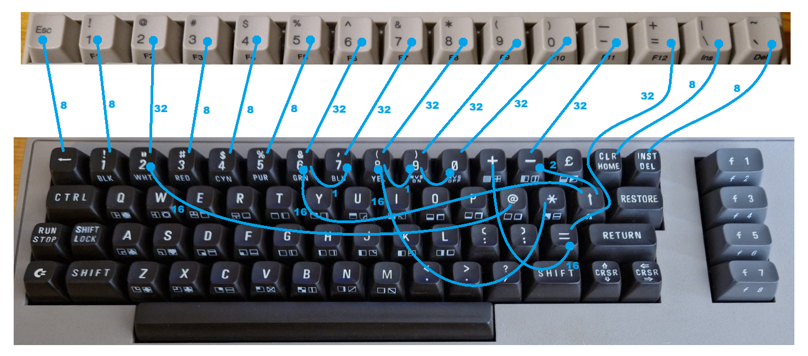

### Row 2

Slightly scary is mapping `Tab` to `CONTROL`, or `Delete` to `RESTORE`.
The latter requires a negative row value.
Curly braces do not exist on the C64 keyboard, I mapped them to `£` and `↑`.

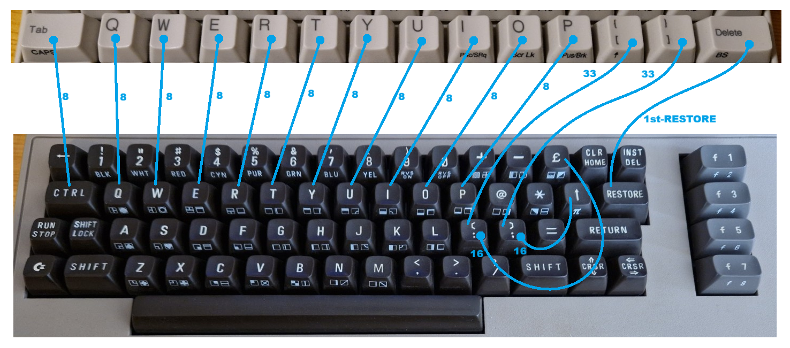

The `Tab` key has a dual function with `Fn` but I did not succeed in making
it work as a `SHIFT LOCK`. But I don't need `SHIFT LOCK` so a give up after a 
few tries.


### Row 3

Slightly scary is mapping `Control` to `RUN/STOP`.
And we have a key (`' "`) for the symbols with two digit keys that we missed.

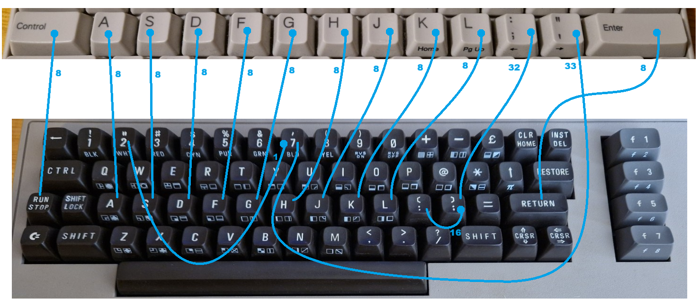


### Row 4

Very simple row, even the mapping of the two `Shift` keys is straightforward.

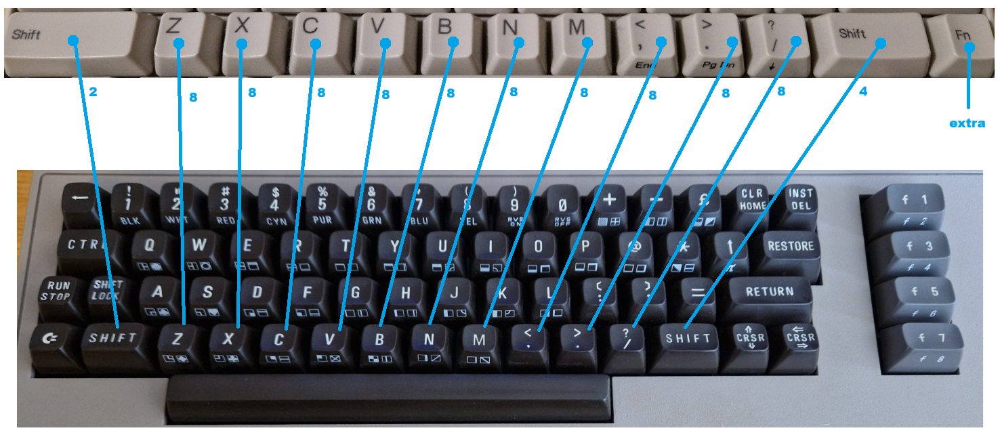

The `Fn` is explained in the last section for extra mappings.


# Row 5

The `Fn` is used in the last section for extra mappings.
As mention `Alt` does not seem to work, I skipped it.
But the `Windows` key, labeled with a diamond, also known as `Meta` or `Super`
is available: I map it to `C=`.

The cursor keys are mapped without shift.

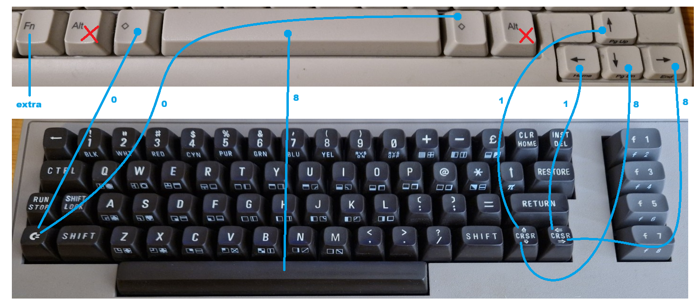


# Extra

My keyboard does not have functions keys, but it has an `Fn` shift key.
However, not all those keys occur in the keysym table, e.g. PrintScreen is missing.

Of course I want the 8 function keys.

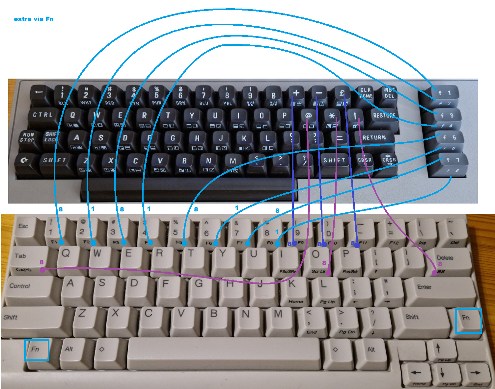

I decided to map some other `Fn` keys to those C64 keys that do not have their own
key on the PC keyboard, but that do have graphic characters.
This allows me to use, e.g. `Fn`+`F9` as the `+` key, so with 
`Windows`-`Fn`-`F9` and `Shift`-`Fn`-`F9` I do get the two graphics characters 
from the `+` key.

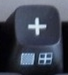


## My file

I stored the [original](rpi_sym0.vkm) mapping, and my latest mapping
[v8](rpi_sym8.vkm) in this repo. 


This is the content.

```
# VICE keyboard mapping file BMC64 (rpi_sym.vkm) - edited by Maarten - V8
#
# A Keyboard map is read in as patch to the current map.
#
# File format:
# - comment lines start with '#'
# - keyword lines start with '!keyword'
# - normal line has 'keysym/scancode row column shiftflag'
#   keysym's that seem to be recognized, see D:\kernel.img "line" 31064
#   or bmc64-master\third_party\common\kbd.c function kbd_arch_keyname_to_keynum() at line 153
#     Return BackSpace  PageUp Delete PageDown  CapsLock  Comma  comma
#     Period period RightBracket  asterisk  Del arrowup Shift_L Shift_R Dash
#     plus  BackQuote  arrowleft  Equals minus  SemiColon  Home  End slash
#     BackSlash  Pound  Insert sterling  SingleQuote semicolon  Tab 
#     Control_L  Control_R  Alt_L  Alt_R  Super_L Super_R Escape LeftBracket at 
#     F1 F2 F3 F4 F5 F6 F7 F8 F9 F10 F11 ScrollLock 
#     KP_Divide  KP_Decimal KP_Multiply KP_Subtract KP_Add KP_Enter
#     KP_1  KP_2  KP_3  KP_4  KP_5  KP_6  KP_7  KP_8  KP_9  KP_0
#
# Keywords and their lines are:
#   '!CLEAR'               clear whole table
#   '!INCLUDE filename'    read file as mapping file
#   '!LSHIFT row col'      left shift keyboard row/column
#   '!RSHIFT row col'      right shift keyboard row/column
#   '!VSHIFT shiftkey'     virtual shift key (RSHIFT or LSHIFT)
#   '!SHIFTL shiftkey'     shift lock key (RSHIFT or LSHIFT)
#   '!UNDEF keysym'        remove keysym from table
#
# Shiftflag can have the values (note: subset from VICE on PC):
#   0      key is not shifted for this keysym/scancode = Key is not shifted on the real machine.
#   1      key is shifted for this keysym/scancode = The key needs a shift on the real machine.
#   2      left shift = Key is left shift
#   4      right shift = Key is right shift
#   8      key can be shifted or not with this keysym/scancode = Allow key to be shifted
#   16     deshift key for this keysym/scancode = Although SHIFT might be pressed, do not press shift on the real machine.
#   32     another definition for this keysym/scancode follows = Allow another key code to be assigned if SHIFT is pressed.
#   64     shift lock = Key is shift lock
#   256    key is used for an alternative keyboard mapping
#
# Negative row values:
#   'keysym -1 n' joystick #1/A, direction n
#   'keysym -2 n' joystick #2/B, direction n
#   'keysym -3 0' first RESTORE key
#   'keysym -3 1' second RESTORE key
#   'keysym -4 0' 40/80 column key
#   'keysym -4 1' CAPS (ASCII/DIN) key
#   'keysym -5 n' joyport keypad, key n
#
# Joystick direction values:
#   0      Fire
#   1      South/West
#   2      South
#   3      South/East
#   4      West
#   5      East
#   6      North/West
#   7      North
#   8      North/East
#
# C64 keyboard matrix:
#         +-----+-----+-----+-----+-----+-----+-----+-----+
#         |Col 0|Col 1|Col 2|Col 3|Col 4|Col 5|Col 6|Col 7|
#   +-----+-----+-----+-----+-----+-----+-----+-----+-----+
#   |Row 0| DEL |Retrn|C_L/R|  F7 |  F1 |  F3 |  F5 |C_U/D|
#   +-----+-----+-----+-----+-----+-----+-----+-----+-----+
#   |Row 1| 3 # |  W  |  A  | 4 $ |  Z  |  S  |  E  | S_L |
#   +-----+-----+-----+-----+-----+-----+-----+-----+-----+
#   |Row 2| 5 % |  R  |  D  | 6 & |  C  |  F  |  T  |  X  |
#   +-----+-----+-----+-----+-----+-----+-----+-----+-----+
#   |Row 3| 7 ' |  Y  |  G  | 8 ( |  B  |  H  |  U  |  V  |
#   +-----+-----+-----+-----+-----+-----+-----+-----+-----+
#   |Row 4| 9 ) |  I  |  J  |  0  |  M  |  K  |  O  |  N  |
#   +-----+-----+-----+-----+-----+-----+-----+-----+-----+
#   |Row 5|  +  |  P  |  L  |  -  | . > | : [ |  @  | , < |
#   +-----+-----+-----+-----+-----+-----+-----+-----+-----+
#   |Row 6|POUND|  *  | ; ] | HOME| S_R |  =  | A_UP| / ? |
#   +-----+-----+-----+-----+-----+-----+-----+-----+-----+
#   |Row 7| 1 ! |A_LFT| CTRL| 2 " |SPACE|  C= |  Q  | R/S |
#   +-----+-----+-----+-----+-----+-----+-----+-----+-----+
#
# My mini keyboard 
#   left  side of box in below diagram: unshifted and shifted key
#   right side of box in below diagram: the Fn-shifted key
#
#   +------+------+------+------+------+------+------+------+------+------+------+------+------+------+------+
#   |Esc   |1!  F1|2@  F2|3#  F3|4$  F4|5%  F6|6^  F6|7&  F7|8*  F8|9(  F9|0) F10|-_ F11|+= F12||\ Ins|~` Del|
#   +------+--+---+--+---+--+---+--+---+--+---+--+---+--+---+--+---+--+---+--+---+--+---+--+---+---+--+------+
#   |Tab  CAPS|  Q   |  W   |  E   |  R   |  T   |  Y   |  U   |I  PSc|OScrLk|P PBrk|[{   ↑|]}     |Del    BS|
#   +---------+--+---+--+---+--+---+--+---+--+---+--+---+--+---+--+---+--+---+--+---+--+---+--+----+---------+
#   | Control    |  A   |  S   |  D   |  F   |  G   |  H   |  J   |K Home|L PgUp|;:   ←|'"   →|    Return    |
#   +------------+--+---+--+---+--+---+--+---+--+---+--+---+--+---+--+---+--+---+--+---+--+---+-------+------+
#   | Shift         |  Z   |  X   |  C   |  V   |  B   |  N   |  M   |<, End|.>PgDn|/?   ↓|   Shift   |  Fn  |
#   +------+------+-+----+-+----+-+------+------+------+------+------+----+-+----+-+---+--+----+------+------+
#          |  Fn  | Alt  | Win  |                  Space                  | Win  | Alt |       |↑ PgUp|
#          +------+------+------+-----------------------------------------+------+-----++------+------+------+
#                                                                                       |← Home|↓ PgDn|→  End|
#                                                                                       +------+------+------+

# init
!CLEAR
!LSHIFT 1 7
!RSHIFT 6 4
!VSHIFT LSHIFT
!SHIFTL LSHIFT

# row 1
Escape 7 1 8         /*          ESC -> Left Arrow   */
1 7 0 8              /*            1 -> 1            */
2 7 3 32             /*            2 -> 2            */
2 5 6 16             /*            @ -> @            */
3 1 0 8              /*            3 -> 3            */
4 1 3 8              /*            4 -> 4            */
5 2 0 8              /*            5 -> 5            */
6 2 3 32             /*            6 -> 6            */
6 6 6 16             /*            ^ -> ^            */
7 3 0 32             /*            7 -> 7            */
7 2 3 1              /*            & -> &            */
8 3 3 32             /*            8 -> 8            */
8 6 1 16             /*            * -> *            */
9 4 0 32             /*            9 -> 9            */
9 3 3 1              /*            ( -> (            */
0 4 3 32             /*            0 -> 0            */
0 4 0 1              /*            ) -> )            */
Dash 5 3 32          /*        Minus -> Minus        */
Dash 6 6 2           /*        Minus -> pi           */
Equals 6 5 32        /*            = -> =            */
Equals 5 0 16        /*            + -> +            */
BackSlash 6 3 8      /*            \ -> CLR/HOME     */
BackQuote 0 0 8      /*            ` -> INST/DEL     */

# row 2
Tab 7 2 8            /*          Tab -> Ctrl         */
q 7 6 8              /*            Q -> Q            */
w 1 1 8              /*            W -> W            */
e 1 6 8              /*            E -> E            */
r 2 1 8              /*            R -> R            */
t 2 6 8              /*            T -> T            */
y 3 1 8              /*            Y -> Y            */
u 3 6 8              /*            U -> U            */
i 4 1 8              /*            I -> I            */
o 4 6 8              /*            O -> O            */
p 5 1 8              /*            P -> P            */
LeftBracket 5 5 33   /*            [ -> [            */
LeftBracket 6 0 16   /*            { -> Lira         */
RightBracket 6 2 33  /*            ] -> ]            */
RightBracket 6 6 16  /*            } -> Up arrow     */
Del -3 1             /*       Delete -> Restore      */

# row 3
Control_L 7 7 8      /*         CTRL -> Run/Stop     */
#CapsLock 1 7 64     /*    Caps Lock -> Shift Lock   */ # Why doesn't this work?
a 1 2 8              /*            A -> A            */
s 1 5 8              /*            S -> S            */
d 2 2 8              /*            D -> D            */
f 2 5 8              /*            F -> F            */
g 3 2 8              /*            G -> G            */
h 3 5 8              /*            H -> H            */
j 4 2 8              /*            J -> J            */
k 4 5 8              /*            K -> K            */
l 5 2 8              /*            L -> L            */
SemiColon 6 2 32     /*            ; -> ;            */
SemiColon 5 5 16     /*            : -> :            */
SingleQuote 3 0 33   /*            ' -> '            */
SingleQuote 7 3 1    /*            " -> "            */
Return 0 1 8         /*       Return -> Return       */

# row 4
Shift_L 1 7 2        /*   Left Shift -> Left Shift   */
z 1 4 8              /*            Z -> Z            */
x 2 7 8              /*            X -> X            */
c 2 4 8              /*            C -> C            */
v 3 7 8              /*            V -> V            */
b 3 4 8              /*            B -> B            */
n 4 7 8              /*            N -> N            */
m 4 4 8              /*            M -> M            */
Comma 5 7 8          /*            , -> ,            */
Period 5 4 8         /*            . -> .            */
Slash 6 7 8          /*            / -> /            */
Shift_R 6 4 4        /*  Right Shift -> Right Shift  */

# row 5
Super_L 7 5 0        /*      diamond -> CommodoreKey */ #new
Space 7 4 8          /*        Space -> Space        */
Up 0 7 1             /*           Up -> CRSR UP      */
Down 0 7 8           /*         Down -> CRSR DOWN    */
Left 0 2 1           /*         Left -> Left         */
Right 0 2 8          /*        Right -> Right        */

# Extra
F1 0 4 8             /*           F1 -> F1           */
F2 0 4 1             /*           F2 -> F2           */
F3 0 5 8             /*           F3 -> F3           */
F4 0 5 1             /*           F4 -> F4           */
F5 0 6 8             /*           F5 -> F5           */
F6 0 6 1             /*           F6 -> F6           */
F7 0 3 8             /*           F7 -> F7           */
F8 0 3 1             /*           F8 -> F8           */

# Duplicate bindings to get to the graphic chars
# Chars missing from first (top) row
F9 5 0 8             /*           F9 -> +            */
F10 5 3 8            /*          F10 -> -            */
F11 6 0 8            /*          F11 -> Lira         */

# Chars missing from second row
CapsLock 5 6 8       /*     CapsLock -> @            */
ScrollLock 6 1 8     /*   ScrollLock -> *            */
BackSpace 6 6 8      /*           BS -> Up arrow     */


# end
```


## My Keyboard

The result is this keyboard. I glued some stickers on key caps, which needs
a better solution. 

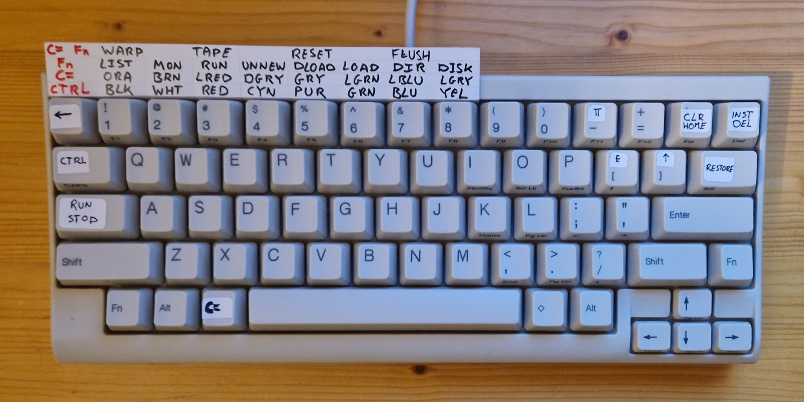

Also note a practical add-on: a card with the colors, the mapping for 
the function keys in my favorite cartridge the 
[Power Cartridge from KCS](https://rr.pokefinder.org/rrwiki/images/8/8f/Power_Cartridge_KCS_Instruction_Manual_dutch.pdf)
and additional hotkeys I added in BMC64 via the Alt-F12 menu.

## Links

- [BMC64 sources ](https://github.com/randyrossi/bmc64)
- [BMC64 setup](https://accentual.com/bmc64/)
- [VICE](https://vice-emu.sourceforge.io/)
- [VICE manual](https://vice-emu.sourceforge.io/vice_toc.html)

(end)
