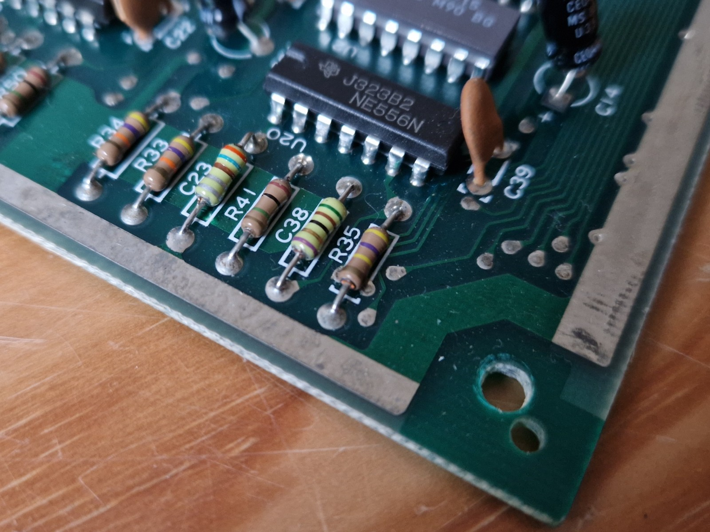
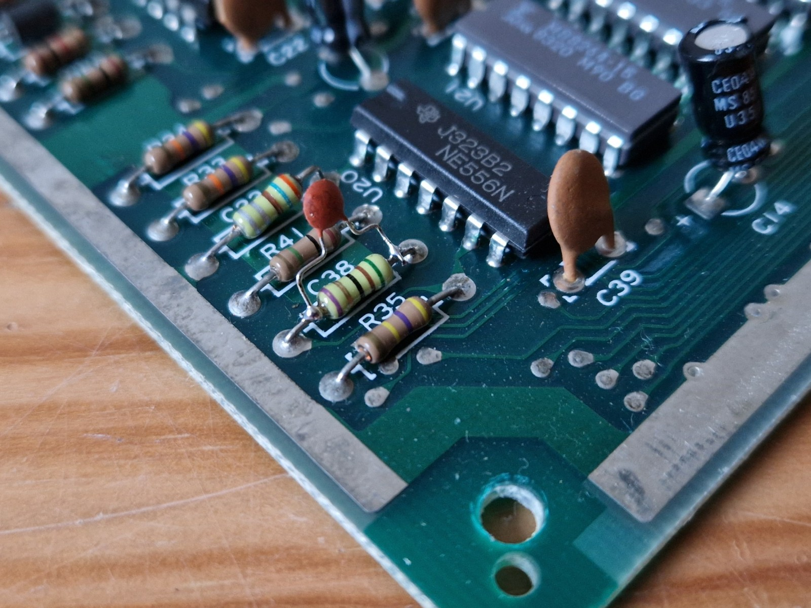
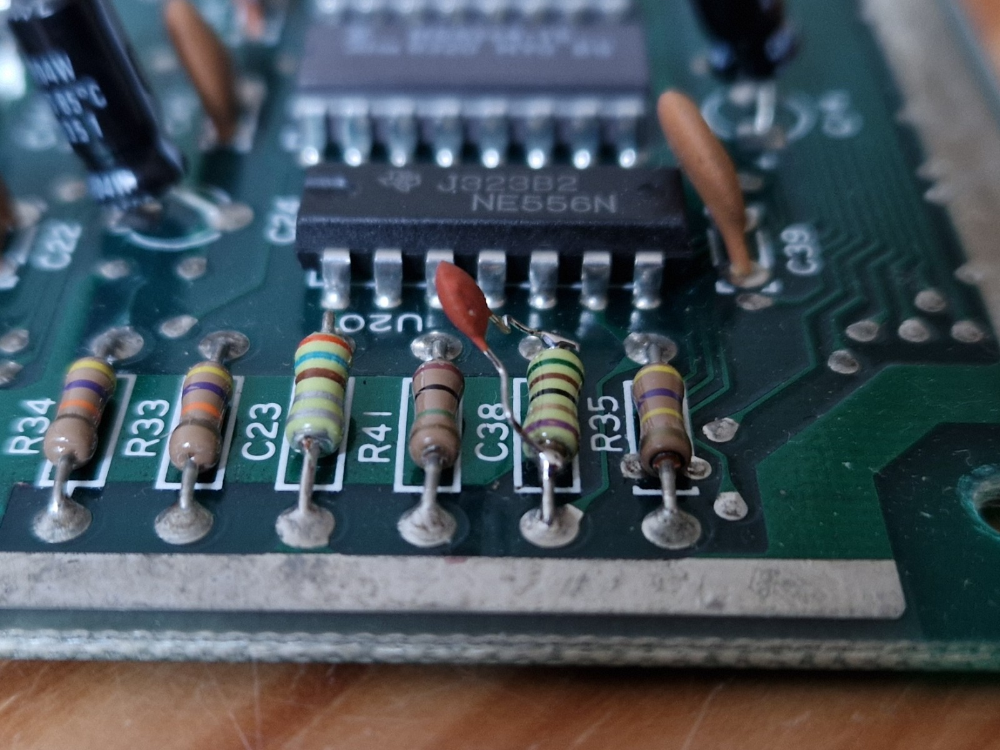

# C64 fix the RESTORE key

The commodore 64 has a RESTORE key.
It is most often used in combination with the RUN/STOP key to 
soft reset the C64.

On the older C64 you really have to quickly hammer that key.
This is not by design (prevent accidental soft reset).
It is caused by a small design error.

## Fix: C38

The culprit is capacitor C38. You find it in the lower left corner.
On newer boards it is still on the left, but higher towards the center.
C38 looks like a resistor, but resistors on the C64 have a beige background 
color, these capacitors have a light green background color.

These are the color rings of C38 - gold must be on the right hand side.

| Position | Color  | Meaning                 | Value      |
|:---------|:-------|:------------------------|:-----------|
| 1st band | green  | 1st digit               | 5          |
| 2nd band | brown  | 2nd digit               | 1          |
| 3rd band | black  | multiplier              | 10⁰        |
| 4th band | gold   | tolerance               | ±5%        |
| 5th band | purple | temperature coefficient | -750×10^-6 |

As we see from the color rings C38 is 51×10⁰ or 51 pF by default; and it should be about 100× as high. 
Many suggest to de-solder the old one and replace it,
but I just soldered a 4.7 nF in parallel to the existing one.
Officially the resulting capacitance is then 4.751 nF, but that gets 
lost in tolerances.

## Links

- [short article](https://ist.uwaterloo.ca/~schepers/MJK/fix_restore.html)
- [capacitor lists](https://wiki.console5.com/wiki/Commodore_64#:~:text=25v%0A%0AOther%20Caps%3A-,C38%0951pF%09Replace%20with%204.7nF,-to%20restore%20soft)
- [Weasel's blog](https://weaselsworld.com/ultimate-useful-commodore-64-upgrades-and-mods-list/)

(end)
