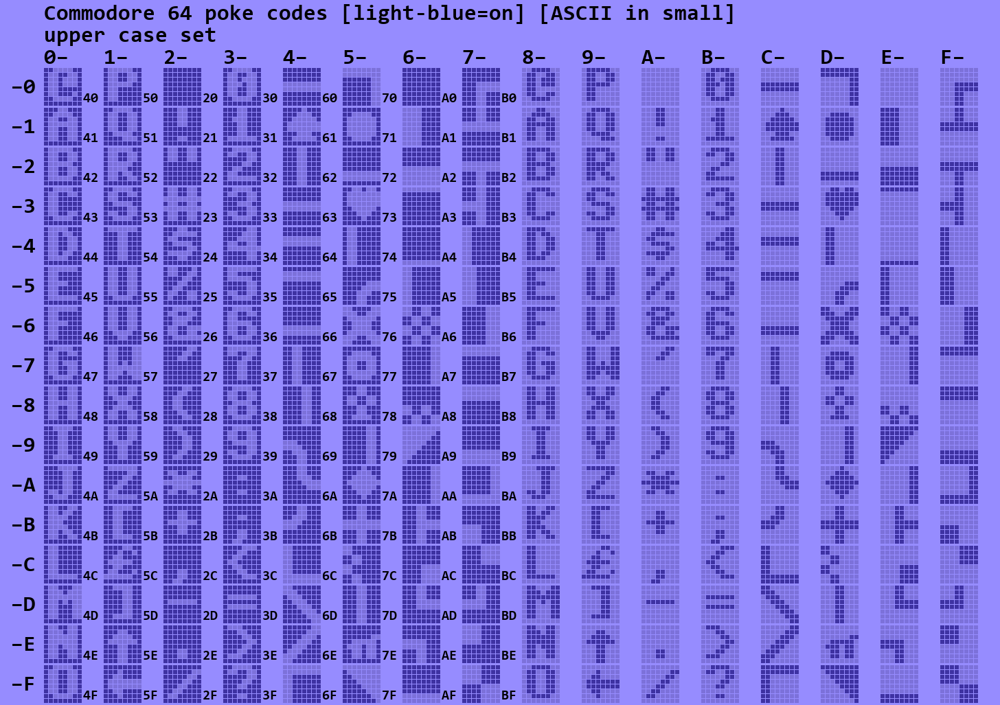
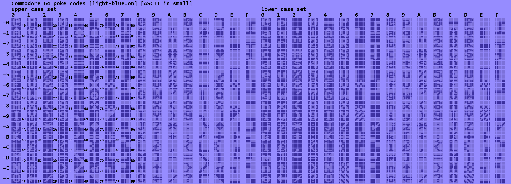

# Commodore 64 characters

Font ROM of the C64

## Introduction

The character management in the C64 is a bit complex.

- There are two sets: standard, graphics or upper case and the text or lower case set.
- In one character set (256 chars), the upper 128 or the reverse video of the lower 128.
- There is a difference between ASCII codes (or PETSCII if you want) and screen poke codes.
- Some glyphs (char bitmaps) are duplicated (e.g. ASCII 0x60 and 0x63).

This project was an attempt to clarify for myself how the standard set looks like,
and how the mapping from poke codes to ASCII works out.

## Process

I started with a font ROM [dump](c64fontrom1.pbm).
Actually there is a [double](c64fontrom2.pbm) double one if you want both sets.

I wrote a [python script](app.py) to convert separate the pixels ("dots") of the characters
so that I could clearly see which ones connect.
When you run it (open cmd shell, execute `setup.bat`, execute `run.bat`) it generates the tables

## Key

This [site](https://sta.c64.org/cbm64petkey.html) maps ASCII codes to key strokes.

(end)

