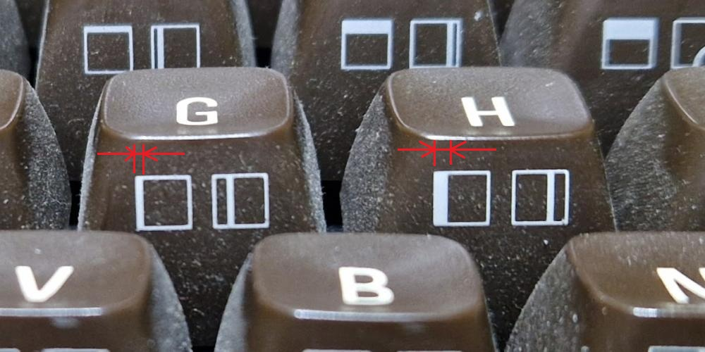
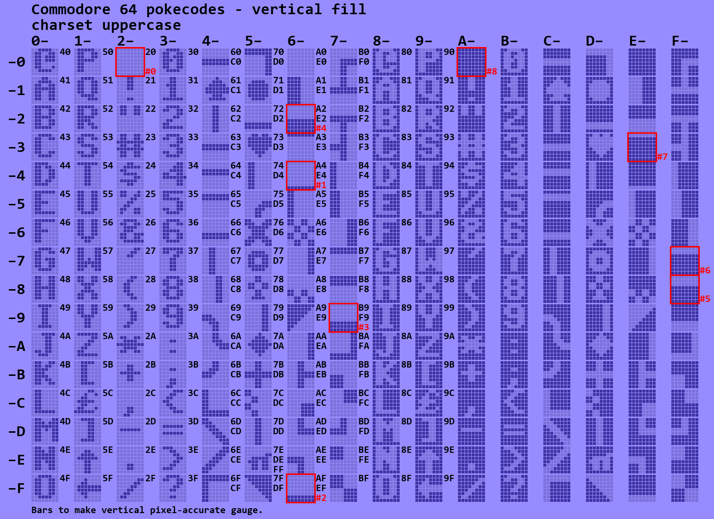
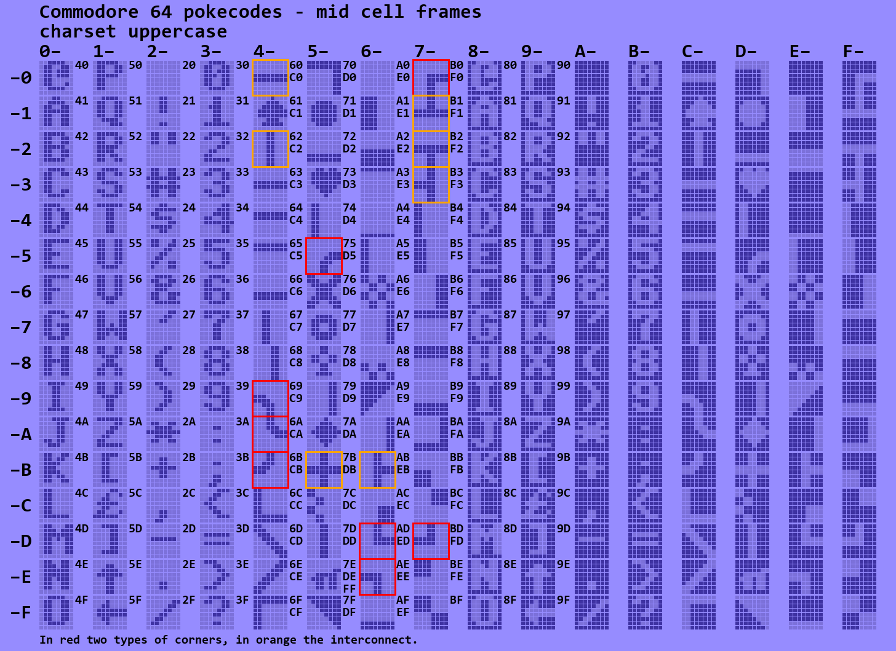

# Commodore 64 characters

Font ROM of the C64.

## Introduction

The character management in the C64 is a bit complex.

- There are two character sets: the default (standard, graphics or upper case) and alternate (text or lower case) set.
- In one character set (of 256 characters), the upper 128 are the reverse video of the lower 128 characters (all pixels flipped).
- There is a difference between ASCII codes (or PETSCII if you want) and screen poke codes.
- Several glyphs (character bitmaps) are duplicated.

This project was an attempt to clarify for myself how the standard set looks like,
how characters can work together to form bigger "ACSII art",
and how the mapping from poke codes to ASCII works out.

## Process

I started with a font ROM [dump](c64fontromhi.pbm).
This is only the default character set.
The repo also stores the [lower case text set](c64fontromhilo.pbm) if you want to examine it.

I wrote a [python script](app.py) to convert this to overview tables.
The script separates the pixels of the characters so that I could clearly see which characters connect.
When you run the script (open `cmd` shell, execute `setup.bat`, execute `run.bat`) it generates the tables

## Standard

The first table that is generated just shows all glyphs in a matrix organized according to their pokecodes.

The ASCII code that produces that glyphs is printed in small font to the right of it.
But this is a bit tricky and still confuses me. I cannot get ASCII codes 0x80-0x9F to do/print anything.

## Duplicates

One of the things that wondered me is why there are duplicate glyphs.
My python script finds them all.
There quite some, see the red encircled ones below (with in red the pokecode of the duplicate).

I think I now know why this is.

One case is the space (0x20) which is also present at 0x60.
I see that as a space that looks like a space but that is not treated by the kernel
as a separator. It was already present in the VIC-20 character set, see
the diagram below with the C64 (left0 and VIC20 (right) character sets.

This also explains the other duplicates.
The rumor goes that when Commodore moved from the 22 columns VIC-20 to
the 40 columns C64, there was color distortion at pixel boundaries.
To mitigate this Commodore made the characters fat: in horizontal
direction there are always at least two similar colored pixels.
This doubling is very clear in the above comparison. 

It also meant that the vertical line character with pokecode 0x42,
a single line in the VIC20 had to double. But so had 0x5D, and then they look alike.

In the above duplicates overview, the pixels added by Commodore 
for the doubling are dotted by me in the overview.

Since now all vertical lines are double, Commodore decided to also 
double all horizontal lines, which resulted in 0x40 and 0x43 to become duplicates.

If you are still not convinced, have a look at the keyboard.
The G and H can be used with the Commodore shift key to give a thin (1 pixel) or thicker (2 pixel)
vertical bar. In practice, the G gives glyph 0x65 and H gives character 0x74.
On VIC-20 these are 1 and 2 pixels wide but on the C64 both are 2 pixels wide.

Similarly, the N and M can be used with the Commodore shift key to give a thick (2 pixel) or thin (1 pixel)
vertical bar. In practice, the N gives glyph 0x6A and M gives character 0x67.
On VIC-20 these are 2 and 1 pixels wide but on the C64 both are 2 pixels wide.

It is harder to see, but similar for shift-star and shift-C
respectively shift-minus and shift-B

## Reverse video error

My python script also checks if each glyph is a flip of its reverse video counter part.
To my big surprise, there was one mismatch: for character 0x00 (@).

## Grouping glyphs

This section partiotions all glyphs in catagories.

### Coarse block graphics

When using character mode, it is possible to plot 80×50 pixels using the block glyphs.

### Vertical fill

Use these glyphs for a pixel accurate vertical fill gauge (battery level).

### Horizontal fill

There is also a set of glyphs for a horizontal fill gauge, but, due to the pixel doubling, 
there are some duplicates.

### Vertical wave

Use these glyphs for a pixel accurate vertical tick gauge (stereo speaker balance).

### Horizontal wave

Use these glyphs for a horizontal tick gauge, but, due to the pixel doubling, 
there are some duplicates.

### Mid frames

Draw frames with these "mid-cell" line glyphs.

### Outside frames

Draw different style of frames with these glyphs.

### Various symbols

There us an assortment of symbols, including card suits.

### Diagnoal

There are some diagonal glyphs.

### Dithering

For me the least useful, sort of gray scaling via dithering.

## Links

This [site](https://sta.c64.org/cbm64petkey.html) maps ASCII codes to key strokes.

The VIC-20 char set is from [kreativekorp](https://www.kreativekorp.com/software/fonts/c64/).

(end)

