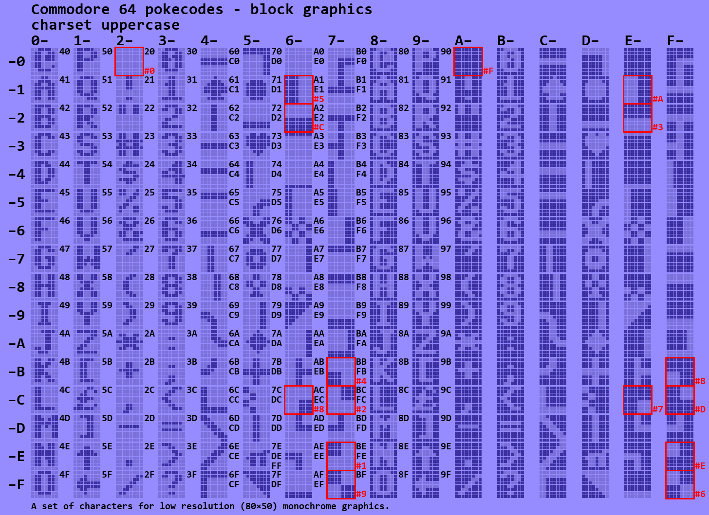
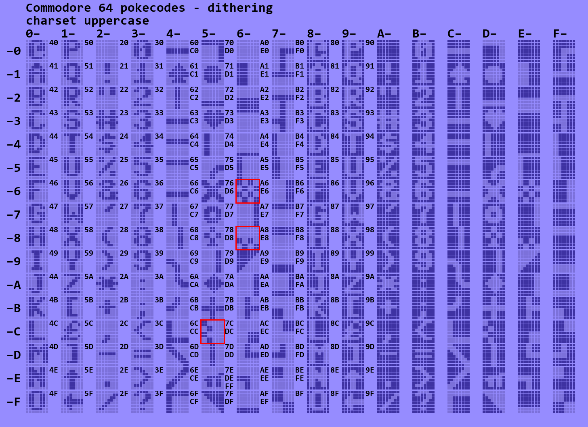

# Commodore 64 characters

Font ROM of the C64.

## Introduction

The character management in the C64 is a bit complex.

- There are two character sets: the default (standard, graphics or upper case) and alternate (text or lower case) set.
- In one character set (of 256 characters), the upper 128 are the reverse video of the lower 128 characters (all pixels flipped).
- There is a difference between ASCII codes (or PETSCII if you want) and screen poke-codes.
- Several glyphs ("the specific shape, design, or representation of a character", i.e. the character bitmaps) are duplicated.

This project was an attempt to clarify for myself how the standard set looks like,
how characters can work together to form bigger "ACSII art",
and how the mapping from poke-codes to ASCII works out.

## Process

I started with a font ROM [dump](c64fontromhi.pbm).
This is only the default character set.
The repo also stores the [lower case text set](c64fontromhilo.pbm) if you want to examine it.

I wrote a [Python script](app.py) to convert this to overview tables.
The script separates the pixels of the characters so that I could clearly see which characters connect.
When you run the script (open `cmd` shell, execute `setup.bat`, execute `run.bat`) it generates the tables
in this repo.

## Standard

The first table that is generated just shows all glyphs in a matrix organized according to their poke-codes.

The ASCII code that produces a glyph is printed in small (black) font to the right of it.
For example the glyph with poke-code 0x5E (π) is associated to 3 ASCII codes

In general, the mapping from ASCII to poke-codes (glyphs) is in chunks of 32 (two columns).
But the ASCII mapping still confuses me; see section [ASCII](#ascii) for my research results.

## Duplicates

One of the things that puzzled me is why there are duplicate glyphs.
My Python script finds them all.
There quite some, see the red encircled ones below (with in red the poke-code of the duplicate).

One case is the space (0x20) which is also present at 0x60.
I see that as a space that looks like a space but that is not treated by the kernel
as a separator. It was already present in the VIC-20 character set, see
the diagram below with the C64 (left, blue) and VIC-20 (right, grey) character sets.

The VIC-20 table also hints for easons of the other duplicates.
The rumor goes that when Commodore moved from the 22-column VIC-20 to
the 40-column C64, there was color distortion at pixel boundaries.
To mitigate this Commodore made the characters fat: in horizontal
direction there are always at least two similar colored pixels.
This "double pixel policy" is very clear when comparing the C64 and VIC-20 tables above. 

It also meant that the vertical line character with poke-code 0x42,
a single line in the VIC-20 had to doubled. But so had 0x5D, and 
the result is that they are identical on the C64.

In the above duplicates overview, the pixels added by Commodore 
for the doubling are dotted by the Python script.

Since now all glyphs with vertical lines are double-width, Commodore decided to also 
double the horizontal line glyphs, which resulted in 0x40 and 0x43 to become duplicates.

If you are still not convinced, have a look at the keyboard.
The G and H can be used with the Commodore key to give a thin (1 pixel) or thicker (2 pixel)
vertical bar as shown on the key caps. In practice, the G gives glyph 0x65 and H gives glyph 0x74.
On VIC-20 these are indeed 1 and 2 pixels wide but on the C64 both are 2 pixels wide.

Similarly, the N and M can be used with the Commodore key to give a thick (2 pixel) or thin (1 pixel)
vertical bar. Also this is depicted on the key caps. 
In practice, the N gives glyph 0x6A and M gives glyph 0x67.
On VIC-20 these are 2 and 1 pixels wide but on the C64 both are 2 pixels wide.

It is harder to see on the key caps, because they are farther apart and have centered lines.
But a similar situation appears for shift-C and shift-star respectively shift-B and shift-minus.

Coding confirms the suspicion.

Conclusion: the C64 duplicate glyphs are a result of the "double pixel policy".

## Reverse video errors

My Python script also checks if each glyph is a flip of its reverse video counter part.
To my big surprise, there was one mismatch: for character 0x00 (@), see the pixel in the 6th row of the 6th column (dotted in 0x80 in the table below).

## Grouping glyphs

This section partitions all glyphs in categories.

### Coarse block graphics

When using character mode, it is possible to plot 80×50 pixels using the block glyphs.

### Vertical fill

Use these glyphs for a pixel accurate vertical fill gauge (e.g. battery level).

### Horizontal fill

There is also a set of glyphs for a horizontal fill gauge, but, due to the pixel doubling, 
there are some duplicates.

### Vertical wave

Use these glyphs for a vertical tick gauge, but, due to the pixel doubling, there are some duplicates.

### Horizontal wave

Use these glyphs for a pixel accurate horizontal tick gauge (e.g. stereo speaker balance).

### Mid frames

Draw frames with these "mid-cell" line glyphs; corners in red, connectors in orange.

### Outside frames

Draw a different style of frames with these glyphs.

### Various symbols

There is an assortment of symbols, including card suits.

### Diagonal

There are some diagonal glyphs.

### Dithering

For me the least useful glyphs do a sort of gray scaling via dithering.

## ASCII

There is no _function_ to convert an ASCII code to a poke-code.
But we can print an ASCII character to the screen, and then peek the screen memory to 
find the poke-code. That is what this program does.

We know that multiple ASCII codes maps to one poke-code. 
The array `P$(x)` records all ASCII codes (as two character hex string) that result
in poke-code `x`. If an ASCII code does not map to a poke code, it is appended
to string `Q$`. The subroutine at lines 60-75 converts and ASCII code in `A` 
to a two character hex string in `A$`.

Line 15-40 loops over all ASCII codes.
On line 20 we home the cursor, overwrite the home position with a space and then 
cursor-left to set the cursor back to its home position. Since several ASCII codes 
change the cursor color, we also print a change-to-light-blue in order not to
get too much chaos on the screen. Finally we print the
ASCII code under investigation `CHR$(A)`; and look up the poke-code `P=PEEK(1024)`.

If character `A` is a bit special (like switching cursor color), 
it doesn't change the home location, so `P` ends up as 32.
So only if `P` is not 32, we record the ASCII value `A` as a result for poke-code `P`
(line 25). If `P` is 32 it could be that we really printed the space,
this special case is dealt with in line 30. Line 35 collects all ASCII code
that print nothing to the screen.

The table is printed by lines 42-55. It is a bit messy, because I wanted the whole 
table to fit on the screen. Line 42 clears the screen, switches to light-blue and 
(re)activates the upper case fonts. Variable `C` records how many characters have
been printed. By spoofing a line overflow (`C=40`) a new line will be started
prefixed with a poke-code.

Line 45 loops over all poke-codes; the loop variable is called `A` (instead of maybe `P`)
because subroutine 60 is called so that `A$` holds the two character hex string matching `A`.
The rest of the line checks if poke-code `A` has any ASCII codes, if not a `-` will 
be printed without a separator (so `S$=""`) to save screen space.

Line 50 checks if all ASCII codes associated with the current poke-code `A`, fit on the 
current line. If not, a new line is started, and the current poke-code is printed with a colon.
Line 53 prints all ASCII codes associated with the poke-code `A` and updates column count (`C`).
Line 55 ends the program after printing all non-printable ASCII codes (`Q$`).

This is the result.

Note that
 - poke-codes 00-1F are produced by ASCII codes 40-5F.
 - poke-codes 20-3F are produced by ASCII codes 20-3F - same ones.
 - poke-codes 40-5F are produced by ASCII codes 60-7F and also by C0-DF.
 - poke-codes 60-7F are produced by ASCII codes A0-BF and also by E0-FF.
 - one special case is ASCII code FF it maps to 5E instead of 7F.
 - poke-codes 80-FF have no associated ASCII code.
 - ASCII codes 00-1F and 80-9F do not map to poke-codes.
 - The tables in the previous chapter do list ASCII codes for poke-codes 80-9F.
   Printing `CHR$(9*16+3)` does not print a reverse video `S`.
   However if you print a reverse video `S` it does correspond to ASCII code 0x93.
   

## Links

This [site](https://sta.c64.org/cbm64petkey.html) maps ASCII codes to key strokes.

The VIC-20 char set is from [kreativekorp](https://www.kreativekorp.com/software/fonts/c64/).

(end)

