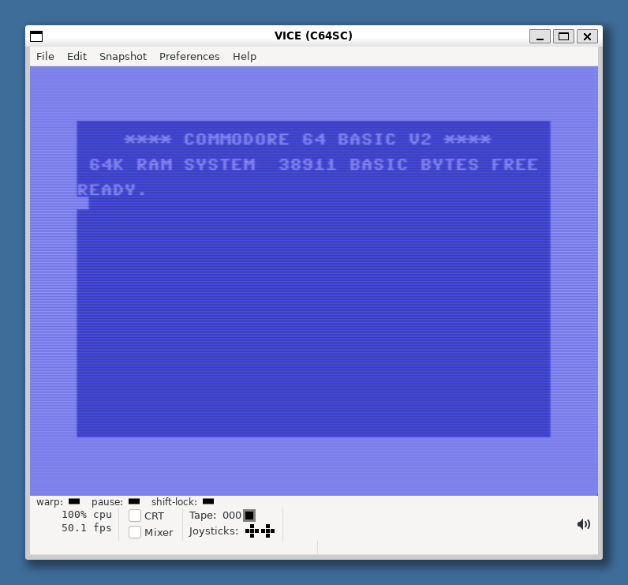
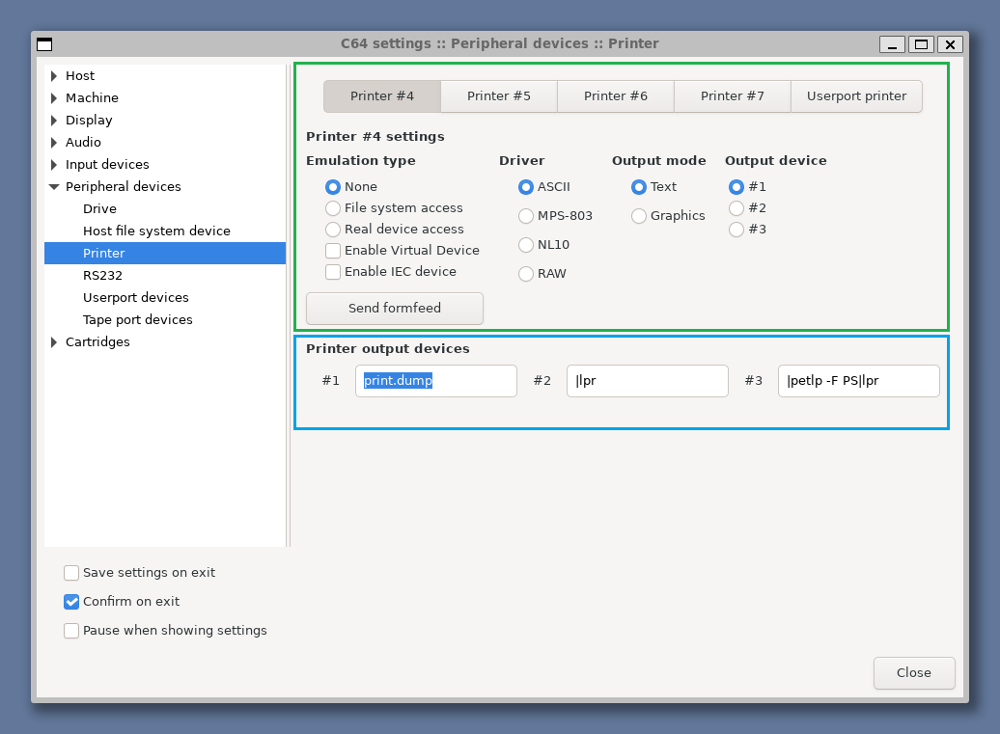
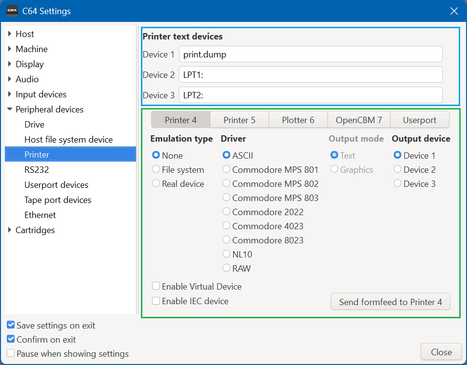
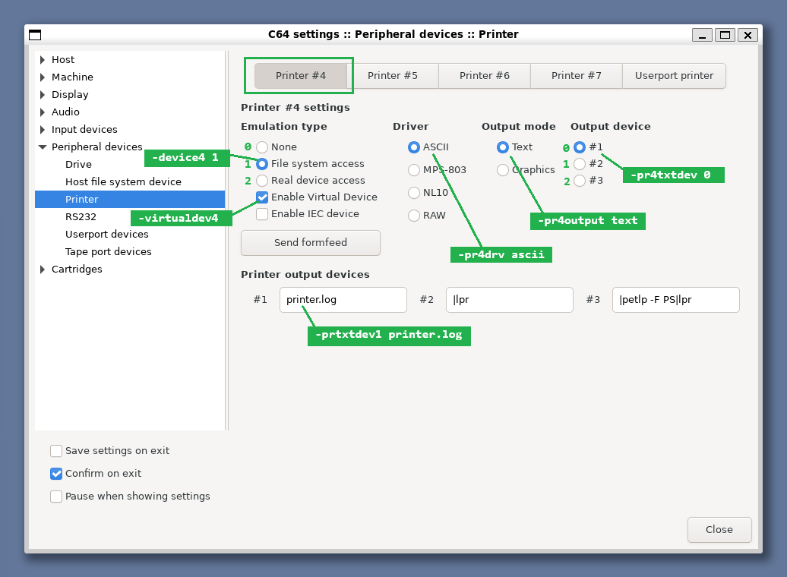

# C64 development

This how-to explains how to develop C64 software on a Windows PC.


## Introduction

I use WSL (Windows Subsystem for Linux) for automation:

- An assembler (`64tass`) to convert an .asm text file to a C64 `.prg` file.
- Using a VICE _tool_ (`petcat`) to convert a text file to a C64 BASIC `.prg` file, i.e. plain text to tokens.
  The purpose of this BASIC program is to test the assembly routine.
- Using a VICE _tool_ (`c1541`) to create a `.d64` disk image (loadable in VICE) from the two `.prg` files.
- With the `make` tool the above steps are automated.
- To test the compiled assembler or tokenized basic, we mount the `.d64` in VICE, the C64 emulator.
  We can install VICE in Windows and mount the `.d64` file generated in WSL.
  It is also possible to run the VICE _GUI_ in WSL (you need WSL2 and some extra installs are required).


## Install

Since Windows is my main system, I did install VICE for Windows.
For the automation part I use WSL (Windows Subsystem for Linux) and installed the VICE tools there.


### Windows

For Windows we just need the VICE emulator.

- Get it from [sourceforge](https://vice-emu.sourceforge.io/index.html#download).
  VICE recommends the GTK3 version so get "Download VICE 3.10 (64bit GTK3)".

- I typically auto-mount the [KCS power cartridge](https://rr.pokefinder.org/wiki/Power_Cartridge). 
  It supports hex commands in BASIC and includes a machine language "monitor".
  The Binaries section of the above page links to the cartridge image.
  In VICE use File > Attach cartridge image ... to mount it, set the check-mark to set it as default.


### WSL

I did the WSL install some time ago, so these steps are a bit of a guess:
- Run `cmd.exe` (or PowerShell) as admin and issue `wsl --install`.
- Reboot, Ubuntu starts (if not, find it in Start) and you have to create an username/password 
  typically different from your Windows' one.
- Get list of updates with `sudo apt update` and install them with `sudo apt upgrade`.

We need a couple of automation tools in WSL:
- The make utility `sudo apt-get install make`.
- An assembler for the C64, e.g. `sudo apt-get install 64tass`.
- Some C64 file management tools `sudo apt-get install vice`.
  This installs the complete VICE toolset, we use `petcat` and `c1541` 
  (and maybe the VICE emulator GUI)

Instead of running the VICE emulator under Windows, we can also run it under WSL.
- The `sudo apt-get install vice` from previous step installed the emulator.
- The WSL VICE install does not include the Commodore 64 binaries 
  (kernal, basic, charrom). 
  
  I copied them from my Windows VICE. On my machine, Windows VICE is located in 
  `c:\programs\GTK3VICE-3.10-win64`, this directory is mounted in WSL as 
  `/mnt/c/programs/GTK3VICE-3.10-win64`. That directory contains the source of 
  the C64 binaries, the destination is a subdir `.local/share/vice/C64` in my 
  WSL home directory. These are the commands I used.
  
  ```
  cd  ~
  mkdir  -p  .local/share/vice/C64
  cd  .local/share/vice/C64
  cp  /mnt/c/programs/GTK3VICE-3.10-win64/C64/kernal-901227-03.bin  .
  cp  /mnt/c/programs/GTK3VICE-3.10-win64/C64/basic-901226-01.bin  .
  cp  /mnt/c/programs/GTK3VICE-3.10-win64/C64/chargen-901225-01.bin  .
  ```

  **Note** the `C64` directory is with uppercase `C`.

- For older VICE versions, the three files need to be renamed 
  to `kernal`, `basic`, and `chargen` respectively.

- To test, start VICE in WSL with with `x64sc` or use `x64sc -verbose` to see 
  which files are loaded.

  

- You probably also want to use an emulated 1541-II drive.
  Like the C64, the 1541-II has ROM, and the WSL emulator needs a copy.

  ```
  cd ~
  mkdir -p .local/share/vice/DRIVES
  cd .local/share/vice/DRIVES
  cp  /mnt/c/programs/GTK3VICE-3.10-win64/DRIVES/dos1541ii-251968-03.bin  .
  ```
  
- **Note** For older VICE versions, the disk rom needs to be renamed to `d1541II`.

This concludes the install. Now let's write and test some software.


## Experiment 1: compile and run

For the first experiment, I have written two example source files: 
one in assembly and one in BASIC. We are going to write a makefile to convert
these to `.prg` files on virtual disk (a `.d64` file).


### Assembly source file

The first file is an assembly file [`border-sub.asm`](src1/border-sub.asm).
We kept it simple; it just changes the border color (at address $D020) 
to white (color $01). This program is compiled for location $C000,
this is where the C64 has a 4k byte "gap" between the BASIC interpreter 
and memory mapped I/O.

```asm
*=$C000
LDA #$01
STA $D020
RTS
```        

The `64tass` assembler will convert this to a `.prg` file.
An interesting observation is that the assembler will not only compile 
the source text to a list of bytes, it will actually generate a `.prg` file:
a list of bytes _prefixed with a load address_, C000 in our case.


### BASIC source file

The other file is a BASIC _text_ file [`border.bas`](src1/border.bas).
This may be edited with a tool like notepad.
We use `petcat` from VICE to convert this to a C64 `.prg` file.
This means that strings like `print` are converted to a print token 
(byte 153; see [list](https://www.c64-wiki.com/wiki/BASIC_token)).

This program is a bit more complicated, but we feel it is a typical setup: 
it loads the assembly subroutine, then runs it. This mimics a test process.

```bas
10 if a=1 then 60:rem restart
20 print "load 'border-sub' at c000"
30 a=1: load "border-sub",8,1
40 rem load will do run
50 :
60 print "call sub at c000"
70 sys 49152
80 print "back in basic."
90 end
```

Note that we must use _lower case_ in the `.bas` file. C64 BASIC will list it as uppercase.

When running this BASIC program, the variable `a` on line 10 will be created
and initialized to 0, so the jump to line 60 will not happen.

Line 20 prints the action that is taken instead: loading the assembly subroutine.
That actually happens on line 30, setting the load flag `a` to 1.
Note that the assembly routine is loaded from disk 8 (so this program 
won't work when the disk is inserted in another drive). Note also that
a second parameter is passed (`,1`); this ensures the file is loaded 
at the address specified in its header. In our case that will be C000.

C64 BASIC has a bit funny implementation of `LOAD` when used in a program: after loading the 
specified program, it issues a `RUN`, however without clearing variables 
(which might not work if the second program is longer than the first).

So after line 30, line 10 will execute (again), which now does jump to 60.
The second part of our program prints it will call the assembly subroutine,
then it calls it (49152=$C000), prints we are back in basic and finally
ends the program.


### Assembly source to `.prg`

> Recall that the C64, or better phrased, the 6502, is little endian machine. 
> In other words a number like C000 is stored as 00 C0.


To convert [`border.asm`](src1/border-sub.asm) to a .prg file, we use `64tass`.
Details are in the [Makefile](src1/Makefile).

```make
	64tass  border-sub.asm  -o build/border-sub.prg
```

The generated `.prg` file is only 8 bytes.
First the load address (red box).
Next come three instructions, `LDA #$01` in a green,
`STA $D020` in a blue, and finally `RTS` in a yellow box.


### BASIC source to `.prg`

To convert [`border.bas`](src1/border.bas) to a `.prg` file, we use `petcat`.
The `-w2` selects C64 BASIC 2.0; see the [Makefile](src1/Makefile).

```make
	petcat  -w2  -o build/border.prg  --  border.bas
```

The generated `.prg` file also starts with a load address, namely the 0801 (red box).
This allows for a load to specific address as in `LOAD "BORDER",8,1`.
A plain load `LOAD "BORDER",8` will also work, since BASIC interpreter will 
then load to the start of BASIC, which happens to be 0801 on the C64.

Observe that the BASIC text is a _list_ of lines; the green boxes show the link to 
(the address of) the next line. The blue boxes encircle the line numbers 
(in reverse video the line number in decimal). Each line is a series of bytes 
terminated with a 00 (yellow box). The bytes are a mix of 
literal program text and tokens. On offset 6 we see `8b`, the token for `if` 
(see [list](https://www.c64-wiki.com/wiki/BASIC_token)). This is followed by 
`20` (space), `41` (variable name `A`) and another token `b2` for `=`, the equals operator.


### Creating a virtual disk

We deliberately made a "complex" setup with a BASIC program loading another files.
It is possible to double click on a `.prg` file to start VICE (if the extension association is registered).
It is also possible to drag&drop a `.prg` file on an already started VICE.

However for our complex setup that doesn't work, one program needs the other.
The solution is to create a C64 _disk image_ with both files on it. 
We use the tool `c1541` for that.
We create a new disk, format it and save the two `.prg` files on it.
See the [Makefile](src1/Makefile) for the exact arguments.

```make
	c1541 -format "border-dsk,bd" d64 build/border-dsk.d64 \
        -write build/border.prg      "border" \
        -write build/border-sub.prg  "border-sub"
```


### Running the program

We can now double-click the `.d64` file and VICE starts, mounts it,
and loads and runs the first `.prg` file on the disk. 
On the screenshot below, we see the `LOAD"*",8,1` and the `RUN` 
caused by double clicking the `.d64` disk file.

Next we see the `LOAD` message from line 20 of our BASIC program.
This causes a re-run, which jumps to line 60, printing that an
assembly call will be made. The call is made which makes the border white 
as we can see in the screenshot. Finally, 
`80 print "back in basic."` is executed.


## Experiment 2: compile and automated test

In this second experiment, we go one step further, also automate the _testing_.
We run the C64 software on the emulator (VICE), but do not print to the 
screen but to the printer. We instruct VICE to save the printer output to a 
file.


### Configuring the printer

It turned out quite a challenge to configure a printer in VICE.
And the WSL version is running behind (VICE 3.6.1 vs VICE 3.9).
Find printer configuration under Preferences > Settings > Peripheral devices > Printer.
Below is a screenshot from VICE 3.6.1 under WSL, followed by a screenshot of VICE 3.9 under Windows.





We can configure 5 _emulated_ printers (green box): four printers 
connected to IEC Serial bus, and one connected to the User port.
The IEC printers (like disk drives) have an address from 4 to 7.
The screenshots show that we configure the default printer 
(note the highlighted tab); the printer on IEC address 4.

We can configure 3 _physical_ printers (blue box).
These can be a file, or a printer connected to the host computer.

To configuring the printer we need to consult the VICE command line manual.
The [TOC](https://vice-emu.sourceforge.io/vice_toc.html) directs us to 
section [6.12.2 Printer settings](https://vice-emu.sourceforge.io/vice_6.html#SEC117).
Don't use the "resources" (6.12.2.1) but the "command-line options" (6.12.2.2).

- We need to set the "Printer [text|output] devices" for VICE (blue box).
  This is the "physical" printer connected to the host computer running VICE.
  In our case, we will use a "file" as physical device.
  
  The command line option `-prtxtdev1 printer.log` configures printer 
  device #1 as (the file) `printer.log`.

- The option `-pr4txtdev 0` configures the "Output device" 
  (column 4 in green box) for printer 4, to the just created device. 
  The UI uses device 1, 2, 3, the command line 0, 1, 2.

- The "Output mode" (column 3 in green box) is "Text" for us. This creates 
  a text file with the printed characters in it. "Graphics" would create 
  a png file with drawings of the characters. We add `-pr4output text`.

- The "Driver" (column 2 in green box) is ASCII for us. 
  We do not have a real printer connected to the host, we print to a file.
  Therefore we do not need a driver. We add `-pr4drv ascii`.
  
- The "Emulation type" (column 1 in green box) is "File system access".
  We add `-device4 1` (option 1, 0-based).
  We also enable the virtual device `-virtualdev4`

This is the complete command line

```
x64sc  -prtxtdev1 printer.log  -pr4txtdev 0  -pr4output text  -pr4drv ascii  -device4 1  -virtualdev4
```

If we then inspect the printer settings we get




### Testing the printer

When we start VICE with the above command line parameters, and then run the 
following BASIC program, we get a file `printer.log` in the directory 
where we started VICE.

```
10 open 4,4
20 print#4,"hello, world!"
30 print#4,"second line"
40 close 4
```

This is the hexdump of the generated file.

```
maarten@Desktop-Maarten:/mnt/c/Repos/howto/c64development$ hd printer.log
00000000  48 45 4c 4c 4f 2c 20 57  4f 52 4c 44 21 0a 53 45  |HELLO, WORLD!.SE|
00000010  43 4f 4e 44 20 4c 49 4e  45 0a                    |COND LINE.|
0000001a
```

Notice the line ending: 0x0A (character 10 or linefeed).


### Configuring the drive

The emulated C64, VICE, needs a disk drive so that it can load the "SUT" 
(Software Under Test) and the test programs. 

This proves to be easier than the printer.

- Select which driver to emulate. We pick the latest C64 drive, the 1541-II.
  As the [manual](https://vice-emu.sourceforge.io/vice_6.html#SEC112) explains,
  we need to add the option `-drive8type 1542`. It is assumed that the 
  1541-II ROM is [installed](#wsl).

- To start a program automatically, pass `-autostart disk.d64:prog`, where 
  `-disk.d64` is the name of a virtual disk and `prog` is the name of a 
  program on that disk ([manual](https://vice-emu.sourceforge.io/vice_2.html#SEC50))


### Run and stop

There is one more problem, how do we stop VICE, once a test program is 
completed? The test program is (typically) BASIC, and what can it "call"
to shut down VICE (and stay truly C64 compatible)?

I was assuming there would be a virtual IEC device or some memory mapped 
device where the BASIC program could send some messages (`POKE`s) to, and 
that this would virtually "cut the power" of the C64. I could not find 
such a thing.

- The advise is to use `-limitcycles xxx`, which automatically exits 
  the emulator after xxx number of cycles. Recall that the C64 runs at 1 MHz,
  so `-limitcycles 5999000` is nearly 6 seconds 
  ([manual](https://vice-emu.sourceforge.io/vice_2.html#SEC50))

- Since we are testing, we want results as soon as possible. 
  The argument `-warp` ([manual](https://vice-emu.sourceforge.io/vice_6.html#SEC92))
  enables running as fast as the emulator can.
  

### todo


```
PRINTER4 = -prtxtdev1 printer.log  -pr4txtdev 0  -pr4output text  -pr4drv ascii  -device4  1  -virtualdev4
DISK8 = -drive8type 1542  -autostart bld/test.d64:test
OTHER = -warp  -limitcycles 5999000
test: build/test.d64
	rm -f printer.log
	x64sc  $(DISK8) $(PRINTER4) $(OTHER)
```

(end)
