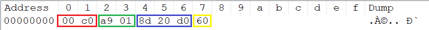
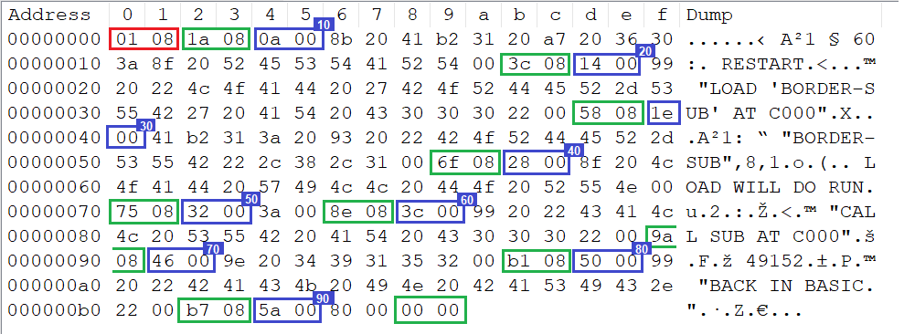
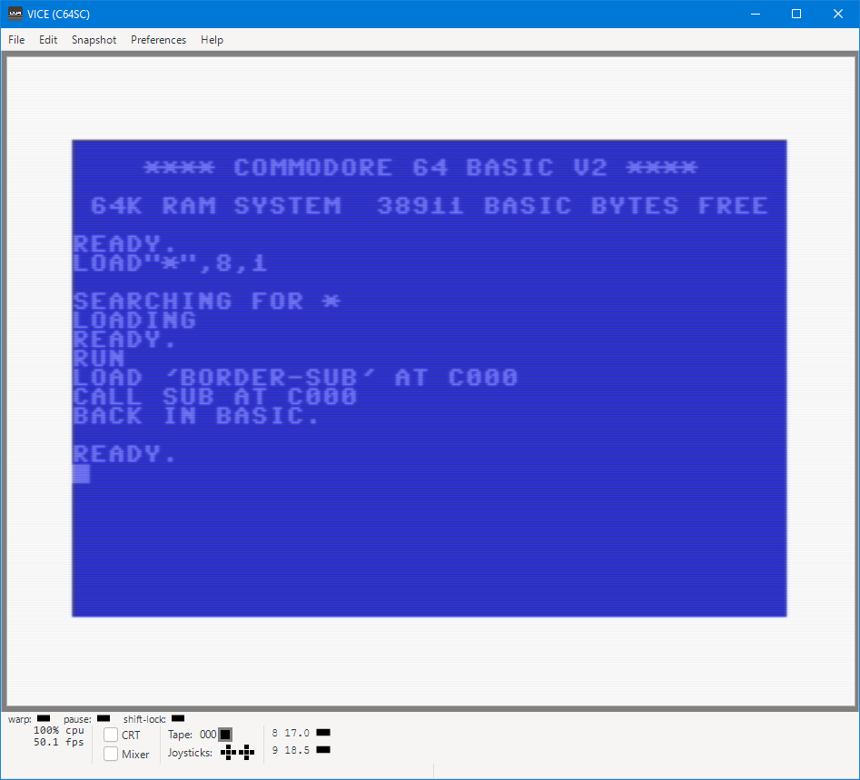

# C64 development

This how-to explains how to develop C64 software on a PC.


## Introduction

This is my setup.

I use WSL (Windows Subsystem for Linux) for automation:
- An assembler (`64tass`) to convert an .asm text file to a C64 .prg file.
- Using a VICE _tool_ (`petcat`) to convert a text file to a C64 BASIC .prg file, i.e. plain text to tokens.
  The purpose of this BASIC program is to test the assembly routine.
- Using a VICE _tool_ (`c1541`) to create a .d64 disk image (loadable in VICE) from the two .prg files.
- With the `make` tool the above steps are automated.

I use Windows for testing and debugging
- Running the VICE _GUI_ to test the two .prg files in an emulated C64.

I'm assuming that if your development system is Ubuntu or Mac, the last step can also be
executed in the same system.


## Install

If, like me, Windows is your development system, you need WSL for the 
automation part.


### WSL

I did the WSL install some time ago, so these steps are a bit of a guess:
- Run `cmd.exe` (or PowerShell) as admin and issue `wsl --install`.
- Reboot, Ubuntu starts (if not, find it in Start) and you have to create an username/password 
  typically different from your Windows' one.
- Get list of updates with `sudo apt update` and install them with `sudo apt upgrade`.

We need a couple of automation tools in WSL:
- The make utility `sudo apt-get install make`.
- An assembler for the C64, e.g. `sudo apt-get install 64tass`.
- Some C64 file management tools `sudo apt-get install vice`.
  This installs the complete VICE toolset, we only use `petcat` and `c1541`.


### Windows

For Windows we just need VICE

- Get it from [sourceforge](https://vice-emu.sourceforge.io/index.html#download).
  VICE recommends the GTK3 version so get "Download VICE 3.10 (64bit GTK3)".

- I typically auto-mount the [KCS power cartridge](https://rr.pokefinder.org/wiki/Power_Cartridge). 
  It supports hex commands in BASIC and includes a machine language "monitor".
  The Binaries section of the above page links to the cartridge image.
  In VICE use File > Attach cartridge image ... to mount it, set the check-mark to set it as default.


## Source files

I have written two example source files: one in assembly and one in BASIC.


### Assembly

The first file is an assembly file [`border-sub.asm`](src/border-sub.asm).
We kept it simple; it just changes the border color (at address $D020) 
to white (color $01). This program is compiled for location $C000,
this is where the C64 has a 4k byte "gap" between the BASIC interpreter 
and memory mapped I/O.

```asm
*=$C000
LDA #$01
STA $D020
RTS
```        

The `64tass` assembler will convert this to a .prg file.
An interesting observation is that the assembler will not only compile 
the source text to a list of bytes, it will actually generate a .prg file:
a list of bytes _prefixed with a load address_, C000 in our case.


### BASIC

The other file is a BASIC _text_ file [`border.bas`](src/border.bas).
This may be edited with a tool like notepad.
We use `petcat` from VICE to convert this to a C64 .prg file.

This program is a bit more complicated, but we feel it is a typical setup: 
it loads the assembly subroutine, then runs it. This mimics a test process.

```bas
10 if a=1 then 60:rem restart
20 print "load 'border-sub' at c000"
30 a=1: load "border-sub",8,1
40 rem load will do run
50 :
60 print "call sub at c000"
70 sys 49152
80 print "back in basic."
90 end
```

Note that we must use _lower case_ in the .bas file. C64 BASIC will list it as uppercase.

When running this BASIC program, the variable `a` on line 10 will be created
and initialized to 0, so the jump to line 60 will not happen.

Line 20 prints the action that is taken instead: loading the assembly subroutine.
That actually happens on line 30, setting the load flag `a` to 1.
Note that the assembly routine is loaded from disk 8 (so this program 
won't work when the disk is inserted in another drive). Note also that
a second parameter is passed (`,1`); this ensures the file is loaded 
at the address specified in its header. In our case that will be C000.

C64 BASIC has a bit funny implementation of `LOAD` when used in a program: after loading the 
specified program, it issues a `RUN`, however without clearing variables 
(which might not work if the second program overlaps with the first).

So after line 30, line 10 will execute (again), which now does jump to 60.
The second part of our program prints it will call the assembly subroutine,
then it calls it (49152=$C000), prints we are back in basic and finally
ends the program.


## Generating .prg files.

We are using two tools to convert the sources to .prg files.

This section shows some 2-byte hex numbers, recall that the C64, 
or better phrased the 6502, is little endian machine. In other words
the number C000 is stored as 00 C0.


### Assembly

To convert [`border.asm`](src/border-sub.asm) to a .prg file, we use `64tass`.
Details are in the [Makefile](makefile).

```make
	64tass  src/border-sub.asm  -o build/border-sub.prg
```

The generated .prg file is only 8 bytes.
First the load address (red box).
Next come three instructions, `LDA #$01` in a green,
`STA $D020` in a blue and `RTS` in a yellow box.




### BASIC 

To convert [`border.bas`](src/border.bas) to a .prg file, we use `petcat`.
The `-w2` selects C64 BASIC 2.0; see the [Makefile](makefile).

```make
	petcat  -w2  -o build/border.prg  --  src/border.bas
```

The generated .prg file also starts with a load address, namely the 0801 (red box).
This allows for a load to specific address as in `LOAD "BORDER",8,1`.
A plain load `LOAD "BORDER",8` will also work, since BASIC interpreter will 
then load to the start of BASIC, which happens to be 0801 on the C64.

Observe that the BASIC text is a _list_ of lines; the green boxes show the link to 
(tha address of) the next line. The blue boxes encircle the line numbers. Then 
each line is a series of bytes terminated with a 00. The bytes are a mix of 
literal program text and tokens. On offset 6 we see `8b`, the token for `if` 
(see [list](https://www.c64-wiki.com/wiki/BASIC_token)). This is followed by 
`20` (space), `41` (variable name `A`) and another token `b2` for `=`, the equals operator.




## Running the code

We deliberately made a "complex" setup with a BASIC program loading another files.
It is possible to double click on a .prg file to start VICE (if the extension association is registered).
It is also possible to drag&drop a .prg file on an already started VICE.

However for our complex setup that doesn't work, one program needs the other.
The solution is to create a C64 _disk image_ with both files on it. 
We use the tool `c1541` for that.
We create a new disk, format it and save the two .prg files on it.
See the [Makefile](makefile) for the exact arguments.

```make
	c1541 -format "border-dsk,bd" d64 build/border-dsk.d64 \
        -write build/border.prg      "border" \
        -write build/border-sub.prg  "border-sub"
```

We can now double-click the .d64 file and VICE starts, mounts it,
and loads and runs the first .prg file on the disk. 
On the screenshot below, we see the `LOAD"*",8,1` and the `RUN` 
caused by double clicking the .d64 disk file.

Next we see the `LOAD` message from line 20 of our BASIC program.
This causes a re-run, which jumps to line 60, printing that an
assembly call will be made. The call is made which makes the border white 
as we can see in the screenshot. Finally, 
`80 print "back in basic."` is excuted.



It is also possible to add the following line to the makefile to
start VICE automatically as part of make. For me that doesn't work:
I did not succeed in starting Ubuntu VICE via WSL.

```make
	x64sc -autostart build/border-dsk.d64
```


(end)
