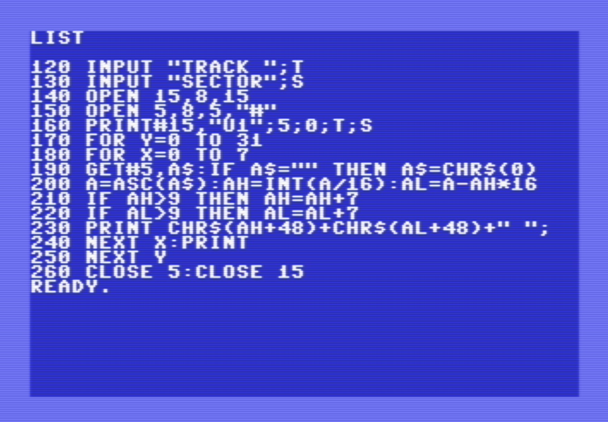

# C64 drive

The drives (like the 1541) that come with the Commodore 64 (C64) are called _smart_.
This naming refers to the fact that the disk operating system is implemented in the drive, not in the computer (C64).
The computer sends a command (a string) to the drive, and the drive interprets the command and executes it.


## Communication

Drive devices are connected to a serial bus.
The C64 has _one_ serial port. Typically, a serial cable is plugged into that port and the other end is plugged into a drive device.
A drive device has _two_ serial port; they are identical. The other port can be used to plug in another cable to run to a second drive device (or a printer or a ...).
In other words, devices are _daisy chained_ on the serial bus. Every device on the bus has a hardwired (typically with dip switches on that device) _device number_.
Disk drive device numbers range from 8 up to 15.

Within a drive _device_ - a physical enclosure with an incoming serial port, an outgoing serial port and a set of 
dip switches that configure a device number, there could be two drive _units_ - a spindle and head and an opening to insert a disk. 
When sending a command to a drive device, the command string includes a drive unit id (e.g. 0 or 1).
If the drive unit id is absent, it usually defaults to 0.


In the past maybe there were drive devices with two drive units. But those no longer appear to exist - or [do they](https://bitbinders.com/products/commodore-1581dv).
In the remainder of this document, we will no longer use the term "drive device" but simply "drive" or "device".

Since a program might have more then one file open on a drive (remember that the disk operating system is in the drive),
the drive needs to differentiate between them. This is done with so-called _secondary addresses_. 
One aspects of a secondary address is that it has a 256 byte buffer on the drive; other aspects 
associated with a secondary address are pointers to the current track, sector and (byte) offset.

To [open](https://www.c64-wiki.com/wiki/OPEN) a file the following command is given.

```
open <logical_file_number> , <device_number> , <secondary_address> , <command_string>
```

This allocates a file handle on the C64 (e.g. a buffer) identified by `<logical_file_number>`.
The handle is associated with a file on device `<device_number>`, but since there could be more,
specifically using handle `<secondary_address>` on the drive. 

For example, this opens two sequential files on device 8. They have handles 2 and 3 on the C64 and 5 and 6 on the drive.

```
OPEN 2, 8, 5, "FILENAME,SEQ,READ" 
OPEN 3, 8, 6, "FILENAME,SEQ,WRITE" 
```

Yes that is confusing, so you see a lot of programs keeping the two handles equal (`open 15,8,15`).

Three secondary addresses are special:
- secondary address 0 is dedicated for LOAD; the file type is implicitly PRG and the mode is implicitly READ.
- secondary address 1 is dedicated for SAVE; the file type is implicitly PRG and the mode is implicitly WRITE.
- secondary address 15 is not for managing files, rather it allows to give _commands_ to the device.

Device commands are the way the disk operating system is used. As an example, see the following "new" command,
which formats a disk. It assigns name `DISKNAME` (disk names have a maximum length of 16 characters) and 
identifier `ID` (disk identifiers are exactly 2 characters) to the disk.

```
OPEN 1, 8, 15, "N0:DISKNAME,ID" : CLOSE 1
```

For other examples see [c64-wiki](https://www.c64-wiki.com/wiki/Commodore_1541), or [manual](https://www.mocagh.org/cbm/c1541II-manual.pdf).


An example of a complex administrative command is the following: it seems to change the [device number](https://www.c64-wiki.com/wiki/Device_number).

```
OPEN 2,8,15:PRINT#2,"M-W";CHR$(119);CHR$(0);CHR$(2);CHR$(devnum+32);CHR$(devnum+64):CLOSE 2
```


## Example basic programs


### filetest

This program tests how (sequential) files are written and read.
It has a simple menu: 1 writes some data to sequential file `BYTES`, 
2 reads all data from `BYTES`, and 3 scratches (deletes) file `BYTES`.
Option 0 ends the program.


This program begins (line 100) by opening the command channel of the drive
(hardwired device 8). The channel is needed because all operations from 
the menu report drive status obtained via the command channel.

Lines 110-140 print a menu, get user's menu selection, execute chosen subroutines, and all that
until the user presses 0. Then the program closes the command channel and ends.

Lines 2xx form the writing subroutine. Lines 3xx form the reading subroutine,
and lines 4xx are the scratch subroutine. On 5xx we find the drive status
reporting.

Some observations

- It seems that `ST` is used for querying the system state after data input 
  (INPUT/GET) and output (PRINT); [see](https://www.c64-wiki.com/wiki/STATUS). 
  I'm note sure of `ST` is also updated after OPEN or CLOSE.
  
- The C64 file state (`ST`, not to be confused with the drive status read via channel 15)
  turns 64 when the last byte has been read. As [Bumbershoot](https://bumbershootsoft.wordpress.com/2017/09/23/c64-basic-disk-io/) 
  states "Unlike `feof()` in C, though, ST is set on the _last legal_ read, not the _first illegal_ one."
  The code prints a `/` before the last byte.
  This mechanism of "last legal read" makes me wonder how that works for an empty file.
  Unfortunately, I'm not able to generate an empty file. If I `OPEN:CLOSE`,
  or `OPEN:PRINT3,"";:CLOSE` or even `OPEN:PRINT3,"A";:CLOSE`, I get a file of four bytes
  x 0 2 x where x is 13 in the first two cases and 65 (A) for the third try...
  
- A sequential file is like a modern text file, but there is more than just newline 
  conversions when using INPUT.
  That's why this program reads character by character (`GET#3,B$`). One "glitch" in
  C64 BASIC is that when the file has a NUL char, `B$` is an empty string.
  The second part of line 320 converts the read character (`B$`) to an ASCII value (`B`)
  taking care of the glitch.


I ran the program (with `BYTES` present from a previous run).

- The first delete (scratch) was successful the last `1` in `1 FILES SCRATCHED 1 0` 
  means 1 file was scratched.
  
- A second delete was sort of successful, no error, but also no file scratched.

- A first write was successful, but the second gave a `FILES EXISTS`.

- Finally the reading.
  This was a bit of a surprise to me.
  We see that CRs (character 13) are inserted if we use `PRINT#` without `;`.
  We see that our patch to read the NUL character works.
  For fun: change the `;` in  a `,` in `PRINT#`. This inserts a series of spaces into the file.


### filedump

This basic program prints a hex dump of a file.

Lines 100-130 records in `DK` the device number of the disk and inputs in `NM$` the name of the file to dump.
Line 200 opens the file on (unit 0 in device 8) using 3 as file handle on the C64 and on the drive.


Statement `GET#3,B$` gets exactly one byte from the file (handle 3) and assigns that to `B$`.
`B$` has therefore always a length of 1 except when the read byte is 0x00, that doesn't match with basic strings.
If that happens, `B$` is empty. This special case is repaired on line 300: 
`B` is the read byte (`B$` or 0x00) after the line is executed.

Line 320 prints the address (in hex) of the row (if address is nr 0 of a block of 8).
Line 330 prints the read byte (8in hex).
Line 360 converts byte `B` to printable character `C` or to `.` (char 46) when not printable.
Those characters are accumulated in `C$` on line 370, which is printed by routine 995, 
for each complete line (at 380), and for the remaining characters of the last incomplete line (400).

On line 310 `GET` updates `ST`, if it is non-zero in line 390, lines 400 and 410 terminate the program.

The subroutine at line 900 prints (numeric) variable `D` to a _two_ character string 
with the hex representation of `D`. It uses `DH` and `DL` as scratch variables.
The subroutine at line 800 prints (numeric) variable `DD` to a _four_ character string 
with the hex representation of `DD`. It calls 800 twice, so uses `D`, `DH` and `DL` as scratch variables.

The following shows filedump dumping itself.


The first two bytes (white: 01 08) is the address where to load this program (0x0801).

The next two bytes (red: 15 08) store the link, the address of the next basic line (0x0815).
The next two line (green: 64 00) give the line number of the line (0x0064 or 100 dec).
The line ends at 0814 (file offset 0015, black: 00).

The the next lines starts. Two bytes for the link (red: 0832), two bytes for the line 
number (green: 006E or 110 dec) the several bytes terminated by a 00 (black, at offset 0032).
And so on.

The last link (at offset 0222) 00 00, prefixed by the terminating 00 of the last 
basic line (at offset 0221).

ST is printed on line 410. It prints 64, bit 6 of `ST` indicates 
[end of file has been reached](https://www.c64-wiki.com/wiki/STATUS).
I'm a bit puzzled when to check ST, this feels a bit late (we processes the read `B$`), 
but this way the dump has the correct amount of bytes.


### filecopy

This basic program copies a file from device 8 to 9.


### sectordump

This basic program prints one "raw" sector of a disk.
Note that it uses the command address (secondary address 15) to send the block-read command `U1`,
and a plain secondary address 5 to get the block bytes.



Line 160 is tricky; as the manual explains on [page 66](https://www.mocagh.org/cbm/c1541II-manual.pdf#page=38) the
`U1` command has four parameters

```
  "U1" ; <secondary_address> ; <unit> ; <track> ; <sector>
```

This line therefore couples the command block-read given via the command channel 15, to the other file descriptor 5.


### Save with load address

When LOADing a program BASIC loads to its default address of 0x0801.
For assembler programs this is unwanted behavior.
The LOAD command does allow loading to another location, by appending the 1 flag: `LOAD "BYTES",8,1`.
This works for PRG files, since the have a very simple header, namely two bytes the specify the load address.

BASIC also has the counterpart for saving: `SAVE "BYTES",8,1`.
What is inconvenient is that the start and end-address are not part of the command.
Instead, the SAVE,1 command uses the addresses at 0043/0044 and 0045/0046.
The first is the start address where to save from. This location is known as TXTTAB, or start-of-basic.
The second address is the end address. This location is known as VARTAB, or start-of-variables; 
which is also the end-of-basic (program code).

In this test we make a "fake" program of 4 bytes at 49152 (page 192, or 0xC000); 
We poke decimal values 11, 22, 33, 44; arbitrary values, just to recognize them.

Next we set the TXTTAB to 49152 (00/192) and VARTAB to 49152
(it might be wise to first record the original values of TXTTAB and VARTAB, 
see warning at the end of this section).
Those pointer values setup a block of 0 bytes.
The first SAVE saves that block of 0 bytes.


The next step is to set VARTAB one higher and SAVE a block of 1 bytes.
The next step is to set VARTAB again one higher, to 2, and SAVE a block of 2 bytes.

If we run this in VICE we can take a copy of the whole [raw disk](nbytes.d64).
With [d64viewer](https://github.com/maarten-pennings/d64viewer) we can inspect the details of the disk.

First we check the directory

```
(env) C:\Repos\d64viewer\viewer>run nbytes.d64
d64viewer: file 'nbytes.d64' has 683 blocks of 256 bytes
showing dir starts at 358 as dir [tech0 cont(17)]

|block 358 zone 1/19 track 18 sector 1 type DIR------|
| blocks | filename           | filetype | block1    |
|--------|--------------------|----------|-----------|
|   1    | '0BYTES'           |   PRG    | 11/00=336 |
|   1    | '1BYTES'           |   PRG    | 11/01=337 |
|   1    | '2BYTES'           |   PRG    | 11/02=338 |
no next block (request was 17)
Done
```

Next we check the two-byte file.

```
(env) C:\Repos\d64viewer\viewer>run nbytes.d64 --tfile 2BYTES
d64viewer: file 'nbytes.d64' has 683 blocks of 256 bytes
showing file 2BYTES at 338 as hex [tech0 cont(682)]

|block 338 zone 0/21 track 17 sector 2 type FIL-----------------------------|
|offset| 00 01 02 03 04 05 06 07 08 09 0A 0B 0C 0D 0E 0F | 0123456789ABCDEF |
|------|-------------------------------------------------|------------------|
|  00  | 00 05 00 C0 0B 16*00*00*00*00*00*00*00*00*00*00*| °·°···°°°°°°°°°° |
|  10  |*00*00*00*00*00*00*00*00*00*00*00*00*00*00*00*00*| °°°°°°°°°°°°°°°° |
|  20  |*00*00*00*00*00*00*00*00*00*00*00*00*00*00*00*00*| °°°°°°°°°°°°°°°° |
|  30  |*00*00*00*00*00*00*00*00*00*00*00*00*00*00*00*00*| °°°°°°°°°°°°°°°° |
|  40  |*00*00*00*00*00*00*00*00*00*00*00*00*00*00*00*00*| °°°°°°°°°°°°°°°° |
|  50  |*00*00*00*00*00*00*00*00*00*00*00*00*00*00*00*00*| °°°°°°°°°°°°°°°° |
|  60  |*00*00*00*00*00*00*00*00*00*00*00*00*00*00*00*00*| °°°°°°°°°°°°°°°° |
|  70  |*00*00*00*00*00*00*00*00*00*00*00*00*00*00*00*00*| °°°°°°°°°°°°°°°° |
|  80  |*00*00*00*00*00*00*00*00*00*00*00*00*00*00*00*00*| °°°°°°°°°°°°°°°° |
|  90  |*00*00*00*00*00*00*00*00*00*00*00*00*00*00*00*00*| °°°°°°°°°°°°°°°° |
|  A0  |*00*00*00*00*00*00*00*00*00*00*00*00*00*00*00*00*| °°°°°°°°°°°°°°°° |
|  B0  |*00*00*00*00*00*00*00*00*00*00*00*00*00*00*00*00*| °°°°°°°°°°°°°°°° |
|  C0  |*00*00*00*00*00*00*00*00*00*00*00*00*00*00*00*00*| °°°°°°°°°°°°°°°° |
|  D0  |*00*00*00*00*00*00*00*00*00*00*00*00*00*00*00*00*| °°°°°°°°°°°°°°°° |
|  E0  |*00*00*00*00*00*00*00*00*00*00*00*00*00*00*00*00*| °°°°°°°°°°°°°°°° |
|  F0  |*00*00*00*00*00*00*00*00*00*00*00*00*00*00*00*00*| °°°°°°°°°°°°°°°° |
|------|-------------------------------------------------|------------------|
no next block (request was 682)
Done
```

Looks good. First two bytes (00 05) is the _link_ to the next disk block.
But in this case the first byte, normally track, is 00 which signals that this is the last block of the file.
The next byte 05 is then not the sector, but the index of the last byte in this sector.
So 6 bytes (from 00 up to and including 05) of this sector are used.
We see that d64viewer "stars" all bytes from 06 onward so it came to the same conclusion.
Why does this make sense?
After the two bytes for _link_ a PRG file has two bytes for the load address.
We indeed see 00 C0 for 49152.
After that, two bytes contents: 0B and 16, or, in decimal, 11 and 22, that's what we poked.

A quick check on the one-byte file shows indeed a _link_ of 00 04

```
(env) C:\Repos\d64viewer\viewer>run nbytes.d64 --tfile 1BYTES
d64viewer: file 'nbytes.d64' has 683 blocks of 256 bytes
showing file 1BYTES at 337 as hex [tech0 cont(682)]

|block 337 zone 0/21 track 17 sector 1 type FIL-----------------------------|
|offset| 00 01 02 03 04 05 06 07 08 09 0A 0B 0C 0D 0E 0F | 0123456789ABCDEF |
|------|-------------------------------------------------|------------------|
|  00  | 00 04 00 C0 0B*00*00*00*00*00*00*00*00*00*00*00*| °·°··°°°°°°°°°°° |
|  10  |*00*00*00*00*00*00*00*00*00*00*00*00*00*00*00*00*| °°°°°°°°°°°°°°°° |
|  20  |*00*00*00*00*00*00*00*00*00*00*00*00*00*00*00*00*| °°°°°°°°°°°°°°°° |
|  30  |*00*00*00*00*00*00*00*00*00*00*00*00*00*00*00*00*| °°°°°°°°°°°°°°°° |
|  40  |*00*00*00*00*00*00*00*00*00*00*00*00*00*00*00*00*| °°°°°°°°°°°°°°°° |
|  50  |*00*00*00*00*00*00*00*00*00*00*00*00*00*00*00*00*| °°°°°°°°°°°°°°°° |
|  60  |*00*00*00*00*00*00*00*00*00*00*00*00*00*00*00*00*| °°°°°°°°°°°°°°°° |
|  70  |*00*00*00*00*00*00*00*00*00*00*00*00*00*00*00*00*| °°°°°°°°°°°°°°°° |
|  80  |*00*00*00*00*00*00*00*00*00*00*00*00*00*00*00*00*| °°°°°°°°°°°°°°°° |
|  90  |*00*00*00*00*00*00*00*00*00*00*00*00*00*00*00*00*| °°°°°°°°°°°°°°°° |
|  A0  |*00*00*00*00*00*00*00*00*00*00*00*00*00*00*00*00*| °°°°°°°°°°°°°°°° |
|  B0  |*00*00*00*00*00*00*00*00*00*00*00*00*00*00*00*00*| °°°°°°°°°°°°°°°° |
|  C0  |*00*00*00*00*00*00*00*00*00*00*00*00*00*00*00*00*| °°°°°°°°°°°°°°°° |
|  D0  |*00*00*00*00*00*00*00*00*00*00*00*00*00*00*00*00*| °°°°°°°°°°°°°°°° |
|  E0  |*00*00*00*00*00*00*00*00*00*00*00*00*00*00*00*00*| °°°°°°°°°°°°°°°° |
|  F0  |*00*00*00*00*00*00*00*00*00*00*00*00*00*00*00*00*| °°°°°°°°°°°°°°°° |
|------|-------------------------------------------------|------------------|
no next block (request was 682)
Done
```

And finally a quick check on the zero-byte file shows indeed a _link_ of 00 03


```
(env) C:\Repos\d64viewer\viewer>run nbytes.d64 --tfile 0BYTES
d64viewer: file 'nbytes.d64' has 683 blocks of 256 bytes
showing file 0BYTES at 336 as hex [tech0 cont(682)]

|block 336 zone 0/21 track 17 sector 0 type FIL-----------------------------|
|offset| 00 01 02 03 04 05 06 07 08 09 0A 0B 0C 0D 0E 0F | 0123456789ABCDEF |
|------|-------------------------------------------------|------------------|
|  00  | 00 03 00 C0*00*00*00*00*00*00*00*00*00*00*00*00*| °·°·°°°°°°°°°°°° |
|  10  |*00*00*00*00*00*00*00*00*00*00*00*00*00*00*00*00*| °°°°°°°°°°°°°°°° |
|  20  |*00*00*00*00*00*00*00*00*00*00*00*00*00*00*00*00*| °°°°°°°°°°°°°°°° |
|  30  |*00*00*00*00*00*00*00*00*00*00*00*00*00*00*00*00*| °°°°°°°°°°°°°°°° |
|  40  |*00*00*00*00*00*00*00*00*00*00*00*00*00*00*00*00*| °°°°°°°°°°°°°°°° |
|  50  |*00*00*00*00*00*00*00*00*00*00*00*00*00*00*00*00*| °°°°°°°°°°°°°°°° |
|  60  |*00*00*00*00*00*00*00*00*00*00*00*00*00*00*00*00*| °°°°°°°°°°°°°°°° |
|  70  |*00*00*00*00*00*00*00*00*00*00*00*00*00*00*00*00*| °°°°°°°°°°°°°°°° |
|  80  |*00*00*00*00*00*00*00*00*00*00*00*00*00*00*00*00*| °°°°°°°°°°°°°°°° |
|  90  |*00*00*00*00*00*00*00*00*00*00*00*00*00*00*00*00*| °°°°°°°°°°°°°°°° |
|  A0  |*00*00*00*00*00*00*00*00*00*00*00*00*00*00*00*00*| °°°°°°°°°°°°°°°° |
|  B0  |*00*00*00*00*00*00*00*00*00*00*00*00*00*00*00*00*| °°°°°°°°°°°°°°°° |
|  C0  |*00*00*00*00*00*00*00*00*00*00*00*00*00*00*00*00*| °°°°°°°°°°°°°°°° |
|  D0  |*00*00*00*00*00*00*00*00*00*00*00*00*00*00*00*00*| °°°°°°°°°°°°°°°° |
|  E0  |*00*00*00*00*00*00*00*00*00*00*00*00*00*00*00*00*| °°°°°°°°°°°°°°°° |
|  F0  |*00*00*00*00*00*00*00*00*00*00*00*00*00*00*00*00*| °°°°°°°°°°°°°°°° |
|------|-------------------------------------------------|------------------|
no next block (request was 682)
Done
```

Warning: BASIC will behave strangely after you reset these pointers.
Sometime is helps to do RUN/STOP/RESTORE.
The NEW command resets the pointers.
But NEW might now work, then `POKE43,1:POKE44,8` and `POKE45,3:POKE 46,8`.


## Save program as text file

A `SAVE` command saves a BASIC program as PRG file, a series of tokens.
It is also possible to save the program as text, as SEQ file with plain ASCII to be more precise.
We use `CMD` for that.
This "changes the data output from the screen to another peripheral device" - [C64 wiki](https://www.c64-wiki.com/wiki/CMD).

The procedure is to first open a sequential file for writing.

```
  OPEN 6,8,6,"MYPROG.TXT,SEQ,WRITE"
```

Then to redirect the screen to that file, we use the `CMD` command.

```
  CMD 6,;
```

The `,;` looks mysterious. 
The `CMD` command is optionally passed a string that is printed to the file whose logical file number has been passed (6 here).
If that string is absent, `CMD` prints an empty line. To avoid that empty line, we pass the string as second argument (after the `,`).
That string is empty, but the `;` suppresses the newline character that would otherwise be inserted.

Finally, we list the program, to the console, which is now redirected to logical file 6.

```
  LIST 
```

I would expect that to stop redirection from the screen to logical file 6, we would have to type `CMD` without a parameter, but 
the funny method is to do an explicit print to its logical file.

```
  PRINT#6,;
```

Again, the `,;` suppresses an otherwise added newline character.

Finally we close the logical file.

```
  CLOSE 6
```

It should be note that
- This series of command cannot easily be coded in a program, since `LIST` aborts a `RUN`.
- These commands are typically entered manually on _two_ lines, not one, again, because any command after `LIST` is ignored.

```
  OPEN 6,8,6,"MYPROG.TXT,SEQ,WRITE" : CMD 6,; : LIST 
  PRINT#6,; : CLOSE 6
```

The below screenshot shows a program that prints a text file that is generated by saving itself to a text file.
Lines 50 doesn't run (misses the `REM` statement), line 60 does run but the `LIST` aborts the run.
But I added them as documentation.


Two observations around the generated text file.
- The text file still starts with a newline (it is printed after the `*`).
- The text file ends with `READY.`, since that is printed  after `LIST`.

(end)

