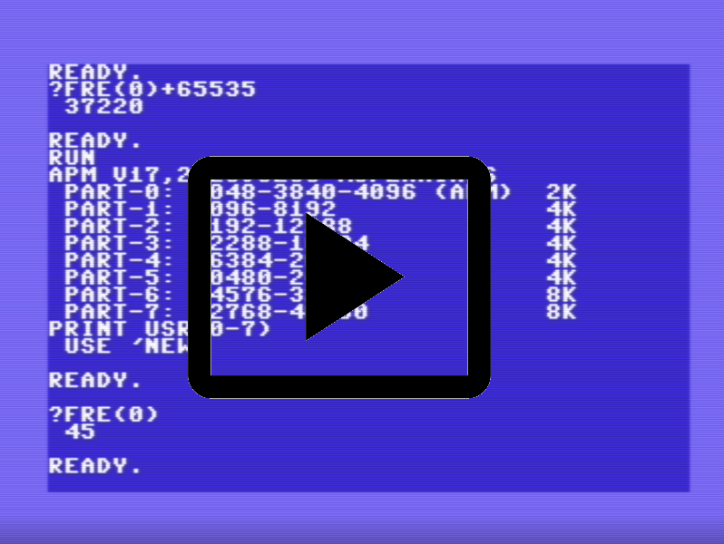
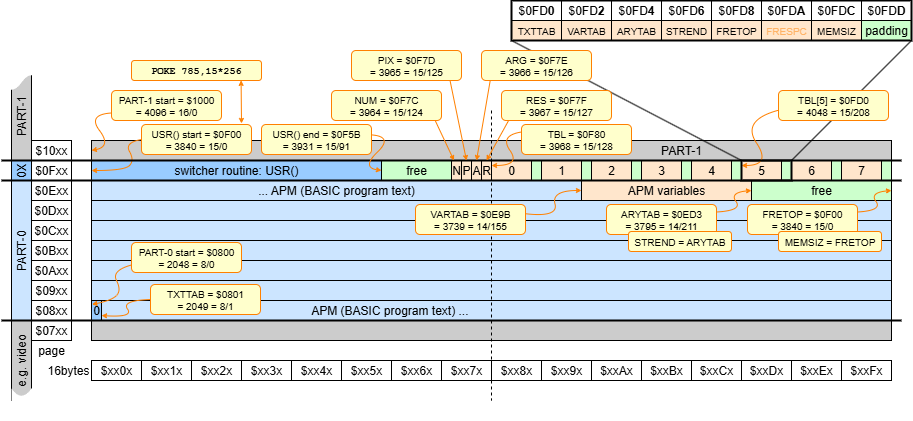
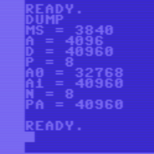

# C64 Memory partitioning

Can we partition the C64 memory, storing two BASIC programs simultaneously?
A multi-app setup?

This is not multitasking with millisecond time slicing; rather we activate 
one partition, run the BASIC app, stop it, switch to another partition, 
and run that BASIC app, switch back, etc.

Think of a use-case where we have one app writing files and another app is reading those files.
We could have one partition where we develop the app that writes files to disk.
A second partition has some standard app that performs hex-dumps of disk files; 
we use that to debug what the first app has written. Partition three has the 
second app we develop; it reads and processes disk files. A fourth partition 
could be used for `LOAD "$",8` without overwriting the apps we develop.

The outline of the article is as follows
After reconstructing where the partitioning idea came from, we look at the BASIC memory map.
Next, we create a _Simple Partition Manager_, and we close with some after thoughts.

In the second part we develop an _Advanced Partition Manager_, including some 
assembly code to switch between partitions.

This document comes with two appendices: one containing source files, and 
one examining how `SAVE` and `LOAD` match with partitions.

See the [demo video](https://youtu.be/ysc5qWT_Enk).

[](https://youtu.be/ysc5qWT_Enk)


## Introduction

I was browsing "Mapping the Commodore 64" from Sheldon Leemon. I still have an original, falling apart.
It is a [classic](https://archive.org/details/Compute_s_Mapping_the_64_and_64C) for programmers, 
describing the memory map of the C64 ([webversion](https://www.pagetable.com/c64ref/c64mem/)).

The entry [TXTTAB](https://www.pagetable.com/c64ref/c64mem/#:~:text=%24002B%2D%24002C-,TXTTAB,-Pointer%20to%20the) caught my attention.
It is the "Pointer to the Start of BASIC Program Text" at $002B-$002C (43-44 decimal).
The book explains

> This two-byte pointer lets BASIC know where program text is stored. 
> Ordinarily, such text is located beginning at 2049 ($0801). 
> Using this pointer, it is possible to change the program text area. 
> Typical reasons for doing this include:

> (3) Keeping two or more programs in memory simultaneously. 
> By changing this pointer, you can keep more than one BASIC program in memory at one time, 
> and switch back and forth between them. 

Then came a reference to [COMPUTE!'s First Book of PET/CBM, pages 66 and 163](https://archive.org/details/COMPUTEs_First_Book_of_PET-CBM_1981_Small_Systems_Services)
an article showcasing a multi-app implementation. The book predates the C64. 
It describes the [Commodore PET](https://en.wikipedia.org/wiki/Commodore_PET), 
but since the PET also had Microsoft BASIC, it is a usable start. 
The administration of BASIC interpreter (pointer names, pointer locations) on the PET 
differs from the C64, so it did take me some time to 
get going on my [C64](https://en.wikipedia.org/wiki/Commodore_64).

I did miss one reason in "Mapping the Commodore 64" for changing `TXTTAB`/`MEMSIZ`, namely to set aside a 
part of the memory for an assembly routine. We will utilize this later in the
[advanced partition manager](#advanced-partition-manager) for a central 
switching routine.

Let's first try to understand the memory map used by BASIC, then try to 
replicate on my C64 the multi-app system described in the PET article.


## BASIC memory map

The above mentioned _COMPUTES!'s First Book_ contains the article 
"Memory Partition of BASIC Workspace" by Harvey B. Herman on pages 64-67.
It explains a system with four programs, all four in the memory of the PET. 
Program 1, 2 and 3 are the actual programs between which we want to switch.
The other program is the manager; it lets the user pick the one to switch to.
Once program 1, 2, or 3 is done, it switches back to the manager, where we
can dispatch again one of 1, 2, or 3.

The four programs implement the switching by manipulating pointers.
Herman's article describes and uses pointers on the PET.
In the meantime I found the corresponding pointers for the C64.
The table below comes from the book, with the right-most column ("C64 ROM") added by me.


What are all these pointers? The diagram below shows the C64 memory map with focus on BASIC.
The gray parts (zero page, stack, OS data, screen buffer, BASIC, I/O and Kernal) are ignored;
we look at the colored (blue, orange, green) parts.


By default, a BASIC program starts at $0800, with a zero byte, which _must_ be there (or even `NEW` won't work).
Then comes the BASIC program "text" (the entered lines). Program text starts at a location known
as `TXTTAB` ($0801) and grows pushing up `VARTAB`. 
The image below shows a simple example (of a two-line program `10 A$="ABC"`/`20 B=0`) in more detail.


If a program uses _plain_ variables (scalars, i.e. not arrays), they are stored from location `VARTAB` 
to location `ARYTAB`. Every new variable pushes up `ARYTAB`. Every variable takes a fixed 
amount of 7 bytes, two for the name and 5 for the data. For strings, the data part is actually 
the size and a _pointer_ to the characters, the characters themselves are on the heap at top of the BASIC memory
(when constructed dynamically), or part of the program text (string literals).

If a program uses _array_ variables, they are stored from location `ARYTAB` to location `STREND`.
Every new array (explicit or implicit `DIM`) pushes up `STREND`. 
This name is a bit confusing (I expected `ARYEND`). As mentioned before, string 
characters are stored in the heap. The heap grows _down_ from `MEMSIZ` to `FRETOP`, until the 
latter hits `STREND`. Hence the name.

This explains all six pointers relevant for managing a BASIC program.
I call this set of six BASIC/Kernal maintained zero-page locations the **layout pointers**.
The table below lists them. Although pointer `FRESPC` is interspersed, it does not 
contribute to describing the layout of a BASIC program.

  | addr (dec)| addr (hex)|   name   |life cycle|
  |:---------:|:---------:|:--------:|:--------:|
  | **43/44** |**$2B/$2C**|**TXTTAB**| progtime |
  | **45/46** |**$2D/$2E**|**VARTAB**| progtime |
  | **47/48** |**$2F/$30**|**ARYTAB**| runtime  |
  | **49/50** |**$31/$32**|**STREND**| runtime  |
  | **51/52** |**$33/$34**|**FRETOP**| runtime  |
  |   53/54   |  $35/$36  |  FRESPC  |          |
  | **55/56** |**$37/$38**|**MEMSIZ**| progtime |

The layout pointers tagged _progtime_ in the life cycle column are established during the programming phase. 
The layout pointers tagged _runtime_ are updated during the program execution. 
By calling `CLR`, the runtime pointers are initialized by emptying the
variables block, the array block, and the heap block.
  

## Simple partition manager

We now try to replicate Herman's article, but then on the C64.

- Create one partition manager (app "A0").
- Create two apps ("A1" and "A2", instead of three as Herman does).
- Each app gets a block of 2k RAM (yes, that is small), the first one starting at $0800.
- All three apps are BASIC programs.

The figure below shows how I've partitioned the 38k BASIC RAM (leaving 32k unused).
The numbers on the right are the partition boundaries as selected in the bullets above.
They are shown in hex (`$0801`) followed by an equals sign, and then the 
high byte and low byte in decimal (`8/1`), because that is what we need
for pokes in BASIC.


The partition manager A0 can be loaded from e.g. a disk (but you can also type it in).
It will be loaded at the standard `TXTTAB` ($0801), and the 
loader will set `VARTAB` once the whole program is loaded and the end is known 
(or the editor maintains `VARTAB` while editing).

When ran, one of the first things the partition manager does, is to lower 
its own `MEMSIZ`. With that the three progtime layout pointers for its partition are set.
The partition manager then calls `CLR`, which updates `ARYTAB`, `STREND` and `FRETOP`;
all six layout pointers are then set correctly for A0.
For debugging (and as we will see later, for configuring A1 and A2),
A0 does print the three progtime layout pointers (`TXTTAB`, `VARTAB`, and `MEMSIZ`) to the screen.

The partition manager A0, does need to know the addresses of the partitions
that will contain applications A1 and A2, because activating an application 
means changing the six layout pointers. 

However, at this moment, we do not yet know `VARTAB` of A1 and A2, because we don't know
which (how big) those programs will be. Fortunately that doesn't hamper use.
At first we will uses dummy values for `VARTAB` in A0, then run A0 
(write down its `TXTTAB`, `VARTAB`, and `MEMSIZ`), let it switch to A1, and there call `NEW`. 
This initializes `VARTAB` of A1 (and the dependent layout pointers).

Then we type in the program for A1. At the end of the A1 program, we add lines
that set `TXTTAB`, `VARTAB`, and `MEMSIZ` to the values written down for A0.
Once A1 is done, we can inspect its length by peeking `VARTAB` 
(`TXTTAB` and `MEMSIZ` should not have changed). In my experimental apps, part 
of the code of A1 is to actually print the three progtime layout pointers 
`TXTTAB`, `VARTAB`, and `MEMSIZ`.

In other words, from the table below, the layout pointers with no marking come for free, 
the layout pointers with the single < marking come by design (it is the partitions we want),
and the layout pointers with the double << marking come once we have written those apps.

  |  App |TXTTAB (43/44)| |VARTAB (45/46)|  |MEMSIZ (55/56)| |
  |:----:|:------------:|-|:------------:|--|:------------:|-|
  |  A0  | $0801 =  8/1 | |$0A13 = 10/49 |  | $1000 = 16/0 |<|
  |  A1  | $1001 = 16/1 |<|$110D = 17/54 |<<| $1800 = 24/0 |<|
  |  A2  | $1801 = 24/1 |<|$190D = 25/54 |<<| $2000 = 32/0 |<|


### Application A0 (partition manager)

The screenshot below shows the complete listing for a simple partition manager A0.

Before or after running it (but don't press `1` or `2` yet), the listing can be saved e.g. to disk. 
BASIC's SAVE will look at `TXTTAB` and `VARTAB` (but not `MEMSIZ`) to determine what to save.
`TXTTAB` is even saved as header of the `PRG` file (see hex dump [below](#appendix-on-file-handling)).
This way BASIC knows where to load a `PRG` back. 


See [copy-able listing](#file-a0---simple-partition-manager) below.

Note
- Line 100, identifies this program as the simple partition manager A0.
- Line 110, sets own the partition size by poking `MEMSIZ`
- Line 120 updates the runtime layout pointers via the BASIC `CLR` command.
- Lines 130 and 140 set the leading 0 for the other two partitions.
- Lines 150-170 print the progtime layout pointers (to write down, needed when editing A1 or A2).
- Lines 180-220 let the user enter `1` or `2` or something else, and activate A1 or A2, or just end A0 (to be rerun, edited, saved).
- Lines 300-330 active A0.
- Lines 400-430 active A1.
- The activation sets `TXTTAB`, `VARTAB`, and `MEMSIZ` (then `CLR` for the other 3). 
  At first `VARTAB` at lines 310 and 410 are set to dummy values. 
  They need to be updated with the actual values once A1 and A2 are known (programmed/edited, loaded).
- On purpose we have extra spaces for the poke values, so that there is room for 3 digits (0..255)
  without changing the size of the program (and thus without changing A0's `VARTAB`).
- If you enter the programs yourself make sure to _copy the lines exactly_.
  If there is any size change you need to correct the layout pointer values in A1 and A2.

The screen below is what we see after running.
We need to write down the values of the three layout pointers.


Go ahead and press `1` now.


### Application A1 (user program)

After pressing `1` in the partition manager A0, it activated the partition for A1.

> Remember, the first time we activate a partition, we need to call `NEW` to set `VARTAB`.

We can now load or enter a program. We start with the latter.


See [copy-able listing](#file-a1---simple-demo-app) below.


Note
- Lines 100-110 identify this program as user program A1. One could argue these are the only two real lines of app A1, the rest is to support switching.
- Lines 120-140 print the progtime layout pointers (to write down - we need to update A0 for that).
- Lines 200-220 let the user enter `0` or something else, and return to A0, or just end A1 (to be rerun, edited, saved).
- Lines 230-260 active A0. These are the numbers we wrote down while running A0.

The screen below is what we see after running A1.
Again, we need to write down the values of the three layout pointers of A1 to patch A0.


Press e.g. space to exit. Save this user program. For fun, do a `PRINT FRE(0)`. Rerun it and press `0`. 
After pressing `0` in A1, it activates (the partition for) A0 again.

Update the A1's `VARTAB` in A0 and save A0.


### Application A2 (user program)

When we now run A0, we can press `1` and go to A1. List it. Run it and press `0`. We are back in A0.

Run A0 and now press `2`. We are now in partition A2, which was unused until now.

We can write a program for A2. In that case we should start with `NEW`.

However, we can also `LOAD "A1",8`, which includes an implicit `NEW`.
**Do not `LOAD "A1",8,1`**.
When loading without the `,1` BASIC will load at `TXTTAB` (which is $1801 for A2) and 
automagically fix the linked list of BASIC line numbers (of A1 which was saved for $1001).

> I have the KCS power cartridge. It features a `DLOAD "A1"`. That seems to do a `FASTLOAD "A1",8,1` so do not use it.

After A1 is loaded, fix e.g. line 1 to identify it as user program 2.
Run it. Write down the layout pointers. 


Hit `0` to switch to A0. Update A0, to have the correct pointers for A2.


### After thoughts

While a program like A0 (or A1) is changing the layout pointers - by 
poking in 43/44, 45/46, 55/56 - it is changing its own "world". 
Would it still be able to use its variables? 
Probably not, because `VARTAB` is broken.
Would it be able to use `GOTO`? 
I believe that a `NN GOTO MM` starts looking from the current line (`NN`) 
downwards when `MM>NN`. But it starts looking from the start (from `TXTTAB`) 
when `MM<NN`. So that will probably not work either. 
But apparently just going to the next line is fine.

Note that A0 needs to know the layout pointers of apps A1 and A2, 
otherwise it can not activate those apps. Note also that A1 and A2 
need to know the layout pointers of A0, otherwise they cannot switch back.
If you are editing A1, this dependency is painful.

Finally, I was surprised to find out that the standard BASIC commands
`LOAD` and `SAVE` are fully partition compliant: `SAVE` saves the program  
stored between `TXTTAB` and `VARTAB`, and `LOAD` relocates a file to the 
current `TXTTAB`.


## Advanced partition manager 

In the second part of this document we try to make an **advanced** partition 
manager, which mitigates the shortcomings of the simple partition manager.
Let's first have a look at those shortcomings.

### Analysis of the simple partition manager

The first drawback of the simple partition manager is that the actual apps 
(A1, A2,...) need to include switching code (eg lines 150-180 of A1). Of course 
the developer of the partition manager A0 needs to understand partitions and 
layout pointers, but the user apps (A1, A2, ...) should be plain BASIC, free of 
partition knowledge. 

The second drawback is that while developing a user app (say A1), its layout 
pointers (most notably `VARTAB`) change. Therefore, each time a switch is made 
from app A1 to the partition manager A0, the layout pointers of A1 need to be 
recorded, so that they can be updated in A0. Failing to do so, would block us 
from switching back to A1 at a later stage. This is a maintenance burden and 
it is easy to forget.

A related drawback is that when changing A0 (to update the layout pointers 
of one of the apps A1, A2, ...) there is a risk that the layout of A0 itself 
changes (typically pointer VARTAB). That would require an update of the 
switching code of all apps (A1, A2, ...) otherwise they could no longer 
switch to A0.

A small nuisance is also that the switching code only restores the progtime 
pointers (begin of partition, end of BASIC program text, and end of partition), 
not the runtime pointers (variables, arrays, strings) - it clears them. 
Adding the runtime pointers in the switching code would aggravate the 
maintenance burden (more pointers to record and update, and more often).

A final drawback is that the apps (A1, A2, ...) only have switching code to go 
back to partition manager A0, and not to another app. Of course we could 
expand the switching code in each app to allow switching to all other apps, 
but this would make the previous drawbacks only more painful. 

There is a solution to all this; it is presented in the next section.


### Sketch of the advanced partition manager

Why would the programmer of app A1 need to write down the values of A1's 
layout pointers when switching to A0? We have a computer, we could store 
those pointers in variables, can't we? No. Not really. The problem is that while we 
are changing the layout pointers of an app we lose access to our variables 
(`VARTAB` indicates where they are). So that doesn't work. 

Unless we do not use _BASIC_ variables to record the layout pointers, but 
some fixed memory locations. And then we do not use BASIC but some assembly 
routine to update those locations.

The idea is that the partition manager sets aside a piece of memory, the 
_layout table_, that records the layout pointers of all its apps. If 
there are 8 apps (partitions), that would be 8 sets of 7 pointers of 2 bytes, 
nearly 128 bytes for the layout table. The partition manager also records 
which partition is active. Finally, there would be one assembly routine, 
the _switcher_, with one input parameter: the partition to make active 
(to switch to). 

When the switcher gets called, it first copies the actual layout pointers 
(43..56) to the layout table (a "backup"). The switcher knows which slot in the 
layout table to use, because it knows which partition is currently active. 
Then the switcher updates active partition index with the passed parameter. 
Finally, it copies (it "restores") the layout pointers 
from the layout table (using the slot of the new active partition) to the 
actual layout pointers (43..56).

The advanced partition manager thus consists of three parts
- the _layout table_ with layout pointers of all partitions,
- the _switcher_, an assembly routine that implements the switching using 
  the layout table,
- a BASIC program that packages all this; it
   - has some easy way to define partition boundaries,
   - creates the partitions (pokes the leading zeros),
   - initializes the layout table with pointers for all partitions,  
   - initializes the active partition index (to 0, self),
   - pokes the switcher assembly routine into memory, and
   - maps `USR()` to the switcher. 
   
I decided to use `USR()` because this makes it easy to pass a parameter 
(the new partition to become active) to the switcher. 
It also makes the switcher easily accessible in all partitions.


### Partitions

I decided that a maximum of 8 partitions (including one for the partition manager 
itself) is sufficient. Since each partition has 7 layout pointers (14 bytes, 
which I padded with 2 bytes to a slot of 16 bytes) the layout table is 8×16 
or 128 bytes, which is half a 6502 page. Seems sufficient and fitting well.

The Advanced Partition Manager BASIC program includes a table (with `DATA`), 
specifying the partitions wanted by the user. The diagram below 
is the choice I made: 2 large partitions (8k) and 5 medium ones (4k). 
There is one small partition (2k), which is initially for the 
Advanced Partition Manager itself, but once run, it might be replaced by 
something else; the (assembly) switching routine is in a gap between partitions.


Feel free to change the partitions in source code, as long as the partitions 
do not overlap. It is allowed, and I actually did that, to leave "gaps" 
between partitions. The partitions are for BASIC, the gaps can be used 
for e.g. assembly programs or graphics data.


### BASIC program (`APM`)

The main part of the BASIC program of the Advanced Partition Manager (APM) is only 9 lines.

```BAS
100 PRINT"APM V17,2025JUL05 MCPENNINGS"
110 MS=4096-256:REM OWN MEMSIZE
120 A=55:D=MS:GOSUB600:REM SET MEMSIZ
130 GOSUB700:REM POKE USR() ROUTINE
140 A=785:D=MS:GOSUB600:REM SET USRADD
150 GOSUB500:REM PRINT PART-0
160 GOSUB200:REM CREATE PART TABLE
170 PRINT"PRINT USR(0";-(N-1)"{left})":PRINT" USE 'NEW'"
190 END
```

- APM starts with a banner (line 100)

- APM assumes to start at $0800. At line 110, variable `MS` is set to 
  the chosen top: $1000, the MEMSIZ to be. However, we cut of 256 bytes 
  (one 6502 page) for the switcher routine and the layout table.
  
- At line 120 MEMSIZ is actually set. We use the sub routine at line 600 for that; it
  implements a "DOKE" (double poke).
  
  ```BAS
  600 REM DOKE A,D:A=A+2
  610 POKE A,(D-32768)AND255:A=A+1
  620 POKE A,INT(D/256):A=A+1:RETURN
  ```  
  
- In the next section of this article we develop the assembly routine for 
  the switcher. Those byte are included in the BASIC source, and poked 
  to memory by the routine at 700, which is called from line 130. 
  
  Note that the code consists of 92 bytes.
  They are poked to address `MS` and up.
  The poker even has a simple checksum (computed in `P`).
  I noticed the checksum checker misses the `:END` in case of error.
  
  ```BAS
  700 REM USR() CODE
  710 P=0:FORA=MSTOA+92-1:READD:POKEA,D:P=P+D:NEXTA
  720 READD:IFD<>PTHENPRINT"DATA ERR";P
  730 DATA 173,125,15,141,127,15,32,247,183,201,0,208,30,204,124,15,16,25
  740 DATA 140,126,15,32,52,15,32,70,15,173,126,15,141,125,15,32,52,15,32
  750 DATA 81,15,169,0,240,2,169,1,172,127,15,32,145,179,96,173,125,15,41
  760 DATA 7,10,10,10,10,105,128,133,253,169,15,133,254,96,160,13,185,43
  770 DATA 0,145,253,136,16,248,96,160,13,177,253,153,43,0,136,16,248,96
  780 DATA 8824:RETURN
  ```  

- Once the switcher is placed in RAM, we poke the `USR()` vector (address 785),
  see line 140.
  
- Line 150 prints the (address/size) details for partition 0, which differs
  a bit from the details of the other partitions (routine at 500).
  
  ```BAS
  500 REM PRINT PART-0
  510 A0=PEEK(43)+256*PEEK(44)-1:A1=MS+256
  520 PRINT" PART-0:"A0"{left}";-MS"{left}";-A1;"(APM)",(A1-A0)/1024"{left}K":RETURN
  ```

- Line 160, calling routine 200, creates the partition table and prints
  (address/size) details for the other partitions. We discuss that next.

- Line 170 gives a one line user manual: it states to use `USR(0)` .. `USR(7)`.
  It also prints a reminder to use `NEW` the first time a partition is entered.
  
- Line 190 ends the program.

One big part has not yet been discussed, the routine at 200, which creates
the partition table. This table is created from a user supplied list of 
address pairs, defining the partitions.

```BAS
800 REM PARTITION TABLE
810 DATA 8:REM NUM PARTS (WITH PART-0)
820 DATA  4096, 8192
830 DATA  8192,12288
840 DATA 12288,16384
850 DATA 16384,20480
860 DATA 20480,24576
870 DATA 24576,32768
880 DATA 32768,40960
```

Note that the first `DATA` element defines the number of partitions, here 8 
(the maximum the switcher supports). Also note that lines 820-880 only 
define partitions 1 to 7, partition 0 is implicit, that is the partition
initially used by APM itself.

- The number of partitions needs to be between 3 and 8.
 (probably a lower bound of 2 instead of 3 would also be OK).
- The partitions shall not overlap. 
- It is allowed to leave "gaps" between partitions.
- We could have added a check that partitions do not to overlap with the 
  BASIC interpreter at $A000 and up.

This is routine 200.

```BAS
200 REM SET USR() VARS,INCL PART TBL
210 READ N:REM NUM PARTITIONS
220 IFN<3ORN>8THENPRINT"NUM ERR":END
230 A=4096-128-4:REM ADDR OF USR() VARS
240 D=N+256*0:GOSUB600:REM NUM,PIX
250 A=A+2:REM SKIP ARG,RES
260 A=A+16:REM SKIP PART-0
270 PA=MS+256:REM END OF PREV PART
280 FORP=1TON-1
290 :READA0,A1:PRINT" PART";-P"{left}:"A0"{left}";-A1" ",(A1-A0)/1024"{left}K"
300 :IFPA>A0THENPRINT"OVERLAP ERR":END
310 :IFA0+64>A1THENPRINT"SIZE ERR":END
320 :POKE A0,0      :REM LEAD00
330 :D=A0+1:GOSUB600:REM TXTTAB
340 :D=A0+3:GOSUB600:REM VARTAB
350 :D=A0+3:GOSUB600:REM ARYTAB
360 :D=A0+3:GOSUB600:REM STREND
370 :D=A1  :GOSUB600:REM FRETOP
380 :D=0   :GOSUB600:REM FRESPC
390 :D=A1  :GOSUB600:REM MEMSIZ
400 :A=A+2 :REM PAD
410 :PA=A1
420 NEXT P:RETURN
```

- Is starts (line 210) by reading how many partitions to create.
  This is tested at line 220.

- The layout table is written in the second half of page $0F00: at $0F80.
  But the table is prepended by four variables (`NUM`, `PIX`, `ARG`, `RES`)
  used by the switcher assembly routine.
  See the assembly routine below for the purpose of those variables.
  Line 230 initializes the address pointer `A` to the start address
  of the variables.
  
- Line 240 initializes NUM to N and PIX to 0, using the DOKE routine 600.

- Line 250 skips initialization of ARG and RES.

- Line 260 skips initialization of slot 0 of the layout table.
  Slot 0 is for APM itself; it will be initialized the first time the
  user will call `USR()`.
  
- Line 270 initializes `PA` ("previous address") to the first free address, 
  for some error checking while creating the partitions (see line 300).

- Line 280 initializes the vector table for partitions 1 to N-1 
  (PART-0 was done/skipped at line 260).

  - Line 290 reads the wanted address pair `A0`/`A1`for partition `P`.
    It prints the addresses and the partition size (in kibi bytes).

  - Line 300 checks against partitions overlapping and line 310 against too 
    small partitions (we took 64 bytes as limit).

  - Line 320 ensures that every partitions starts with a 0 byte, as BASIC 
    requires.
    
  - Lines 330-390 save the seven layout pointers (assuming an empty program) 
    to the layout table. Again, routine 600 is used, which steps `A` each time. 
    Note that `FRESPC` is included; it does not belong to the layout pointers,
    but having 14 continous bytes is easy, and it does not harm.
  
  - Line 400 pads each slot in the layout table to 16 entries. 
    This makes the switch routine easier, ×16 is easier in assembler 
    (4× shift) than ×14.
    
  - Line 410 records the new first free address.

- Line 420 ends the partition loop.

This completes the BASIC program of the Advanced Partition Manager.
For full source see [listing](#file-apm17---advanced-partition-manager) below.
The data for the poker (lines 730-770) was generated by an assembler 
(Turbo Macro Pro) from an assembly source. Let's look at that next.


### Assembly program (`APMUSR`)

Let's recall what the switcher (the assembly routine behind `USR()`) 
needs to do:

- One partition is active, which one, is recorded in variable `PIX` 
  (partition index).
  
- The user will give a command `USR(E)`, which is supposed to activate
  partition `E`.
  
- The switcher will make a backup of the active layout pointers 
  into the layout table, at slot `PIX` (current layout).

- The active partition will switch: `PIX` will be set to the passed `E`.

- The layout pointers that were backed-up for `E` will now be restored from 
  slot `E` to the active layout pointers.

Let's review the assembly program.

It begins with a header with comments.

```ASM
         ; APMUSR.TMP V6
         ; ADVANCED PARTITION MANAGER;
         ; IMPLEMENTATION OF USR()
         ; COPIES THE LAYOUT POINTERS
         ; 2025 JUL 4
         ; MAARTEN PENNINGS
```

Next come symbol definitions.

```ASM
;---------------------------------------
PTR      = $FD  ;..FE PTR TO TBL[CURRIX]
TXTTAB   = $2B  ;..3B LAYOUT POINTERS
;---------------------------------------
GETADR   = $B7F7;INT(FAC) TO Y/A
GIVAYF   = $B391;Y/A TO FAC
;---------------------------------------
NUM      = $0F7C;NUMBER OF PARTITIONS
PIX      = $0F7D;CURRENT PARTITION INDEX
ARG      = $0F7E;INPUT ARGUMENT
RES      = $0F7F;OUTPUT RESULT
TBL      = $0F80;TABLE OF LAYOUT PTRS
;---------------------------------------
```

- Location $FD/$FE is used for an indirect pointer `PTR`.
- Symbol `TXTTAB` identifies the address of the (active) layout pointers.
- `GETADR` is a BASIC routine that converts a floating point number (`E` as it
  comes in via `USR(E)`) to an integer in register Y and A.
- `GIVAYFADR` is a BASIC routine that converts and integer in registers 
  Y and A to a floating point number (as returned by `USR()`).
- `NUM` stores the number of partitions, set by the BASIC program.
- `PIX` stores the index (slot) of the current active partition.
- `ARG` is the low-byte of the integer passed via `USR()` 
  (after conversion from float).
- `RES` is the low-byte of the integer that will be returned by `USR()` 
  (after conversion to float).

Let us first have a look at the backup and restore routines.

```ASM
BACKUP   ; COPY LAYOUT POINTERS TO PTR
         LDY #13; 7 POINTERS = 14 BYTES
BACKUP_  LDA TXTTAB,Y
         STA (PTR),Y
         DEY
         BPL BACKUP_
         RTS
```

This routine copies 14 bytes from the layout pointers (at the zero page)
to the layout table. It skips the 2 padding bytes. Precondition fro `BACKUP` 
is that `PTR` points to the correct slot in the layout table. 
Note that pointer `FRESPC` is also backed-up.

```ASM
RESTOR   ; COPY PTR TO LAYOUT POINTERS
         LDY #13; 7 POINTERS = 14 BYTES
RESTOR_  LDA (PTR),Y
         STA TXTTAB,Y
         DEY
         BPL RESTOR_
         RTS
```

The restore routine is similar. Also here we have the precondition that 
`PTR` points to the correct slot in the layout table. This rouitine restores 
`FRESPC`, it is not part of the layout pointers formally, but restoring seems 
not to cause problems.

Both routines (`BACKUP` and `RESTORE`) need `PTR` to point the the 
correct address. `PTR` is computed from `PIX` by routine `SETPTR`. 

```ASM
SETPTR   ; PTR := @TBL[PIX]
         ; PTR := TBL + 16*PIX
         ; LO(TBL)+16*7 < $100
         LDA PIX
         AND #7 ; PROTECT MEMCPY
         ; 0 <= A < 8
         ASL A  ; 16*A
         ASL A
         ASL A
         ASL A
         ; Ã=0
         ADC #<TBL
         STA PTR
         LDA #>TBL
         STA PTR+1
         RTS
```

Since (due to the padding) a slot in the layout table is 16 bytes, 
the computation is relatively simple: `PTR := TBL + 16*PIX`. 
What also helps is that `PIX<8`, so we maximally add $80.
Since `TBL` is $0F80, there is no carry for the addition.

For safety, `PIX` is ANDed with 7, this ensures `PTR` always points 
inside the layout table, so that when somehow`PIX` is incorrect, we will 
not write 14 bytes over the `USR` routine.

With `SETPTR` completed, have discussed all ingredients.
This is the main program for `USR()`.

```ASM
         *= $0F00
USR      ; IMPLEMENTATION OF USR()

         ; RES:=PIX
         LDA PIX
         STA RES

         ; ARG:=FAC (QUIT ON TOO LARGE)
         JSR GETADR
         CMP #0  ; HI MUST BE 0
         BNE RET1
         CPY NUM ; LO MUST BE <NUM
         BPL RET1
         STY ARG

         ; TBL[PIX]=LAYOUTPOINTERS
         JSR SETPTR
         JSR BACKUP

         ; PIX:=ARG
         LDA ARG
         STA PIX

         ; LAYOUTPOINTERS=TBL[PIX]
         JSR SETPTR
         JSR RESTOR

RET0     ; FAC:=RES (ERROR FLAG CLR)
         LDA #0
         BEQ RET
RET1     ; FAC:=RES (ERROR FLAG SET)
         LDA #1
RET      LDY RES
         JSR GIVAYF

         ; DONE
         RTS
```

- The `USR()` function always returns the index of the old/previous partition.
  Therefore the first block of lines copies `PIX` (current partition) to `RES` 
  the result that later will be returned by `USR()`.
  
- The next block of lines converts the FAC to an integer by calling `GETADR`.
  Recall that FAC means floating point accumulator.
  It holds the value of expression `E` when calling `USR(E)`.
  
  The conversion result is checked: the high byte (`A`) shall be 0, 
  otherwise execution bails out via `RET1`.
  The next check requires the low byte (`Y`) to be less then the number 
  of partitions (`NUM`). Again, otherwise execution bails out via `RET1`.
  If both checks pass, the low byte is stored in `ARG`, and
  execution proceeds normally.
  
- The next block of lines computes `PTR` from `PIX` and performs a backup
  of the layout pointers.

- Then, active index (`PTR`) is set to the new partition (`ARG`).

- The following block of lines computes `PTR` from the new `PIX` 
  and performs a restore of the layout pointers.

- The last block of lines converts the integer in `RES` to a floating point 
  value in BASIC's FAC, which will be returned by `USR()`. As high byte (`A`) 
  we use 0, if there was no problem, or 1 if there was (`USR(E)`'s argument 
  `E` out of range).

Note that calling `USR(8)` always triggers the "partition index out of range 
error". This will return the current active partition index without changing 
to a new partition. The return value (old partition number) will be ORed 
with 256 to flag the error. In other word, this BASIC line inspects the 
current partition number.

```BAS
PRINT USR(8) AND 7
```

For the full assembly source see the [listing](#file-apmusr6txt---assembly-source-for-usr) below.


### System

The Advanced Partition Manager as discussed above has the following 
memory footprint.



After the leading zero (at $0800) comes the basic program: $0800..$0E9B or
1691 bytes long. This is followed by $0E9B..$0ED3 or 56 bytes of variables
(that is, 8 variables of 7 bytes).



Note that the BASIC partition has 0x0ED3..$0F00 or 45 bytes free, so not much 
room left to add lines or variables.

The assembly switcher is located at $0F00 and runs to $0F5B, 92 bytes.
Similarly, the switcher routine has free space for $0F5B..$0F7C or 33 bytes.
The four variables are located at $0F7C, $0F7D, $0F7E, and $0F7F,
followed by 128 bytes for the layout table. Slot 5 of the layout table 
has been magnified to show details.

Recall that the switcher and variables page ($0F00-$0FFF) technically does
_not_ belong to PART-0 (that ends one page earlier at $0EFF). 
In the diagram, the page is tagged as PART-0X because functionally it 
extends the APM in PART-0. However, once the BASIC APM has run, and PART-0X 
is setup, there is no harm in reusing PART-0 for something else.


## Appendix example files

This document comes with a [d64](partmngr.d64) disk image.
The image can be used in VICE or e.g. copied to Kung Fu Flash.

The disk comes with three sections separated by `----` lines.


The first section contains **tools**, which can largely be ignored:

- `TMP` or Turbo Macro Pro. Assembler with which the switcher assembly code
  was written: `APMUSR6.TMP`. 
  Available at [turbo.style64.org](https://turbo.style64.org/).
- `TMPPREFS` or utility to configure preferences for Turbo Macro Pro. 
  Available from same site.
- `CBMCOMMAND.C64` utility that was used to copy various files to this disk. 
  Available at [CDDB](https://csdb.dk/release/?id=123036).
- `HEXDUMP` small BASIC program written by me. 
  It dumps a file from disk to the screen, in hex.
- `MYLAYOUTVECTORS` small BASIC program written by me. 
  It dumps the current layout vectors to the screen.
  
The second section contains **SPM** related files; for the Simple Partition Manager:

- `A0` the Simple Partition Manager as discussed [above](#application-a0-partition-manager).
  See [listing](#file-a0---simple-partition-manager) below.
- `A1` application A1 used with the Simple Partition Manager [above](#application-a1-user-program).
  See [listing](#file-a1---simple-demo-app) below.
- Note that for the second partition, we reload `A1` or use `HEXDUMP` first.

Third section **APM**, has files for the Advanced Partition Manager.
The numbers in the filenames record my version number:

- `APMUSR6.TMP` the assembler source file, to be used in TMP, for the
  assembly code to implements the switcher - triggered by `USR()`.

- `APMUSR6.TXT` same as `APMUSR6.TMP`, but the `.TXT` is plain text and `.TMP`
  is a proprietary binary format.
  See [listing](#file-apmusr6txt---assembly-source-for-usr) below.  
  
- `APMUSR6.LST` a list file (source and opcodes) generated by TMP during 
  compilation.
  See [listing](#file-apmusr6lst---assembly-source-for-usr) below.  

- `APMUSR6.PRG` the compiled binary generated by TMP. Loads at $0F00,
  but is included in `APM17` using `DATA`.
  
- `APM-PRINTTABLE` small BASIC program written by me. 
  It dumps the layout table (with layout vectors for each partition) 
  to the screen.

- `APM17` the BASIC program that implements the Advanced Partition Manager;
  it includes `APMUSR6.PRG` as `DATA` statements.
  See [listing](#file-apm17---advanced-partition-manager) below.  

For easy access, the most important files are listed in the subsections below.


### File `A0` - Simple Partition Manager

See [explanation](#application-a0-partition-manager).

```BAS
100 PRINT "A0/SIMPLEPARTMNGR"
110 POKE 56,16:POKE 55,0:REM MEMSIZ
120 CLR:REM INIT RUNTIME POINTERS
130 POKE 4096,0:REM A1 LEADING0
140 POKE 6144,0:REM A2 LEADING0
150 PRINT " 44/43";PEEK(44);PEEK(43)
160 PRINT " 46/45";PEEK(46);PEEK(45)
170 PRINT " 56/55";PEEK(56);PEEK(55)
180 PRINT "TYPE APP NUM (1..2)"
190 GET A$:IF A$="" THEN 190
200 IF A$="1" THEN 300
210 IF A$="2" THEN 400
220 PRINT "END":END
300 POKE 44, 16:POKE 43,  1:REM TXTTAB
310 POKE 46, 17:POKE 45, 54:REM VARTAB
320 POKE 56, 24:POKE 55,  0:REM MEMSIZE
330 PRINT "ACTIVATED 1":CLR:END
400 POKE 44, 24:POKE 43,  1:REM TXTTAB
410 POKE 46, 25:POKE 45, 54:REM VARTAB
420 POKE 56, 32:POKE 55,  0:REM MEMSIZE
430 PRINT "ACTIVATED 2":CLR:END
```


### File `A1` - Simple demo app

See [explanation](#application-a1-user-program).

```BAS
100 N=1
110 PRINT "A";MID$(STR$(N),2);"/USER"
120 PRINT " 44/43";PEEK(44);PEEK(43)
130 PRINT " 46/45";PEEK(46);PEEK(45)
140 PRINT " 56/55";PEEK(56);PEEK(55)
200 PRINT "HIT 0 TO RETURN"
210 GET A$:IF A$="" THEN 210
220 IF A$<>"0" THEN PRINT "END":END
230 POKE 44,  8:POKE 43,  1:REM TXTTAB
240 POKE 46, 10:POKE 45, 49:REM VARTAB
250 POKE 56, 16:POKE 55,  0:REM MEMSIZ
260 CLR:PRINT "ACTIVATED 0":END
```


### File `APMUSR6.TXT` - assembly source for USR()

See [explanation](#assembly-program-apmusr).

```ASM
         ; APMUSR.TMP V6
         ; ADVANCED PARTITION MANAGER;
         ; IMPLEMENTATION OF USR()
         ; COPIES THE LAYOUT POINTERS
         ; 2025 JUL 4
         ; MAARTEN PENNINGS

;---------------------------------------
PTR      = $FD  ;..FE PTR TO TBL[CURRIX]
TXTTAB   = $2B  ;..3B LAYOUT POINTERS
;---------------------------------------
GETADR   = $B7F7;INT(FAC) TO Y/A
GIVAYF   = $B391;Y/A TO FAC
;---------------------------------------
NUM      = $0F7C;NUMBER OF PARTITIONS
PIX      = $0F7D;CURRENT PARTITION INDEX
ARG      = $0F7E;INPUT ARGUMENT
RES      = $0F7F;OUTPUT RESULT
TBL      = $0F80;TABLE OF LAYOUT PTRS
;---------------------------------------

         *= $0F00

;---------------------------------------
USR      ; IMPLEMENTATION OF USR()

         ; RES:=PIX
         LDA PIX
         STA RES

         ; ARG:=FAC (QUIT ON TOO LARGE)
         JSR GETADR
         CMP #0  ; HI MUST BE 0
         BNE RET1
         CPY NUM ; LO MUST BE <NUM
         BPL RET1
         STY ARG

         ; TBL[PIX]=LAYOUTPOINTERS
         JSR SETPTR
         JSR BACKUP

         ; PIX:=ARG
         LDA ARG
         STA PIX

         ; LAYOUTPOINTERS=TBL[PIX]
         JSR SETPTR
         JSR RESTOR

RET0     ; FAC:=RES (ERROR FLAG CLR)
         LDA #0
         BEQ RET
RET1     ; FAC:=RES (ERROR FLAG SET)
         LDA #1
RET      LDY RES
         JSR GIVAYF

         ; DONE
         RTS
;---------------------------------------
SETPTR   ; PTR := @TBL[PIX]
         ; PTR := TBL + 16*PIX
         ; LO(TBL)+16*7 < $100
         LDA PIX
         AND #7 ; PROTECT MEMCPY
         ; 0 <= A < 8
         ASL A  ; 16*A
         ASL A
         ASL A
         ASL A
         ; Ã=0
         ADC #<TBL
         STA PTR
         LDA #>TBL
         STA PTR+1
         RTS
;---------------------------------------
BACKUP   ; COPY LAYOUT POINTERS TO PTR
         LDY #13; 7 POINTERS = 14 BYTES
BACKUP_  LDA TXTTAB,Y
         STA (PTR),Y
         DEY
         BPL BACKUP_
         RTS
;---------------------------------------
RESTOR   ; COPY PTR TO LAYOUT POINTERS
         LDY #13; 7 POINTERS = 14 BYTES
RESTOR_  LDA (PTR),Y
         STA TXTTAB,Y
         DEY
         BPL RESTOR_
         RTS
;---------------------------------------
```


### File `APMUSR6.LST` - assembler output for USR()

See [explanation](#assembly-program-apmusr).

```ASM
                        ; APMUSR.TMP V6
                        ; ADVANCED PARTITION MANAGER;
                        ; IMPLEMENTATION OF USR()
                        ; COPIES THE LAYOUT POINTERS
                        ; 2025 JUL 4
                        ; MAARTEN PENNINGS

               ;---------------------------------------
               PTR      = $FD  ;..FE PTR TO TBL[CURRIX]
               TXTTAB   = $2B  ;..3B LAYOUT POINTERS
               ;---------------------------------------
               GETADR   = $B7F7;INT(FAC) TO Y/A
               GIVAYF   = $B391;Y/A TO FAC
               ;---------------------------------------
               NUM      = $0F7C;NUMBER OF PARTITIONS
               PIX      = $0F7D;CURRENT PARTITION INDEX
               ARG      = $0F7E;INPUT ARGUMENT
               RES      = $0F7F;OUTPUT RESULT
               TBL      = $0F80;TABLE OF LAYOUT PTRS
               ;---------------------------------------

                        *= $0F00

               ;---------------------------------------
               USR      ; IMPLEMENTATION OF USR()

                        ; RES:=PIX
0F00 AD 7D 0F           LDA PIX
0F03 8D 7F 0F           STA RES

                        ; ARG:=FAC (QUIT ON TOO LARGE)
0F06 20 F7 B7           JSR GETADR
0F09 C9 00              CMP #0  ; HI MUST BE 0
0F0B D0 1E              BNE RET1
0F0D CC 7C 0F           CPY NUM ; LO MUST BE <NUM
0F10 10 19              BPL RET1
0F12 8C 7E 0F           STY ARG

                        ; TBL[PIX]=LAYOUTPOINTERS
0F15 20 34 0F           JSR SETPTR
0F18 20 46 0F           JSR BACKUP

                        ; PIX:=ARG
0F1B AD 7E 0F           LDA ARG
0F1E 8D 7D 0F           STA PIX

                        ; LAYOUTPOINTERS=TBL[PIX]
0F21 20 34 0F           JSR SETPTR
0F24 20 51 0F           JSR RESTOR

               RET0     ; FAC:=RES (ERROR FLAG CLR)
0F27 A9 00              LDA #0
0F29 F0 02              BEQ RET
               RET1     ; FAC:=RES (ERROR FLAG SET)
0F2B A9 01              LDA #1
0F2D AC 7F 0F  RET      LDY RES
0F30 20 91 B3           JSR GIVAYF

                        ; DONE
0F33 60                 RTS
               ;---------------------------------------
               SETPTR   ; PTR := @TBL[PIX]
                        ; PTR := TBL + 16*PIX
                        ; LO(TBL)+16*7 < $100
0F34 AD 7D 0F           LDA PIX
0F37 29 07              AND #7 ; PROTECT MEMCPY
                        ; 0 <= A < 8
0F39 0A                 ASL A  ; 16*A
0F3A 0A                 ASL A
0F3B 0A                 ASL A
0F3C 0A                 ASL A
                        ; Ã=0
0F3D 69 80              ADC #<TBL
0F3F 85 FD              STA PTR
0F41 A9 0F              LDA #>TBL
0F43 85 FE              STA PTR+1
0F45 60                 RTS
               ;---------------------------------------
               BACKUP   ; COPY LAYOUT POINTERS TO PTR
0F46 A0 0D              LDY #13; 7 POINTERS = 14 BYTES
0F48 B9 2B 00  BACKUP_  LDA TXTTAB,Y
0F4B 91 FD              STA (PTR),Y
0F4D 88                 DEY
0F4E 10 F8              BPL BACKUP_
0F50 60                 RTS
               ;---------------------------------------
               RESTOR   ; COPY PTR TO LAYOUT POINTERS
0F51 A0 0D              LDY #13; 7 POINTERS = 14 BYTES
0F53 B1 FD     RESTOR_  LDA (PTR),Y
0F55 99 2B 00           STA TXTTAB,Y
0F58 88                 DEY
0F59 10 F8              BPL RESTOR_
0F5B 60                 RTS
               ;---------------------------------------
```


### File `APM17` - Advanced Partition Manager

See [explanation](#basic-program-apm).

```BAS
100 PRINT"APM V17,2025JUL05 MCPENNINGS"
110 MS=4096-256:REM OWN MEMSIZE
120 A=55:D=MS:GOSUB600:REM SET MEMSIZ
130 GOSUB700:REM POKE USR() ROUTINE
140 A=785:D=MS:GOSUB600:REM SET USRADD
150 GOSUB500:REM PRINT PART-0
160 GOSUB200:REM CREATE PART TABLE
170 PRINT"PRINT USR(0";-(N-1)"{left})":PRINT" USE 'NEW'"
190 END
200 REM SET USR() VARS,INCL PART TBL
210 READ N:REM NUM PARTITIONS
220 IFN<3ORN>8THENPRINT"NUM ERR":END
230 A=4096-128-4:REM ADDR OF USR() VARS
240 D=N+256*0:GOSUB600:REM NUM,PIX
250 A=A+2:REM SKIP ARG,RES
260 A=A+16:REM SKIP PART-0
270 PA=MS+256:REM END OF PREV PART
280 FORP=1TON-1
290 :READA0,A1:PRINT" PART";-P"{left}:"A0"{left}";-A1" ",(A1-A0)/1024"{left}K"
300 :IFPA>A0THENPRINT"OVERLAP ERR":END
310 :IFA0+64>A1THENPRINT"SIZE ERR":END
320 :POKE A0,0      :REM LEAD00
330 :D=A0+1:GOSUB600:REM TXTTAB
340 :D=A0+3:GOSUB600:REM VARTAB
350 :D=A0+3:GOSUB600:REM ARYTAB
360 :D=A0+3:GOSUB600:REM STREND
370 :D=A1  :GOSUB600:REM FRETOP
380 :D=0   :GOSUB600:REM FRESPC
390 :D=A1  :GOSUB600:REM MEMSIZ
400 :A=A+2 :REM PAD
410 :PA=A1
420 NEXT P:RETURN
500 REM PRINT PART-0
510 A0=PEEK(43)+256*PEEK(44)-1:A1=MS+256
520 PRINT" PART-0:"A0"{left}";-MS"{left}";-A1;"(APM)",(A1-A0)/1024"{left}K":RETURN
600 REM DOKE A,D:A=A+2
610 POKE A,(D-32768)AND255:A=A+1
620 POKE A,INT(D/256):A=A+1:RETURN
700 REM USR() CODE
710 P=0:FORA=MSTOA+92-1:READD:POKEA,D:P=P+D:NEXTA
720 READD:IFD<>PTHENPRINT"DATA ERR";P
730 DATA 173,125,15,141,127,15,32,247,183,201,0,208,30,204,124,15,16,25
740 DATA 140,126,15,32,52,15,32,70,15,173,126,15,141,125,15,32,52,15,32
750 DATA 81,15,169,0,240,2,169,1,172,127,15,32,145,179,96,173,125,15,41
760 DATA 7,10,10,10,10,105,128,133,253,169,15,133,254,96,160,13,185,43
770 DATA 0,145,253,136,16,248,96,160,13,177,253,153,43,0,136,16,248,96
780 DATA 8824:RETURN
800 REM PARTITION TABLE
810 DATA 8:REM NUM PARTS (WITH PART-0)
820 DATA  4096, 8192
830 DATA  8192,12288
840 DATA 12288,16384
850 DATA 16384,20480
860 DATA 20480,24576
870 DATA 24576,32768
880 DATA 32768,40960
```


## Appendix on file handling

In this appendix, we hex-dump the content of file `A1`, to check its load 
address and line links. With that info, we check the behavior of BASIC's `LOAD`.

We come to two conclusions:

- BASIC's `SAVE` saves the program stored between `TXTTAB` and `VARTAB`, so it works for any partition.

- BASIC's `LOAD` (without `,1`) ignores the program's original location (partition) and _relocates_ it to the current `TXTTAB`.

In other words, **`LOAD` and `SAVE` are fully partition compliant**.


### Hex dump

The image below shows the hex dump of app A1.

> A hex dump utility is included in the [disk image](#files). 
> You could load it in the second partition, and run it, to see how A1 was saved to disk.

What is special about file `A1` is that it was saved with BASIC's `SAVE`,
but the `TXTTAB` address was not $0800 but $1000. BASIC's `SAVE` uses `TXTTAB` 
as start of program (and not e.g. a hardwired $0800), and `VARTAB` as end.
So `SAVE` works from any partition.


To analyze the dumped file, we tabulate the first 12 bytes, see table below.
The first row (header) is offset in the file, the second row the contents.
All numbers are in hex.


|offset in file `A1`   | 0000 | 0001 | 0002 | 0003 | 0004 | 0005 | 0006 | 0007 | 0008 | 0009 | 000A | 000B |
|:--------------------:|:----:|:----:|:----:|:----:|:----:|:----:|:----:|:----:|:----:|:----:|:----:|:----:|
|byte at file offset   |  01  |  10  |  09  |  10  |  64  |  00  |  4E  |  B2  |  31  |  00  |  25  |  10  |
|`LOAD` in partition 1 |      |      |[1001]| 1002 | 1003 | 1004 | 1005 | 1006 | 1007 | 1008 |[1009]| 100A |
|byte at memory address|      |      |  09  |  10  |  64  |  00  |  4E  |  B2  |  31  |  00  |  25  |  10  |


- The first two bytes (low byte, high byte order) of the file form $1001, 
  the original _load address_ of the program (`TXTTAB`). The rest of the 
  file is the _content_ of the program. That is stored in memory at the 
  load address.

- If the program is indeed loaded at $1001, we get the memory content as
  shown in rows 2 and 3 of the table.

- Bytes at file offset 2 and 3 (again: low byte, high byte) form $1009, 
  the link to the next line (start-of-lines are marked with square brackets)

- Bytes at file offset 4 and 5 form $0064, which is the line number, 100.

- Bytes at offset 6-8 are E4 B2 31, which represents the BASIC fragment `N=1`.

- Byte at offset 9 is the terminating 0 for line 100.

- We see that the next line indeed starts at address $1009, 
  just as the first link indicated. The next line is at $1025.


### LOAD behavior

The BASIC loader relocates.
When `LOAD`ing a program with load address $1001 in a partition 
that does not start at $1001, BASIC patches the line links stored in the file.

That is a neat feature, illustrated by these experiments:

- Try `LOAD "A1",8` in partition 1. As expected (A1 was written for/in partition 1) it loads, lists, and runs fine. 
  "Reduce" A1 by deleting all of its lines except the code to switch to A0. 
  Switch to A0 and from there to partition 2.

- Try `LOAD "A1",8` in partition 2. Also here, it loads, lists, and runs fine. 
  This shows that (1) BASIC's `LOAD` loads at `TXTTAB`, ignoring the load 
  address in the file, and (2) BASIC's `LOAD` patches the line links.

  The table below shows the file (`A1`) being loaded in partition 2, which 
  starts at $1801. Note that the line links (bold) are patched by the loader.

  |offset in file `A1`   | 0000 | 0001 | 0002 | 0003 | 0004 | 0005 | 0006 | 0007 | 0008 | 0009 | 000A | 000B |
  |:--------------------:|:----:|:----:|:----:|:----:|:----:|:----:|:----:|:----:|:----:|:----:|:----:|:----:|
  |byte at file offset   |  01  |  10  |  09  |  10  |  64  |  00  |  4E  |  B2  |  31  |  00  |  25  |  10  |
  |`LOAD` in partition 2 |      |      |[1801]| 1802 | 1803 | 1804 | 1805 | 1806 | 1807 | 1808 |[1809]| 180A |
  |byte at memory address|      |      |  09  |**18**|  64  |  00  |  4E  |  B2  |  31  |  00  |  25  |**18**|

  This table is generated with `FORI=$1801TOI+10:?HEX$(PEEK(I))" ";:NEXT` 
  (using the KCS power cartridge).
  
- Switch to 0 and from there to 1 to check A1 app is still the "reduced" one.
  Switch back to 0 and from there to 2. "Reduce" A2 by deleting all of its 
  lines except the code to switch to A0. Partition 1 and 2 now both have a 
  "reduced" version of program `A1`.
  
  Try `LOAD "A1",8,1` in partition 2. Note the `,1` to force LOAD to use
  the load address in the file. Recall that the load address in the file is 
  $1001, the start of partition 1. Check with `LIST` that after the `LOAD` 
  partition 2 still has the "reduced" A2 code, so nothing is loaded 
  (in partition 2). 
  
  Switch to 0 and then to 1 and check with `LIST` that the "reduced" A1
  is now replaced by the loaded A1.
  
  This shows that (1) `LOAD "XXX",8` loads in the activate partition, and 
  (2) `LOAD "XXX",8,1` loads absolute, that could be in another partition.


(end)
