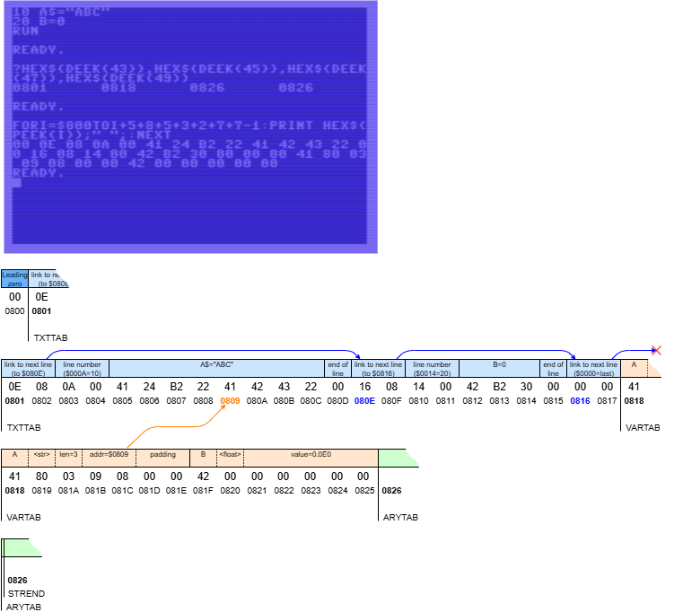

# C64 Memory partitioning

Can we partition the C64 memory, storing two programs simultaneously?
A multi-app setup?

No multitasking, we activate one, run it, activate another and run it.

## Introduction

I was reading "Mapping the Commodore 64" from Sheldon Leemon.
A [classic](https://archive.org/details/Compute_s_Mapping_the_64_and_64C), describing the memory 
map of the C64 ([webversion](https://www.pagetable.com/c64ref/c64mem/)).

I stumbled on the entry **TXTTAB**, the "Pointer to the Start of BASIC Program Text" at $002B-$002C (43-44 decimal).
The book explains

> This two-byte pointer lets BASIC know where program text is stored. 
> Ordinarily, such text is located beginning at 2049 ($0801). 
> Using this pointer, it is possible to change the program text area. 
> Typical reasons for doing this include:

> (3) Keeping two or more programs in memory simultaneously. 
> By changing this pointer, you can keep more than one BASIC program in memory at one time, 
> and switch back and forth between them. 

Then came a reference to [COMPUTE!'s First Book of PET/CBM, pages 66 and 163](https://archive.org/details/COMPUTEs_First_Book_of_PET-CBM_1981_Small_Systems_Services).
That book predates the C64. It describes the [Commodore PET](https://en.wikipedia.org/wiki/Commodore_PET), 
but that also had Microsoft BASIC, so maybe usable. Unfortunately, the administration of the BASIC and Kernal was a bit 
different, so it took me some time to get "Keeping two programs simultaneously" running on my 
[C64](https://en.wikipedia.org/wiki/Commodore_64).

## BASIC memory map

The above mentioned COMPUTES!'s book contains the article "Memory Partition of BASIC Workspace" by Harvey B. Herman on pages 64-67.
It explains a system with 4 programs, all four in the memory of the PET. 
Program 1, 2 and 3 are the actual programs between which we want to switch.
A 4th program is the manager; it lets the user pick the one to switch to.
Once program 1, 2, or 3 is done, it switches back to the manager.

The four programs implement the switching by manipulating pointers.
The article describes and uses pointers on the PET.
In the meantime I found the corresponding pointers for the C64.
The table below comes from the book, with the right-most column added by me.

What are all these pointers? The diagram below shows the C64 memory map with focus on BASIC.
The gray parts (zero page, stack, OS data, screen buffer, BASIC, I/O and Kernal) are ignored;
we look at the colored parts.

By default, a BASIC program starts at $0800. With a zero byte, which _must_ be there (or even `NEW` won't work).
Then comes the BASIC program "text" (the entered lines). Program text starts at a location known
as `TXTTAB` ($0801) and grows pushing up `VARTAB`. 
The image below shows a simple example (a one-line program `10 REM A`) in more detail.

If a program uses _plain_ variables (scalars, i.e. not arrays), they are stored from location `VARTAB` 
to location `ARYTAB`. Every new variable pushes up `ARYTAB`. Every variable takes a fixed 
amount of 7 bytes, two for the name and 5 for the data. For strings, the data part is actually 
the size and a _pointer_ to the characters, the characters themselves are on the heap 
(see later), or part of the program text.

If a program uses _array_ variables, they are stored from location `ARYTAB` to location `STREND`.
Every new array (explicit or implicit `DIM`) pushes up `STREND`. 
This name is a bit confusing. As mentioned before, string 
characters are stored in the heap. The heap grows _down_ from `MEMSIZ` to `FRETOP`, until the 
later hits `STREND`. Hence the name.

This explains all six pointers relevant for managing a BASIC program.
The table below shows their zero page addresses.
Although `FRESPC` is interspersed, it seems not relevant for our discussion.

  | addr (dec)| addr (hex)|   name   |set by|
  |:---------:|:---------:|:--------:|:----:|
  | **43/44** |**$2B/$2C**|**TXTTAB**| user |
  | **45/46** |**$2D/$2E**|**VARTAB**| user |
  | **47/48** |**$2F/$30**|**ARYTAB**| CLR  |
  | **49/50** |**$31/$32**|**STREND**| CLR  |
  | **51/52** |**$33/$34**|**FRETOP**| CLR  |
  |   53/54   |  $35/$36  |  FRESPC  |      |
  | **55/56** |**$37/$38**|**MEMSIZ**| user |

> We will set the pointers tagged "user", then by calling "CLR", the other three pointers will be updated.
  

## Partition manager

My first trial is to replicate Herman's article, but then on the C64.

- I create one partition manager (app "A0").
- I create two apps ("A1" and "A2", instead of three as Herman does).
- Each app gets a block of 2k RAM (yes that is small).

The figure below shows how I've partitioned the 40k BASIC RAM (leaving 32k unused).
The numbers on the right are the partition boundaries as mentioned above.
They are shown in hex (`$0801`) followed by an equals sign, and then the 
high byte and low byte in decimal (`8/1`).

The partition manager A0 can be loaded from e.g. a disk (but you can also type it in).
It will be loaded at the standard `TXTTAB` ($0801), and the 
loader will set `VARTAB` once the whole program is loaded and the end is known.
When ran, one of the first things the partition manager does, is to lower 
its own `MEMSIZ`. With that the three "user" pointers for its partition are set.
The partition manager then calls `CLR`, which updates `ARYTAB`, `STREND` and `FRETOP`;
all six pointers are set correctly for A0.
For debugging (and as we will see later, for configuring A1 and A2),
A0 does print the three "user" pointers (`TXTTAB`, `VARTAB`, and `MEMSIZ`) to the screen.

The partition manager A0, does need to know the addresses of the partitions
that will contain applications A1 and A2, because activating an application 
means changing the six pointers. 

However, at this moment, we do not yet know `VARTAB` of A1 and A2, because we don't know
which (how big) those programs will be. Fortunately that doesn't hamper use.
At first we will uses dummy values for `VARTAB` in A0, then run A0 
(write down its `TXTTAB`, `VARTAB`, and `MEMSIZ`), let it switch to A1, and there call `NEW`. 
This initializes `VARTAB` (and the dependent pointers).

Then we type in the program for A1. At the end of the A1 program, we add lines
that set `TXTTAB`, `VARTAB`, and `MEMSIZ` to the values written down for A0.
Once A1 is done, we can inspect its length via `VARTAB` (`TXTTAB` and `MEMSIZ` should not have changed).
In my experimental apps, part of the code of A1 is to actually print the three pointers 
`TXTTAB`, `VARTAB`, and `MEMSIZ`.

In other words, from the table below, the pointers with no marking come for free, 
the pointers with the single < marking come by design (it is the partitions we want),
and the pointers with the double << marking come once we have written those apps.

  |  App |TXTTAB (43/44)| |VARTAB (45/46)|  |MEMSIZ (55/56)| |
  |:----:|:------------:|-|:------------:|--|:------------:|-|
  |  A0  | $0801 =  8/1 | |$0A13 = 10/19 |  | $1000 = 16/0 |<|
  |  A1  | $1001 = 16/1 |<|$110D = 17/50 |<<| $1800 = 24/0 |<|
  |  A2  | $1801 = 24/1 |<|$190D = 25/50 |<<| $2000 = 32/0 |<|

### Application A0 (partition manager)

The screenshot below shows the complete listing for the simple partition manager A0.

Before or after running it (but don't press `1` or `2` yet), the listing can be saved e.g. to disk. 
BASIC's SAVE will look at `TXTTAB` and `VARTAB` (but not `MEMSIZ`) to determine what to save, 
and `TXTTAB` is even saved as header of the `PRG` file (see hex dump below).
This way BASIC knows where to load a `PRG` back. 
This will come in handy for A1 and A2.

Note
- Line 100, identifies this program as partition manager A0.
- Line 110, sets its own the partition by poking `MEMSIZ`, correcting the other pointers via `CLR`.
- Lines 120 and 130 set the leading 0 for the other two partitions.
- Lines 140-160 print the "user" pointers (to write down).
- Lines 170-210 let the user enter `1` or `2` or something else, and activate 1 or 2, or just end A0 (to be rerun, edited, saved).
- Lines 300-340 active A0.
- Lines 400-440 active A1.
- The activation sets `TXTTAB`, `VARTAB`, and `MEMSIZ` (then `CLR` for the other 3). 
  In the first version `VARTAB` at lines 310 and 410 are dummies.
- On purpose we have extra spaces for a poke value, so that there is room for 3 digits (0..255) without
  changing the size of the program (and thus without changing A0's `VARTAB`).
- If you enter the programs yourself make sure to _copy them exactly_.
  If there is any size chnage you need to update the pointers.

The screen below is what we see after running.
We need to write down the values of the three pointers.

Go ahead and press `1` now.

### Application A1 (user program)

After pressing `1` in the partition manager A0, it activated the partition for A1.
Remember, the first time we need to call `NEW` to set `VARTAB`.

We can now load or enter a program. We start with the latter.

Note
- Lines 100-110 identify this program as user program A1.
- Lines 112-116 print the "user" pointers (to write down - we need to update A0 for that).
- Lines 120-140 let the user enter `0` or something else, and return to A0, or just end A1 (to be rerun, edited, saved).
- Lines 150-180 active A0. These are the numbers we wrote down while running A0.

The screen below is what we see after running A1.
Again, we need to write down the values of the three pointers of A1 to patch A0.

Press e.g. space to exit. Save this user program. For fun, do a `PRINT FRE(0)`. Rerun it and press `0`. 
After pressing `0` in A1, it activates the partition for A0 again.

Update the A1's `VARTAB` in A0 and save A0.

### Application A2 (user program)

When we now run A0, we can press `1` and got to A1. List it. Run it and press `0`. We are back in A0.

Run A0 and now press `2`. We are now in partition A2, which was unused until now.

We can do `NEW` and write a program.

However, we can also `LOAD "A1",8`.
**Do not do `LOAD "A1",8,1`**.
When loading without the `,1` BASIC will load at `TXTTAB` (which is $1801 for A2) and 
automagically fix the linked list of BASIC line numbers (of A1 which was saved for $1001).

> I have the KCS power cartridge. I features a `DLOAD`. That seems to do a "FAST-LOAD,8,1" so do not use it.

The image below shows the hex dump of A1 (version V3).
- First two bytes form $1001, the load address (`TXTTAB`).
- The next two bytes form $1009, the link to the next line.
- Bytes 5 and 6 form $0064, or line number 100.
- Bytes 7-9, E4 B2 31 represent `N=1`.
- Byte 10 is the terminating 0 for the first line.
- We see that the next line indeed starts at address 1009, just as the first link indicated.

  |1001|1002|1003|1004|1005|1006|1007|1008|1009|100A|
  |:--:|:--:|:--:|:--:|:--:|:--:|:--:|:--:|:--:|:--:|
  | 09 | 10 | 64 | 00 | 4E | B2 | 31 | 00 | 25 | 10 |
  

After A1 is loaded, fix e.g. line 1 to identify it as user program 2.
Run it. Write down the pointers. Hit `0` to go to A0. Update A0, to have the correct pointers for A2.

## After thoughts

I have two thoughts.

Firstly, while A0 (or A1) is starting to poke the 3 vectors (43/44, 45/46, 55/56) it is changing
its own world. Would it still be able to use variables, probably not, because `VARTAB` is broken.
Would it be able to use `GOTO`? I believe that a `NN GOTO MM` starts looking from the current line (`NN`) 
downwards when `MM>NN`. But it starts looking from the start (from `TXTTAB`) when `MM<NN`. So 
that will probably not work either. But apparently just going to the next line is fine.

Maintaining the `VARTAB` in A0 is not fun. But you have to otherwise A1 breaks when you switch back to it.
And A0 is the manager, that will not change. But A1 is under development so having that broken is no fun.
We need to write an app manager that 
- has a store of all pointers of all apps;
- knows that app `C` is current app;
- that offers an `USR(N)` which
  - saves the current zero page pointers of `C` in the store
  - switches to app `N`, i.e. sets `C` to `N`
  - copies the pointers of `N` from the store to the zero page pointers
- then the administration would be automated.

(end)
