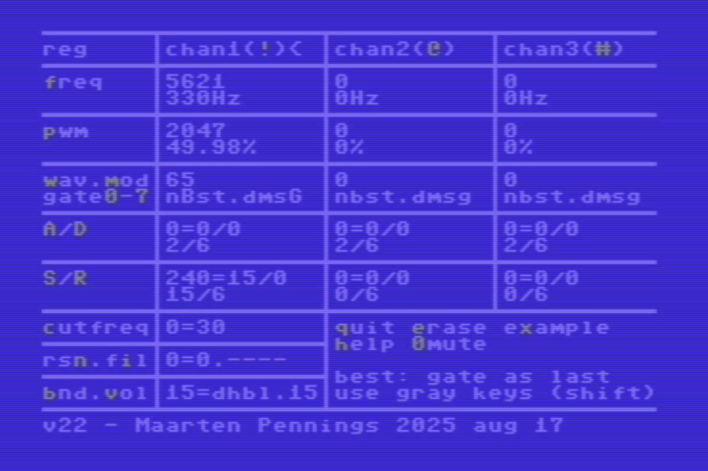
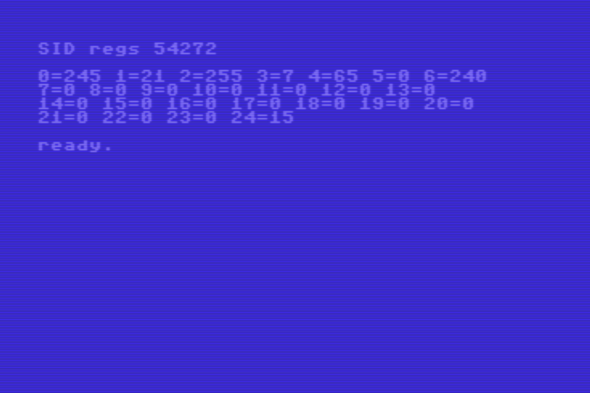

# How to use the C64 SID

The Commodore 64 comes with a Sound Interface Device - the [SID](https://www.c64-wiki.com/wiki/SID).


## Introduction

I got curious how to use the SID chip.

That got me in another rabbit hole - two actually.
First, I made a UI with which I can control the SID registers.

Secondly, I found that Vice comes with `c1541.exe` and `petcat.exe`.
Those programs help in manipulate (virtual) disks, respectively 
convert petscii files to plain text.


## User interface

I made a user interface that shows all register (fields) of the SID.
The UI also allows to _alter_ the fields. Since there is no mouse, 
I decided to use the keyboard. The operational keys are printed in gray.
They work with and without shift, incrementing the field, respectively
decrementing the field. Typically the fields wrap around and for fields 
with a big range, the increments are larger.



To make a sound, follow this procedure. 

First select a channel (1, 2, or 3); on start-up channel 1 is selected (see the 
`<` in the top row), but by pressing SHIFT 1, 2, or 3 (`!`, `"`/`@`, or `#`) the
channel selection can be changed. The the other keys (see next paragraph) 
only change the registers of the selected channel.

Pick a frequency (press `F`). There is only need for PWM duty cycle (press `P`)
when using the block (also known as square or pulse) waveform. Selecting a waveform is mandatory
(press `W` to select Triangle, Sawtooth, Block or Noise). Attack, Decay and 
Release timing are less relevant at first, but it is wise to set Sustain high
(press `S`). Also set volume high (press `V`). 

Finally enable the Gate of one or more channels; this is done by pressing a 
digit 0..7. The binary representation determines which of the three channels is 
gated: key `1` or 0b001 enables channel 1, key `6` or 0b110 enables channels 2 
and 3, and key `0` or 0b000 disables all channels.

When you quit the program (press `q`), the SID registers are printed out.
Note that the hardware SID registers are [write-only](https://www.zimmers.net/anonftp/pub/cbm/c64/manuals/mapping-c64.txt#:~:text=It%20should%20be%20noted%20that%20except%20for%20the%20last%20four%20SID%20chip%20registers%2C%0Athese%20addresses%20are%20write%2Donly.%20%20That%20means%20that%20their%20values%20cannot%0Abe%20determined%20by%20PEEKing%20these%20locations.); 
`PEEK` does not work.



I found out there are two "methods" to generate a beep.

- Either set a longer Attack and Decay, but keep Sustain at 0.
  Setting the Gate (bit 0 of Control) makes a short beep (with the Attack+Decay time).

- Alternatively, set Sustain higher, and start the beep by setting 
  Gate, wait, and then clear the Gate.

I observed, and found it [documented](https://www.zimmers.net/anonftp/pub/cbm/c64/manuals/mapping-c64.txt#:~:text=You%20may%20notice%20the%20volume%20of%20the%20sound%20does%20not%20quite%20get%20to%200%20at%20the%0Aend%20of%20the%20release%20cycle%2C) 
that "the sound does not quite get to 0 at the end of the release cycle";
you might need to set the volume to 0.

I was surprised by the how these parameters can be tweaked to mimic different 
instruments - found in the [C64 user manual](https://www.commodore.ca/manuals/c64_users_guide/c64-users_guide-09-appendices.pdf#page=60).
I played all these with a frequency  at 4534 (266Hz) and 
volume at 15. After configuring using the below table, I made a sound by
pressing 1 (setting gate of channel 1) followed by pressing 0 (clearing 
the gate of channel 1).

  | instrument | PWM (reg 2+3)| ctrl (reg 4) | A,D (reg 5)    | S,R (reg 6)     |
  |:----------:|:------------:|:------------:|:--------------:|:---------------:|
  | piano      | 300 (7.32%)  | 64 (block)   |  9 (2ms,750ms) |   0 (0/15,6ms)  |
  | flute      | n.a.         | 16 (triangle)| 96 (68ms,6ms)  |   0 (0/15,6ms)  |
  | xylophone  | n.a.         | 16 (triangle)|  9 (2ms,750ms) |   0 (0/15,6ms)  |
  | organ      | n.a.         | 16 (triangle)|  0 (2ms,6ms)   | 240 (15/15,6ms) |
  | accordion  | n.a.         | 16 (triangle)|102 (68ms,204ms)|   0 (0/15,6ms)  |
  | trumpet    | n.a.         | 32 (sawtooth)| 96 (68ms,6ms)  |   0 (0/15,6ms)  |


## Files

My second rabbit hole was file transfers between 
[VICE](https://vice-emu.sourceforge.io/) a real C64 and this web page.
I discovered that VICE comes with two tools.
One `c1531.exe` to manipulate disk images, and `petcat.exe` to convert 
a BASIC program to a plain text file.
Both are found in the `bin` directory (`C:\Programs\GTK3VICE-3.9-win64\bin`).

I developed my sid program on VICE using a virtual disk image `develop.d64`.
I first made a fresh virtual floppy, using the `c1541` in interactive mode. 
I gave this command.

```
c1541 #8> format   sid,33   d64 sid.d64
```

I quit the tool (`quit`) and check to see if indeed a new virtual floppy was 
created on my windows machine. Indeed there is now a file `sid.d64` on
my hard disk. It is formatted using the `d64` format, and the disk has 
name `sid` and ID `33`.

I restarted `c1541` in interactive mode, but this timing mounting 
my development disk (in virtual drive 8) and my new empty disk (in 
virtual drive 9). Note that in interactive mode the prompt has the 
form `c1541 #8>`

```
c1541.exe develop.d64 sid.d64

c1541 #8> copy sid22 @9:sid22
copying `sid22' ...

c1541 #8> dir @9:*
0 "sid             " 33 2a
31   "sid22"            prg
633 blocks free.
```

I made a copy of version 22 from disk in drive 8 to the disk in drive 9.
Note the `@9:` syntax. Then I check by commanding a `dir`. Normally 
`dir` lists drive 8, for drive 9 we need `@9:*`. The file is there.

Next step is to export this file also to the PC. We use the read command 
for that. I opted for filename `sid22.prg` on my PC.

```
c1541 #8> read @9:sid22 sid22.prg
reading file `sid22' from unit 9

c1541 #8> quit
Unit 8 drive 0: D64 disk image detached: develop.d64.
Unit 9 drive 0: D64 disk image detached: sid.d64.
```

By the way, it is also possible to skip interactive mode `c1541   editor.d64   -read sid22 sid22.prg`.

Anyhow, with the `sid22.prg` on the PC, 
we can use `petcat` to convert it to text.

```
petcat.exe   -2   -o sid22.txt   sid22.prg
```

The result is several files:
 - [`sid.d64`](sid.d64) the virtual floppy disk. Can be  mounted in VICE or e.g. using
   [Kung Fu Flash](https://github.com/KimJorgensen/KungFuFlash) on a real C64.
 
 - [`sid22.prg`](sid22.prg) the BASIC program. Can also be used in VICE or on a C64 via Kung Fu Flash.
 
 - [`sid22.txt`](sid22.txt) the plain text file, nice on the PC/web.
 
(end)
