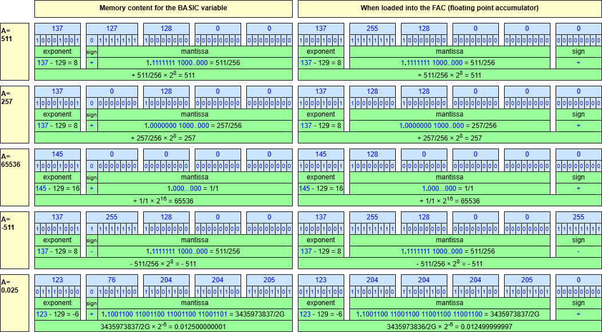

# How to implement USR() on the C64

This document explains how to implement a `USR()` function on the C64. We implement `DEEK()` or double `PEEK()`.

It also shows a trick from Robin "8-Bit Show And Tell" how to easily return to Turbo Macro Pro.


## Introduction

Commodore BASIC has two ways to mix machine language subroutines with BASIC: `SYS <address>` and `USR(<argument>)`.


### SYS

The first one is relatively straightforward. The `SYS` command is passed an address, and then execution is transferred to
the machine code at that address. When execution hits an `RTS`, execution transfers back to BASIC. There is no official
way to pass an argument, nor is there an official way to get a return value. 

The following example calls the routine at 49152 (a free region of memory). 
Make sure to first place a routine there (e.g. by `POKE`ing or via `LOAD "XXX",8,1`).
At minimum `POKE 49152,96` to get a one-instruction routine `RTS`.

```
  SYS 49152
```


### USR

The second method allows passing an argument to the routine, and getting a result back.
We can pass _one_ argument, and we get one result back; both must be floating point.
That is a bit limited, but for the rest, this function behaves like any BASIC function;
it can appear in any place where, say, `SIN` can occur.

The following example is a bit contrived, but it shows the possibilities.

```
  PRINT USR(785)+USR(780+5)
```

You might wonder which routine gets called, to which address the CALL is. 
The answer is the vector at location 785 ($311).
By default this vector points to a routine that prints `?ILLEGAL QUANTITY  ERROR`.
You would poke the vector with your routine's address before calling `USR()`.


### Expressions

It is good to realize that Commodore BASIC has three _types_: float, string and integer.
A variable like `A$` (or function like `MID$`) ending in `$` is (returns) a string.
A variable like `XX%` ending in `%` is an integer.
All other variables and function are float. Floats are stored in 5 bytes, strings use
variable width blocks on the heap and integers are _signed_ and 2 byte (16 bits). 

You might be thinking that it would generally be better to use integers, but the answer is a firm _no_.
First of all you do not save memory: every variable uses 7 bytes: 2 for the name and 5 for the value
(float, size and pointer, respectively lo byte and high byte and padding). Secondly, you do not
save cycles. On the contrary: integers are first converted to float, then the computation is performed
in the float domain, and the result is converted back to integer. This has been done to keep
the BASIC interpreter simple; there is only one "ALU", a float one.

Why are there integers? They help in one place: when you make an array of them. Then they occupy only 2 bytes.


### ALU

Commodore BASIC has an "ALU" (arithmetic and logic unit) in the float domain.
It has a "FAC" (a Floating point ACcumulator), and a second accumulator, "FAC2" or "ARG".
It also implements several operation; see [c64.org](https://sta.c64.org/cbm64basconv.html)
or [codebase64.org](https://codebase64.org/doku.php?id=base:kernal_floating_point_mathematics#the_floating_point_routines).

Example are "FAC:=ARG+FAC" or "FAC:=const*FAC".

The FAC is at location $61-$66 and the ARG at $69-$6E.


## Turbo Macro Pro

To write the `USR` function, we will use TMP or [Turbo Macro Pro](https://turbo.style64.org/).
This is an assembler that runs on the C64 itself, but also on [VICE](https://vice-emu.sourceforge.io/), the emulator.

TMP consists of an editor with some commands.
One command is assemble, another command is to run it, or go to BASIC (and there start it).
Typically in the development cycle, you test and want to go back to TMP.

Robin from [8-Bit Show And Tell](https://www.youtube.com/c/8BitShowAndTell) has a clever trick for that.
I first saw it in a [video](https://www.youtube.com/watch?v=05vlobA3JeU) but when I needed it, I couldn't find it back.
Fortunately, somebody else documented it in a way that was easier to [find](https://old-crank.neocities.org/examples/easy.return.to.tmp).

The trick is to add this to your assembler program.

```
tmpentry  = $8000
          sei ; make vector swap atomic
          lda #<tmpentry
          sta $0318
          lda #>tmpentry
          sta $0319
          cli
```

What it does, is to vector the interrupt (caused by pressing the RESTORE key) to the start of TMP.
**One key press, and your back.**


## Implementing `USR()` 

We write an assembly program that we locate in the cassette buffer.
The program consists of two parts. The second part implements the
function `USR`. The first part sets up the vector to the second part.


### Program header

The program header explains shortly what the program does.
More importantly is specifies the location for the program.
We selected the cassette buffer at (decimal) 828.

```
         ; implements usr(addr)
         ; returns vector at <addr>
         ; also known as deek(addr)
         ; Maarten Pennings 2025 04 23
         *= 828 ; cassette buffer
```

### Setup vector

The first part of the program sets the vector of the `USR`
function to point to the second part of our program.
The vector is located at (decimal) 785 (vectors take two bytes).

This is just two stores and a return.
Observe that `<` and `>` are TMP functions that take the
low byte and high byte respectively of a word (an address).

```
         ; set usr() vector
usradd   = 785; $0311
         lda #<main
         sta usradd+0
         lda #>main
         sta usradd+1
         rts
```

### Some constants

The second parts needs some constants.
It uses three subroutines and two buffers (`poker` and `fac`).

```
getadr   = $b7f7; int(fac) to mem[poker]
givayf   = $b391; a/y to fac
addmem   = $b867; fac+=mem[a/y]
poker    = $14  ; aka linnum
fac      = $61  ; floating point accu
```

### DEEK() implementation

We are making DEEK or double PEEK.

```
  DEEK(A) := PEEK(A)+256*PEEK(A+1)
```

When calling `USR(expr)`, BASIC first evaluates `expr` and puts the
resulting value in the floating point accumulator (`FAC`). Then our program 
runs. When our program ends (with `RTS`), what is left in the FAC is returned
to BASIC.

We use the function `getadr` which converts the FAC to an integer.
This routine assumes the integer is an address and even gives an
error when out of range (outside 0..65535). If the number is ok, the routine returns
with the address in the location known as `poker` (address $14).

When we would enter `USR(2049)` to inspect location $0801, after 
this call, `poker` would store the low byte $01 and `poker+1` would 
store the high byte $08.

We now want to peek at locations $0801 and $0802, this is where the two
`lda (addr),y` come to the rescue. After that, `x` has the high byte
mem[$0802] and `y` has the low byte mem[$0801].

Finally we call the routine `givayf` which converts the integer
in `y` and `a` to a float in FAC.


```
main     ; fac parsed as int in poker
         jsr getadr
         
         ; deref to get hi byte in x
         ldy #1
         lda (poker),y
         tax
         ; deref to get lo byte in y
         dey
         lda (poker),y
         tay
         
         ; lo in y, hi in a, to fac
         txa
         jsr givayf
```

You might believe we are done now.
But we are not.
The problem is integer overflow.
If the value in y/a exceeds 32767, the FAC becomes negative.

If this is new to you, try `FRE()`, it suffers from the same issue.

```
    **** COMMODORE 64 BASIC V2 ****

 64K RAM SYSTEM  38911 BASIC BYTES FREE

READY.
?FRE(0)
-26627

READY.
?65536+FRE(0)
 38909

READY.
```

The final piece of the puzzle comes now. When the FAC is negative, we add 65536.
We use `addmem` which adds a float constant pointed to by a/y to FAC.

The constant is located a `n65536` at the end of the program. 
This is in floating point representation.


```
         ; problem: if y/a>32767 the
         ; fac is now negative
         ; same problem not fixed for
         ; the fre() function

         ; if fac>=0 then done
         lda fac+5 ; sign
         beq done

         ; fac<0 so add 65536,as fre()
         lda #<n65536
         ldy #>n65536
         jsr addmem

done     ; return fac
         rts

         ; 65536 encoded as float
n65536   .byte 145,0,0,0,0,0
```

## Running

Let's try it.
First a real case, then some illegal addresseses.
And finally the BRK vector at 65534, which maps to 65352.


```
LOAD "USR13@828.PRG",8,1

SEARCHING FOR USR13@828.PRG
LOADING
READY.

SYS 828

READY.
?USR(785)
 839

READY.
?(USR(785)+USR(780+5))/2
 839

READY.
?USR(-2)

?ILLEGAL QUANTITY  ERROR
READY.

?USR(65536)

?ILLEGAL QUANTITY  ERROR
READY.

READY.
?USR(65534)
 65352

READY.
```


## Files

Unpacked with [d64viewer](https://github.com/maarten-pennings/d64viewer) to get the files.

- [`usr13@828.d64`](usr13@828.d64) the disk image with the following files.
- [`usr13@828.tmp`](usr13@828.tmp) the turbo macro pro source (binary).
- [`usr13@828.txt`](usr13@828.txt) the turbo macro pro source (text).
- [`usr13@828.prg`](usr13@828.prg) the generated executable which will be loaded at address 828.

Note the constant `n65536` has one 0 too much.
Read the next section for details.


## Floating point format

At first, I was too lazy to study the floating point format.
But I needed the bytes for the `n65536` constant.


### Floating point format of the FAC
Easy peasy, I temporarily modified the program as follows:
it receives a number in the FAC, copies the FAC to address 5000, and 
returns the same number, which is still in the FAC.

```
         ; set usr() pointer
usradd = 785 ; $0311
         lda #<main
         sta usradd+0
         lda #>main
         sta usradd+1

fac      = $61
copy     = 5000

main     lda fac+0
         sta copy+0
         lda fac+1
         sta copy+1
         lda fac+2
         sta copy+2
         lda fac+3
         sta copy+3
         lda fac+4
         sta copy+4
         lda fac+5
         sta copy+5
         rts
```

Then from BASIC we run

```
?USR(65536)
 65536

READY.
?PEEK(5000);PEEK(5001);PEEK(5002);PEEK(5003);PEEK(5004);PEEK(5005)
 145  128  0  0  0  0
```

And presto, we have the FAC image of 65536: 145  128  0  0  0  0.

I tried other numbers as well, and it looks genuine.

```
ready.
sys 4096

ready.
?usr(511);peek(5000);peek(5001);peek(5002);peek(5003);peek(5004);peek(5005)
 511  137  255  128  0  0  0

ready.
?usr(257);peek(5000);peek(5001);peek(5002);peek(5003);peek(5004);peek(5005)
 257  137  128  128  0  0  0

ready.
?usr(65536);peek(5000);peek(5001);peek(5002);peek(5003);peek(5004);peek(5005)
 65536  145  128  0  0  0  0

ready.
?usr(-511);peek(5000);peek(5001);peek(5002);peek(5003);peek(5004);peek(5005)
-511  137  255  128  0  0  255

ready.
?usr(0.025);peek(5000);peek(5001);peek(5002);peek(5003);peek(5004);peek(5005)
 .025  123  204  204  204  204  0
```

Good? No that did not work! (_that_ being _the `USR()` function with adding 65536_ ).

Why not? 

Because, as it turned out, the encoding of a floating point in the FAC 
is different from the encoding of a floating point as a constant in the code.
What should have triggered me, is that a BASIC variable is 7 bytes: 
2 for the name and 5 for the floating point value, whereas the FAC is 6 bytes.
What is going on?

I find that out via the next approach.


### Floating point format of constants

The `addmem` BASIC routine and many others, require a a/y pointer to a floating point.
It makes sense that those pointers would point to a BASIC variable.
So let's examine one of those.

Zero page location 45/46 is known as `VARTAB`; it is a pointer indicating where the BASIC variables start.
The first variable used in a BASIC program gets created there, next ones are appended.
Each variable starts with 2 bytes for the name and the the floating point value.

So I made a program that dumps the memory of `A`.

```
10 A=511
20 STOP
30 FOR I=PEEK(45)+256*PEEK(46) TO I+6
40 PRINT PEEK(I);
50 NEXT I:GOTO 20
```

And ran it for the same inputs as before.

```
RUN
BREAK IN 20
READY.
CONT
 65  0  137  127  128  0  0
BREAK IN 20
READY.
A=257:CONT
 65  0  137  0  128  0  0
BREAK IN 20
READY.
A=65536:CONT
 65  0  145  0  0  0  0
BREAK IN 20
READY.
A=-511:CONT
 65  0  137  255  128  0  0
BREAK IN 20
READY.
A=0.025:CONT
 65  0  123  76  204  204  205
BREAK IN 20
READY.
```

Ignoring the first two bytes (variable names), the memory contents are _different_.


### Comparison

On hindsight the difference is not big.

Each number is normalized. This means it is written in m × 2^e, where m must start with a single 1 before the binary point.
So, 9 decimal is 1001 in binary and this is normalized to 1.001×2³.
Since the mantissa m now always starts with a 1, that 1 is not stored.
The leading bit of the mantissa is used to store the sign of the number.
The exponent gets 129 added (so in our example 129+3=132 would be stored) to cater for negative exponents.

But the FAC does store the leading 1. So there is not room for the sign, so that goes into the 6th byte.



Also note in the last example a rounding difference.
The FAC does seem to have a provision for rounding: there is register FACOV (at zero page $70) that is the 
"Low Order Mantissa Byte of Floating Point Accumulator #1 (For Rounding)"
as [pagetable](https://www.pagetable.com/c64ref/c64mem/#:~:text=Low%20Order%20Mantissa%20Byte%20of%20Floating%20Point%20Accumulator%20%231%20(For%20Rounding)) explains.

(end)

