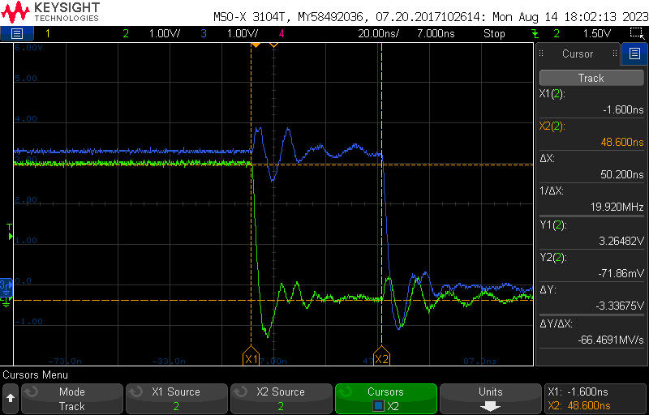

# Fast GPIO on ESP32


## Introduction

The typical way to set a GPIO pin on an ESP32 (in Arduino)
is to use the Arduino API:

```C
digitalWrite( PIN_TEST2, LOW );
```

The Arduino API might be simple, it is not fast.


## Faster

A faster way is to write directly to the special function register ("SFR")
that controls the pin state.

```C
*(uint32_t*)0x3FF4400C = 0b100000000000000000000000;
```

This is not very readable and error prone.

Fortunately, the ESP32 header file `gpio_struct.h` is included in every sketch.
It provides a variable `GPIO` which is overlayed on the GPIO SFRs.
This variable is a struct of unions, giving all registers a readable name.

So our final version is

```C
GPIO.out_w1tc = 1UL << PIN_TEST2;
```


## Example

See the Arduino sketch [esp32-fast-gpio](esp32-fast-gpio) as an example.

from the logic analyzer, we see that two consecutive 0-writes to two different ports
now takes below 50 ns.



(end)

