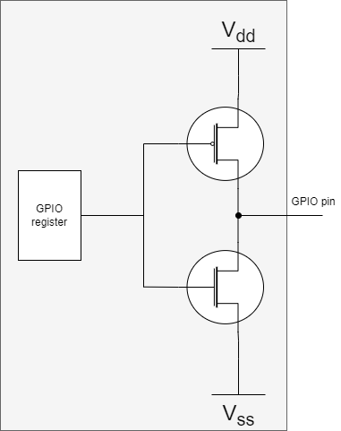
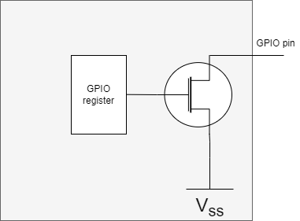
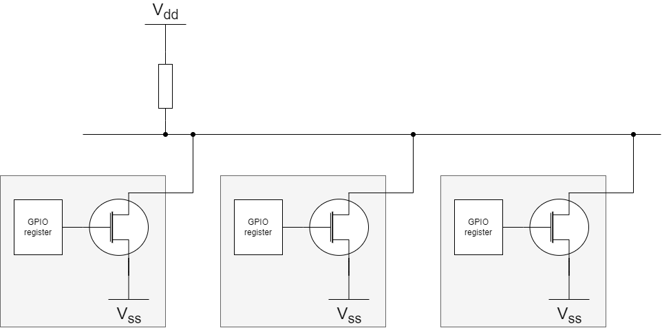

# Open Drain GPIO on ESP32


## Push-pull

The typical way to configure a GPIO pin on an ESP32 (in Arduino)
is to use the Arduino API:

```C
pinMode(OD_PIN, OUTPUT ); 
```

This configures a pin as an output pin.
I believe this is sometimes referred to as push-pull mode.
With `digitalWrite(PIN,HIGH)` the pin is pushed high and with `digitalWrite(PIN,LOW)`
the pin is pulled low.

In this context, pushing high means connect to VCC and pull low means connect to GND.

The below diagram shows the wiring inside the ESP32 of a GPIO pin when configured as push-pull ("output" in Arduino terms).



When the GPIO register is one the upper FAT is connected (and the lower one open) so that the GPIO pin is wired to VDD.
When the GPIO register is zero the lower FAT is connected (and the upper one open) so that the GPIO pin is wired to GND.

Note that if two of these GPIO pins are connected, and one is pushed high and the other pulled low,
there is a shortcut from VDD to GND, an "infinite" current will flow, and the GPIO drivers or maybe even the whole
MCU burns out.


## Open Drain

An alternative wiring of a GPIO port is as open drain.

The below diagram shows the wiring inside the ESP32 of a GPIO pin when configured as open drain.



In this case, the register can be written to 0, the FAT will connect, and the GPIO pin is wired to GND.
If the register is 1, the FAT is open and the GPIO pin is floating.

In general floating is not good. 
In a typical configuration, the GPIO pin has a pull-up.
The pull-up can be on the PCB.
But the ESP32 also has the option to engage a pull-up internally.

Please note that on most MCUs (this includes the ESP32),
the actual state of a pin can be read.
For an push-pull output pin that does not make much sense; the MCU itself
determines that state, so why measure it back.
However, for an open-drain this makes perfect sense.
If the MCU has it set to 1/float, by measuring it, the MCU can determine
if one of the other devices has pulled it low. 


## Why open drain

The reason to use open drain is that multiple devices can connect to the same line.
There is one pull-up on the line.
Normally all devices have their "register set to 1", so all FATs are open, so the pull-up pulls the line high.
One or more devices can set their "register to 0", than the line goes low.



Note this in this case zeror or more devices can set the line to 0 (pulling to th GND), 
while at the same time zero or more devices can set the line to 1 (have it float).
There is no infinite current, no burn-out.

This scheme is used in I2C for the SCL and the SDA line.

It is sometimes also used for the INT lines of devices.
In the latter case, multiple devices can wire their INT line to one GPIO pin of the MCU.
That is, when the MCU configures that GPIO as open drain.

Fortunately, ESP32 supports open drain pins, and the Arduino API for ESP32 suppoprts that too.


## Example

See the Arduino sketch [esp32-opendrain](esp32-opendrain.ino) as an example.

Note the line

```C
pinMode(OD_PIN, OUTPUT_OPEN_DRAIN | PULLUP ); // engage built-in pull-up
```

This is a sample run, where we grounded pin 23 for while (in release mode).


```text
Welcome to esp32-opendrain


Feel free to ground the pin
od  : pin 23 can output 1
od  : init

od  : pulldown
00000000000000000000000000000000000000000000000000000000000000000000000000000000000000000000000000000000000000000000000000000000000000000000000000000000000000000000000000000000000000000000000000000000
od  : release
11111111111111111111111111111111100000000001111111111111111111111111111111111111111111111111111111111111111111111111111111111111111111111111111111111111111111111111111111111111111111111111111111111111
od  : pulldown
00000000000000000000000000000000000000000000000000000000000000000000000000000000000000000000000000000000000000000000000000000000000000000000000000000000000000000000000000000000000000000000000000000000
od  : release
11111111111111111111111111111111111111111111111111111111111111111111111111111111111111111111111111111111111111111111111111111111111111111111111111111111111111111111111111111111111111111111111111111111
```
(end)

