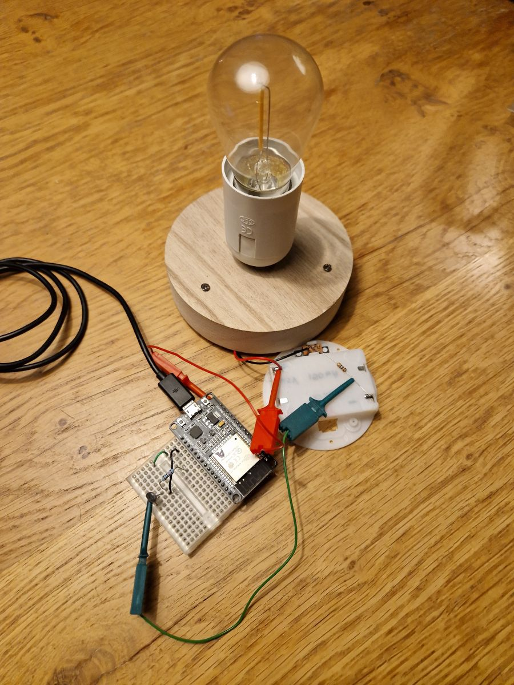

# ESP32 PWM
This project shows how to use PWM on an ESP32, 
with an exponential curve and a transistor to drive a high power LED.

## Setup
We use this to drive a high power, low voltage, LED filament light bulb, similar
to [these](https://www.aliexpress.com/item/1005006027765315.html).

## Sketch
For the sketch see [esp32pwm.ino](esp32pwm.ino).

(end)
