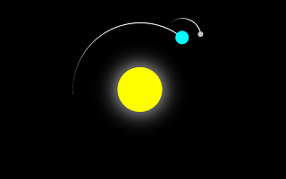
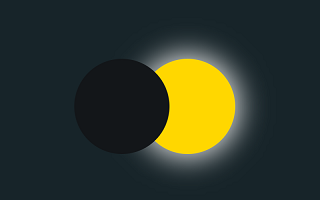
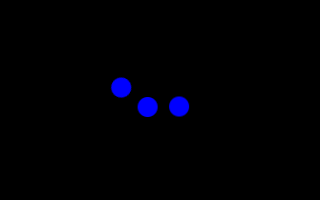

# Animations in HTML

There are three demo's, copied from [Learning Axis](https://www.youtube.com/@learning-axis).

- **Orbiting sun**  
  See the [source](sunorbit.html), or see it in
  [action](https://html-preview.github.io/?url=https://github.com/maarten-pennings/howto/blob/main/html-animation/sunorbit.html).  
  

- **Solar eclipse**  
  See the [source](solareclipse.html), or see it in
  [action](https://html-preview.github.io/?url=https://github.com/maarten-pennings/howto/blob/main/html-animation/solareclipse.html).  
  

- **Three dots**  
  See the [source](threedots.html), or see it in
  [action](https://html-preview.github.io/?url=https://github.com/maarten-pennings/howto/blob/main/html-animation/threedots.html).  
  

(end)
