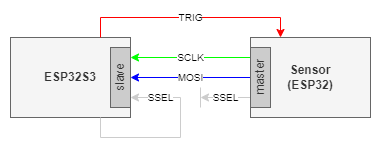
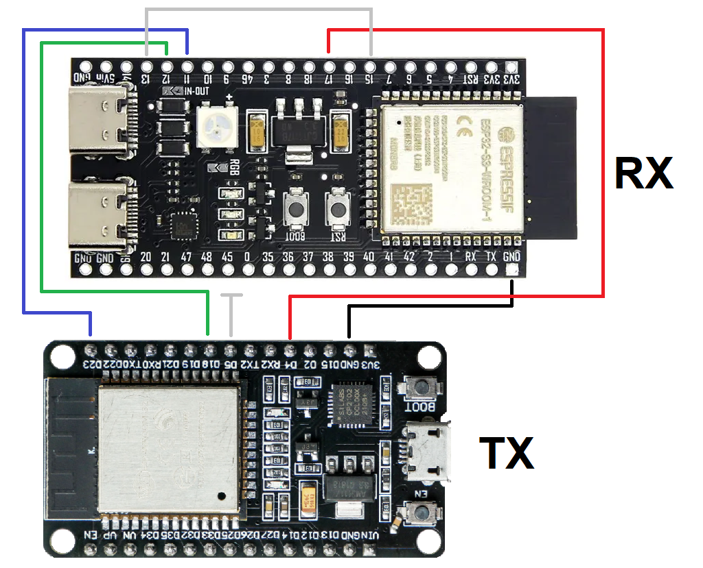
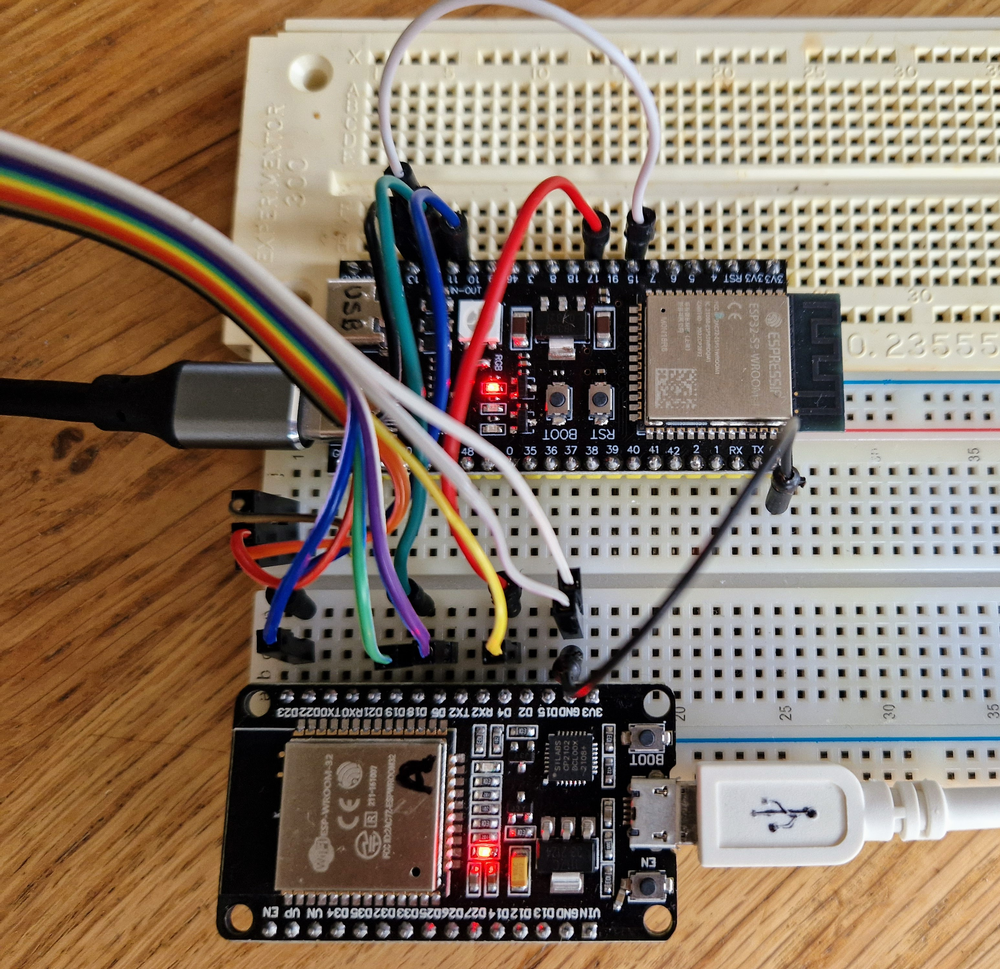
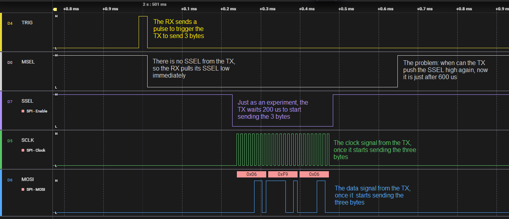

# Using ESP SPI slave without SSEL

The system contains a sort of "sensor" connected to an ESP32S3. 
The ESP32S3 triggers the sensor. 
Then the sensor starts its "measurement process" which takes between 5us and 15000us (guaranteed). 
Once the measurement is finished the sensor masters a 12 byte SPI message (at 2.4MHz) towards the ESP32S3. 



There is one complication, the sensor does NOT have an SSEL line. 
At this moment, the ESP32S3 asserts its own SSEL to enable SPI reception, after it triggers the sensor.
However, the ESP32S3 can only de-assert the SSEL line after 15000 us, which is too long.

Would it be possible to detect the start of the SPI message and de-assert the SSEL line after 12×8 clock ticks?

This is an experiment, where I replaced the sensor by an plain ESP32, to investigate this.

Unfortunately, the experiment **FAILED**.
> I do not know how to detect an incoming message. I checked the spi slave receive buffer, the 
> `rx_buffer` from `spi_slave_transaction_t` via `setUserPostSetupCbAndArg`, and the `len` from the same.


# Introduction

We have one transmitter ("TX").
It is a plain ESP32 (DOIT ESP32 DEVKIT V1), pretending to be the sensor.
It has one GPIO configured as input (GPIO4), its incoming trigger pin.
When the TX sees a pulse on the trigger pin, it sends a message over SPI.
The message is 3 bytes long; it consists of a counter value, its complement, and the counter value.
Then the counter is incremented.

We have one receiver ("RX").
It is an ESP32S3 (ESP32S3 DEVKIT C1).
It has one GPIO configured as output (GPIO17), its outhoing trigger pin.
The receiver periodically wants a message.
For that it sends a pulse over the trigger pin, and waits till it gets the message over SPI.

The problem is that the SPI connection from TX to RX is SCLK and MOSI, 
but there is _no SSEL_ to frame the message.

To solve this, the TX has a loop back wire from a GPIO pin (15, "MSEL")
to its own SSEL input. Currently, the RX asserts the SSEL by pulling MSEL down,
simply waits 600 us and then de-asserts MSEL.


# Schematics

The nets:

- TX.23 = MOSI (blue) -> RX.11
- TX.18 = SCLK (green) -> RX.12
- TX.5  = SSEL (gray) -> dangling 
- RX.17 = TRIG (red) -> TX.4 
- RX.15 = MSEL (gray) -> RX.13
- TX.GND = GND (black) <-> RX.GND





# Trace

The following shows a trace (using [saleae](trace.sal)).




# Firmware

This is the [TX sketch](spitest-tx/spitest-tx.ino/).

This is the [RX sketch](spitest-rx/spitest-rx.ino/).


# Logs

This is the Serial log of the transmitter.
The receiver has been started more or less at the same time.
Notice that the log shows the first 6 triggers by the receiver.
So, the transmitter has sent 6 SPI messages to the receiver.

```
welcome to spitest-tx
spiout: init
trig: init
trig: rises 1
trig: rises 2
trig: rises 3
trig: rises 4
trig: rises 5
trig: rises 6
...
```

This is the Serial log of the receiver.
Notice that the log shows indeed 6 received messages (`rxed`).
Indeed the messages are three bytes long and show the TX counter increment from 01 to 06.

```
welcome to spitest-rx
spiin: init
trig: init
poll 00/00/0 00/00/0 00/00/0 00/00/0 00/00/0 00/00/0 00/00/0 00/00/0 00/00/0 00/00/0 00/00/0 00/00/0 
rxed (3) 01 FE 01
poll 00/00/0 00/00/0 00/00/0 00/00/0 00/00/0 00/00/0 00/00/0 00/00/0 00/00/0 00/00/0 00/00/0 00/00/0 00/00/0 00/00/0 00/00/0 00/00/0 00/00/0 
rxed (3) 02 FD 02
poll 00/00/0 00/00/0 00/00/0 00/00/0 00/00/0 00/00/0 00/00/0 00/00/0 00/00/0 00/00/0 00/00/0 00/00/0 00/00/0 00/00/0 00/00/0 00/00/0 00/00/0 
rxed (3) 03 FC 03
poll 00/00/0 00/00/0 00/00/0 00/00/0 00/00/0 00/00/0 00/00/0 00/00/0 00/00/0 00/00/0 00/00/0 00/00/0 00/00/0 00/00/0 00/00/0 00/00/0 00/00/0 
rxed (3) 04 FB 04
poll 00/00/0 00/00/0 00/00/0 00/00/0 00/00/0 00/00/0 00/00/0 00/00/0 00/00/0 00/00/0 00/00/0 00/00/0 00/00/0 00/00/0 00/00/0 00/00/0 00/00/0 
rxed (3) 05 FA 05
poll 00/00/0 00/00/0 00/00/0 00/00/0 00/00/0 00/00/0 00/00/0 00/00/0 00/00/0 00/00/0 00/00/0 00/00/0 00/00/0 00/00/0 00/00/0 00/00/0 00/00/0 
rxed (3) 06 F9 06
```

The important aspect are the `poll` lines.
This is polling various aspects of the driver, to see if we can detect an incoming byte.
Unfortunately, not.


(end)

